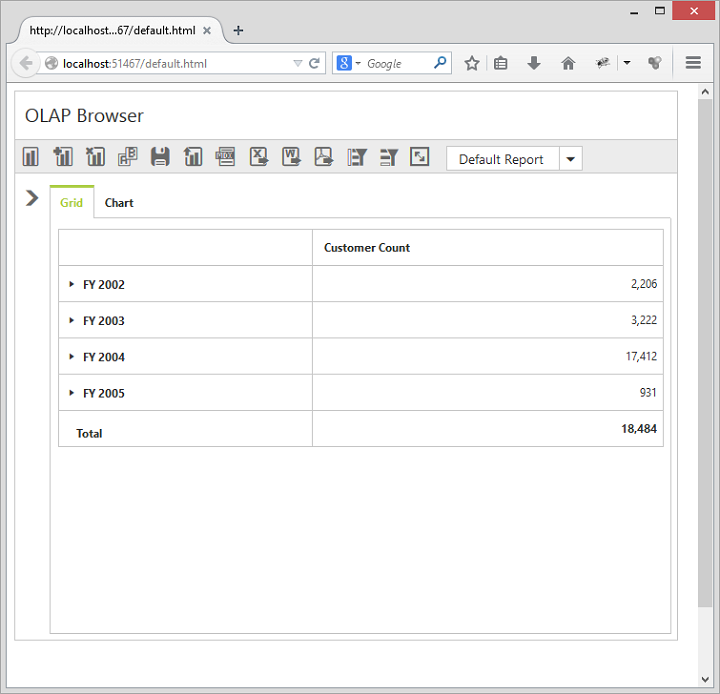

# Responsive Layout

PivotClient control supports responsive rendering based on the target device (desktop & tablet) resolution. It supports resolution upto 1024x600. You can enable responsiveness in PivotClient by setting `IsResponsive` property to true.



    <ej:PivotClient ID="PivotClient1" runat="server" IsResponsive="true">
            <DataSource>
                <Rows>
                    <ej:Field FieldName="Country" FieldCaption="Country"></ej:Field>
                </Rows>
                <Columns>
                    <ej:Field FieldName="Product" FieldCaption="Product"></ej:Field>
                </Columns>
                <Values>
                    <ej:Field FieldName="Amount" FieldCaption="Amount" Format="currency"></ej:Field>
                </Values>
            </DataSource>
            <ClientSideEvents Load="onLoad" />
    </ej:PivotClient>



 
