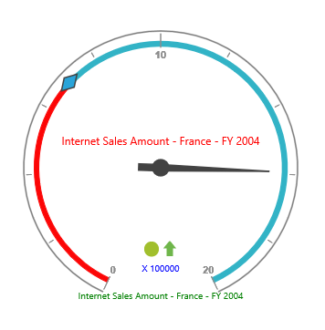

# Custom labels

## Adding custom label collection

You can apply the custom label collection by using the `CustomLabelCollection` which can be directly added to the scales option within the pivot gauge control.



    <ej:PivotGauge ID="PivotGauge1" runat="server">
        <Scales>
            <ej:CircularScales>
                <CustomLabelCollection>
                    <ej:CircularCustomLabel>
                        <Position X="180" Y="290" />
                    </ej:CircularCustomLabel>
                </CustomLabelCollection>
            </ej:CircularScales>
        </Scales>
    </ej:PivotGauge>



## Appearance customization

The appearance of the custom labels can be changed through the following properties:

* **Position**: Sets the position of the labels.
* **Font**: Sets the font size, font style, and font family of the label text.
* **Color**: Sets the color of the label text.
* **TextAngle**: Rotates the label to a specified angle. By default, the value is 0.



    <ej:PivotGauge ID="PivotGauge1" runat="server">
        <Scales>
            <ej:CircularScales>
                <CustomLabelCollection>
                    <ej:CircularCustomLabel Color="blue" TextAngle="20">
                        <Position X="180" Y="320" />
                        
                    </ej:CircularCustomLabel>
                </CustomLabelCollection>
            </ej:CircularScales>
        </Scales>
    </ej:PivotGauge>



 

## Multiple custom labels

Multiple ranges can be added in the `CustomLabelCollection` to the scales option within the pivot gauge control.



    <ej:PivotGauge ID="PivotGauge1" runat="server">
        <Scales>
            <ej:CircularScales>
                <CustomLabelCollection>
                    <ej:CircularCustomLabel Color="red">
                        <Position X="180" Y="150" />
                        
                    </ej:CircularCustomLabel>
                    <ej:CircularCustomLabel Color="green">
                        <Position X="180" Y="320" />
                        
                    </ej:CircularCustomLabel>
                    <ej:CircularCustomLabel Color="blue">
                        <Position X="180" Y="290" />
                        
                    </ej:CircularCustomLabel>
                </CustomLabelCollection>
            </ej:CircularScales>
        </Scales>
    </ej:PivotGauge>



 