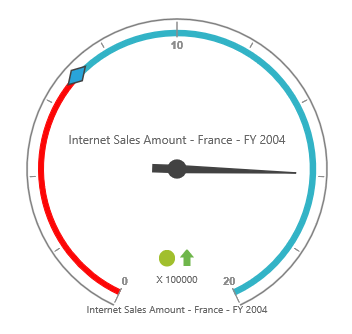

# Frame type

## Full circle

The full circle frame allows the pivot gauge to display in a circular shape. The frame type can be set by using the `FrameType` property. By default, the frame type is "FullCircle".



    <ej:PivotGauge ID="PivotGauge1" runat="server">
        <Frame FrameType="FullCircle" />
    </ej:PivotGauge>



 

## Half circle

Half circle frame allows the pivot gauge to display in a semi-circular shape. The frame type should be set as "HalfCircle" within the `FrameType` property, and you can set the `StartAngle` and `SweepAngle` for the pivot gauge in the `Scales` property.



    <ej:PivotGauge ID="PivotGauge1" runat="server">
        <Frame FrameType="HalfCircle" HalfCircleFrameEndAngle="360" HalfCircleFrameStartAngle="180"/>
        <Scales>
            <ej:CircularScales SweepAngle="180" StartAngle="180></ej:CircularScales>
        </Scales>
    </ej:PivotGauge>



 
