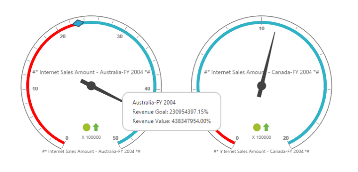

# Label format

You can customize the format of labels displayed in the pivot gauge control by using the `LabelFormatSettings` property.

Following are the formats that can be applied to labels in the pivot gauge:

* `NumberFormat`  - Allows you to change the number format of label values in the pivot gauge.
* `DecimalPlaces` - Allows you to set the number of digits to be displayed after a decimal point.
* `PrefixText`  - Allows you to add a text at the beginning of the label.
* `SuffixText` - Allows you to add a text at the end of the label.

The number format for label values can be set to any of the following types:

* Default	
* Currency
* Percentage
* Fraction
* Scientific
* Text
* Notation



<ej:PivotGauge ID="PivotGauge1" runat="server" RowsCount="2">
 	//...
   <LabelFormatSettings NumberFormat="Percentage" DecimalPlaces="2" PrefixText="#*" SuffixText="*#" />
</ej:PivotGauge>



 
