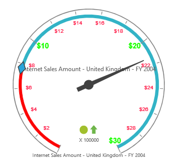

# Labels

## Adding Label Collection

Label collection can be directly added to the scales option within the OlapGauge widget as an array.


<ej:OlapGauge ID="OlapGauge1" Url="../OlapGauge" runat="server">
    <Scales>
        <ej:CircularScales>
            <LabelCollection>
                <ej:CircularLabels Angle="20"></ej:CircularLabels>
            </LabelCollection>
        </ej:CircularScales>
    </Scales>
</ej:OlapGauge>



## Appearance Customization

The appearance of the Label can be customized through the following properties.

* **Angle** – used to display labels in a rotated manner.  By default, the value is 0.
* **Color** – displays the label in specified color
* **Opacity** – sets the opacity of the label. By default, the value is 1.
* **Type** – indicates the label for major intervals or minor intervals.  By default, it takes major intervals.
* **IncludeFirstValue** – includes the initial value based on user requirement.  By default, the value is “true”.
* **Font** – sets the font size, font style and font family of the label.



<ej:OlapGauge ID="OlapGauge1" Url="../OlapGauge" runat="server">
    <Scales>
        <ej:CircularScales>
            <LabelCollection>
                //for Major labels
                <ej:CircularLabels Type="Major" Color="#1AFF01" Opacity="80" IncludeFirstValue="false">
                    
                </ej:CircularLabels>
                //for Minor labels
                <ej:CircularLabels Type="Minor" Color="#FF103F" Opacity="80" IncludeFirstValue="true">
                    
                </ej:CircularLabels>
            </LabelCollection>
        </ej:CircularScales>
    </Scales>
</ej:OlapGauge>



 

## Unit Text

The `UnitText` property is used to add some text along with the labels. Normally, we indicate the unit/measurement of the numeric value through unit text. Using the `UnitTextPosition` property, the text can be positioned either in front or back.  By default, text appears at the back.



<ej:OlapGauge ID="OlapGauge1" Url="../OlapGauge" runat="server">
    <Scales>
        <ej:CircularScales>
            <LabelCollection>
                //for Major labels
                <ej:CircularLabels Type="Major" UnitText="$" UnitTextPosition="Front"></ej:CircularLabels>
                //for Minor labels
                <ej:CircularLabels Type="Minor" UnitText="$" UnitTextPosition="Front"></ej:CircularLabels>
            </LabelCollection>
        </ej:CircularScales>
    </Scales>
</ej:OlapGauge>



 
