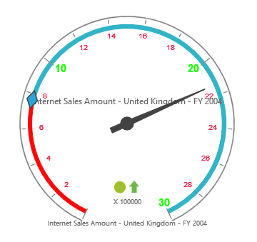

# Labels

## Adding label collection

The `LabelCollection` can be directly added to the scales option within the pivot gauge control.


    
    <ej:PivotGauge ID="PivotGauge1" runat="server">
        <Scales>
            <ej:CircularScales>
                <LabelCollection>
                    <ej:CircularLabels Angle="20"></ej:CircularLabels>
                </LabelCollection>
            </ej:CircularScales>
        </Scales>
    </ej:PivotGauge>



## Appearance customization

The appearance of the label can be customized through the following properties:

* **Angle**: Displays the labels in a rotated manner. By default, the value is 0.
* **Color**: Displays the label in a specified color.
* **Opacity**: Sets the opacity of the label. By default, the value is 1.
* **Type**: Indicates the label for major intervals or minor intervals.  By default, it takes major intervals.
* **IncludeFirstValue**: Includes the initial value based on user requirement.  By default, the value is true.
* **Font**: Sets the font size, font style, and font family of the label.



    <ej:PivotGauge ID="PivotGauge1" runat="server">
        <Scales>
            <ej:CircularScales>
                <LabelCollection>
                    //for Major labels
                    <ej:CircularLabels Type="Major" Color="#1AFF01" Opacity="80" IncludeFirstValue="false">
                        
                    </ej:CircularLabels>
                    //for Minor labels
                    <ej:CircularLabels Type="Minor" Color="#FF103F" Opacity="80" IncludeFirstValue="true">
                        
                    </ej:CircularLabels>
                </LabelCollection>
            </ej:CircularScales>
        </Scales>
    </ej:PivotGauge>



 

## Unit text

The `UnitText` property is used to add some text along with the labels. Normally, the unit/measurement of the numeric value is indicated through the unit text. By using the `UnitTextPosition` property, the text can be positioned in front or back.

N> By default, the text appears at the back.



    <ej:PivotGauge ID="PivotGauge1" runat="server">
        <Scales>
            <ej:CircularScales>
                <LabelCollection>
                    //for Major labels
                    <ej:CircularLabels Type="Major" UnitText="$" UnitTextPosition="Front"></ej:CircularLabels>
                    //for Minor labels
                    <ej:CircularLabels Type="Minor" UnitText="$" UnitTextPosition="Front"></ej:CircularLabels>
                </LabelCollection>
            </ej:CircularScales>
        </Scales>
    </ej:PivotGauge>



 
