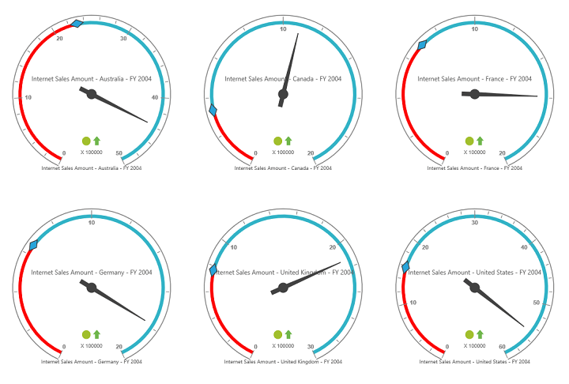

# Layout

## Row-wise layout

The gauges can be arranged in specified number of rows by using the `RowsCount` property.



    <ej:PivotGauge ID="PivotGauge1" runat="server" RowsCount="2">
    </ej:PivotGauge>



 

## Column-wise layout

The gauges can be arranged in specified number of columns by using the `ColumnsCount` property.



    <ej:PivotGauge ID="PivotGauge1" runat="server" ColumnsCount="2">
    </ej:PivotGauge>



