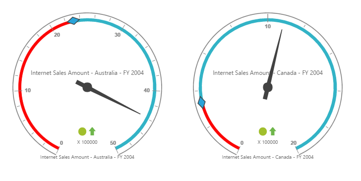

# Getting started

>**Important**
Starting with v16.2.0.x, if you refer to Syncfusion assemblies from trial setup or from the NuGet feed, include a license key in your projects. Refer to this [link](https://help.syncfusion.com/common/essential-studio/licensing/license-key) to learn about registering Syncfusion license key in your ASP.NET Core application to use our components.

## Creating a simple application with pivot gauge and OLAP data sources (client mode)

This section covers the information required to populate a simple pivot gauge with OLAP data completely on the client-side.

## Project initialization

Create a new **ASP.NET Empty Web Application** by using the Visual Studio IDE and name the project **“PivotGaugeDemo”**.

Now, add a Web Form to the ASP.NET empty web application. For adding a Web Form, right-click the project in the solution explorer and select **Add > New Item**. In the Add New Item window, select Web Form and name it Default.aspx, and then click Add.

Now, add the following dependency libraries as references to your web application. To add them to your application, right-click **References** in the solution explorer and select Add Reference. In the **Reference Manager** dialog, under **Assemblies > Extension**, the following Syncfusion libraries will be found.

* Syncfusion.EJ
* Syncfusion.EJ.Export
* Syncfusion.EJ.Pivot

Register the referenced assemblies in Web.config files available at the root of the application.



<compilation debug="true" targetFramework="4.5">
    <assemblies> 
        ……
        ……
        <add assembly="Syncfusion.EJ, Version= {{ site.45esreleaseversion }}, Culture=neutral, PublicKeyToken=3d67ed1f87d44c89" />
        <add assembly="Syncfusion.EJ.Pivot, Version= {{ site.45esreleaseversion }}, Culture=neutral, PublicKeyToken=3d67ed1f87d44c89" />
        <add assembly="Syncfusion.EJ.Export, Version= {{ site.45esreleaseversion }}, Culture=neutral, PublicKeyToken=3d67ed1f87d44c89" />

    </assemblies>
</compilation>


### Scripts and CSS initialization

The scripts and style sheets that are required to render the pivot gauge widget in a web application are mentioned below in an appropriate order:

1. ej.web.all.min.css
2. jQuery-3.0.0.min.js
3. ej.web.all.min.js

[Click here](http://help.syncfusion.com/js/cdn) here to know more about scripts and style sheets available in online (CDN link).

Scripts and style sheets are referred under the <head> tag in the **Default.aspx** file.
    


<head>
    <link href="http://cdn.syncfusion.com/{{ site.releaseversion }}/js/web/flat-azure/ej.web.all.min.css" rel="stylesheet" type="text/css" />
    
    
</head>


### Initialize pivot gauge

You can drag and drop the **pivot gauge** control from the toolbox (under Syncfusion BI Web category) or manually define the widget as shown in the following code sample in the “Default.aspx” page.



<%@ Register Assembly="Syncfusion.EJ.Pivot" Namespace="Syncfusion.JavaScript.Web" TagPrefix="ej" %>
<%@ Register Assembly="Syncfusion.EJ.Pivot" Namespace="Syncfusion.JavaScript.Models" TagPrefix="ej" %>
<%@ Register Assembly="Syncfusion.EJ" Namespace="Syncfusion.JavaScript.DataVisualization.Models" TagPrefix="ej" %>
    
<html> 
…… 
……
<body>
<form runat="server">
        <ej:PivotGauge ID="MyPivotGauge1" runat="server" ClientIDMode="Static">
        </ej:PivotGauge>
        <asp:ScriptManager ID="ScriptManager1" runat="server"></asp:ScriptManager>
</form>
</body>

</html>


### Populate pivot gauge With data source

Initializes the OLAP data source for the pivot gauge widget as shown below:



<html>

    //....
    <body>
        <form runat="server">
        <ej:PivotGauge ID="MyPivotGauge1" runat="server">
        <DataSource Catalog="Adventure Works DW 2008 SE" Cube="Adventure Works" Data="http://bi.syncfusion.com/olap/msmdpump.dll" >
            <Rows>
                <ej:Field  FieldName="[Date].[Fiscal]">
                </ej:Field>
            </Rows>
            <Columns>
                <ej:Field FieldName="[Customer].[Customer Geography]"></ej:Field>
            </Columns>
            <Values>
                <ej:Field Axis="Column">
                <Measures>
                    <ej:MeasuresItems FieldName="[Measures].[Internet Sales Amount]" />
                    <ej:MeasuresItems FieldName ="[Measures].[Internet Revenue Status]" />
                    <ej:MeasuresItems FieldName ="[Measures].[Internet Revenue Trend]" />
                    <ej:MeasuresItems FieldName ="[Measures].[Internet Revenue Goal]" />
                </Measures>
                </ej:Field>
            </Values>
        </DataSource>
        <ClientSideEvents RenderSuccess="loadPivotGaugeTheme" Load="onLoad"/>
        <Scales>
            <ej:CircularScales ShowRanges="true" Radius="150" ShowScaleBar="true" Size="1"  ShowIndicators="true" ShowLabels="true">
                <Border Width ="0.5" />
                <PointerCollection>
                <ej:Pointers ShowBackNeedle="true" BackNeedleLength="20"  Length="125" Width="7" ></ej:Pointers>
                <ej:Pointers Type="Marker" MarkerType="Diamond" DistanceFromScale="5" Placement="Center" BackgroundColor="#29A4D9" Length="25" Width="15"></ej:Pointers>
                </PointerCollection>
                <TickCollection>
                <ej:CircularTicks Type="Major" DistanceFromScale="2" Height="16" Width="1" Color="#8c8c8c" />
                <ej:CircularTicks Type="Minor" Height="6" Width="1" DistanceFromScale="2" Color="#8c8c8c" />
                </TickCollection>
                <LabelCollection>
                <ej:CircularLabels Color="#8c8c8c"></ej:CircularLabels>
                </LabelCollection>
                <RangeCollection>
                <ej:CircularRanges DistanceFromScale="-5" BackgroundColor="#fc0606">
                    <Border Color="#fc0606"/>
                </ej:CircularRanges>
                <ej:CircularRanges DistanceFromScale="-5"></ej:CircularRanges>
                </RangeCollection>
                <CustomLabelCollection>
                <ej:CircularCustomLabel Color="#666666">
                    <Position X="180" Y="290" />
                    
                </ej:CircularCustomLabel>
                <ej:CircularCustomLabel Color="#666666">
                    <Position X="180" Y="320" />
                    
                </ej:CircularCustomLabel>
                <ej:CircularCustomLabel Color="#666666">
                    <Position X="180" Y="150" />
                    
                </ej:CircularCustomLabel>
                </CustomLabelCollection>
            </ej:CircularScales>
        </Scales>
        <LabelFormatSettings DecimalPlaces="2" />
        </ej:PivotGauge>
        <asp:ScriptManager ID="ScriptManager1" runat="server"></asp:ScriptManager>
        
        
       </form> 
    </body>
</html>



The above code will generate a simple pivot gauge as shown in the following screenshot:

 

## Creating a simple application with pivot gauge and OLAP data sources (server mode)
 
This section covers the information required to create a simple pivot gauge bound to OLAP data source.

N> ASP.NET empty web application contains a service that will transfer the data to server-side, process it, and return it to client-side for control rendering and re-rendering. The service utilized for communication can be WCF or WebAPI based on user requirement.

### Project initialization

Create a new **ASP.NET Empty Web Application** by using the Visual Studio IDE and name the project **“PivotGaugeDemo”**.

Now, add a Web Form to the ASP.NET empty web application. For adding a Web Form, right-click the project in the solution explorer and select **Add > New Item**. In the Add New Item window, select Web Form and name it Default.aspx, and then click Add.

Add the following dependency libraries as references to your web application. To add them to your application, right-click **References** in the solution explorer and select Add Reference. In the **Reference Manager** dialog, under **Assemblies > Extension**, the following Syncfusion libraries are found.

N> If you have installed any version of SQL Server Analysis Service (SSAS) or Microsoft ADOMD.NET utility, then the location of Microsoft.AnalysisServices.AdomdClient library is [system drive:\Program Files (x86)\Microsoft.NET\ADOMD.NET]. And if you have installed any version of Essential Studio, then the location of Syncfusion libraries is [system drive:\Program Files (x86)\Syncfusion\Essential Studio\{{ site.releaseversion }}\Assemblies].

* Syncfusion.Compression.Base
* Syncfusion.Linq.Base
* Syncfusion.Olap.Base
* Syncfusion.PivotAnalysis.Base
* Syncfusion.EJ
* Syncfusion.EJ.Web
* Syncfusion.EJ.Export
* Syncfusion.EJ.Pivot

Register the referenced assemblies in Web.config files available at the root of the application.



<compilation debug="true" targetFramework="4.5">
    <assemblies> 
        …… 
        ……
        <add assembly="Syncfusion.EJ, Version= {{ site.45esreleaseversion }}, Culture=neutral, PublicKeyToken=3d67ed1f87d44c89" />
        <add assembly="Syncfusion.EJ.Web, Version= {{ site.45esreleaseversion }}, Culture=neutral, PublicKeyToken=3d67ed1f87d44c89" />
        <add assembly="Syncfusion.EJ.Pivot, Version= {{ site.45esreleaseversion }}, Culture=neutral, PublicKeyToken=3d67ed1f87d44c89" />
        <add assembly="Syncfusion.Linq.Base, Version= {{ site.45esreleaseversion }}, Culture=neutral, PublicKeyToken=3d67ed1f87d44c89" />
        <add assembly="Syncfusion.Olap.Base, Version= {{ site.45esreleaseversion }}, Culture=neutral, PublicKeyToken=3d67ed1f87d44c89" />
        <add assembly="Syncfusion.Compression.Base, Version= {{ site.45esreleaseversion }}, Culture=neutral, PublicKeyToken=3d67ed1f87d44c89" /> 
        <add assembly="Syncfusion.PivotAnalysis.Base, Version= {{ site.45esreleaseversion }}, Culture=neutral, PublicKeyToken=3d67ed1f87d44c89" /> 
    </assemblies>
</compilation>



### Scripts and CSS initialization

The scripts and style sheets that are required to render the pivot gauge widget in a web application are mentioned below in an appropriate order:

1. ej.web.all.min.css
2. jQuery-3.0.0.min.js
3. ej.web.all.min.js

[Click here](http://help.syncfusion.com/js/cdn) here to know more about scripts and style sheets available online (CDN Link).

Scripts and style sheets are referred under the **head** tag in **Default.aspx**.
    


<head>
    <link href="http://cdn.syncfusion.com/{{ site.releaseversion }}/js/web/flat-azure/ej.web.all.min.css" rel="stylesheet" type="text/css" />
    
    
</head>


### Control initialization

Drag and drop the **pivot gauge** control from the toolbox (under Syncfusion BI Web category) or manually define the widget as shown in the following code sample of the “Default.aspx” page.



<%@ Register Assembly="Syncfusion.EJ.Pivot" Namespace="Syncfusion.JavaScript.Web" TagPrefix="ej" %>
<%@ Register Assembly="Syncfusion.EJ.Pivot" Namespace="Syncfusion.JavaScript.Models" TagPrefix="ej" %>     
<%@ Register Assembly="Syncfusion.EJ" Namespace="Syncfusion.JavaScript.DataVisualization.Models" TagPrefix="ej" %> 

<html> 
…… 
……
<body>
<form runat="server">
       <ej:PivotGauge ID="MyPivotGauge1" runat="server" Url="/Olap"  ClientIDMode="Static">
         <ClientSideEvents RenderSuccess="loadPivotGaugeTheme"/>
        <Scales>
            <ej:CircularScales ShowRanges="true" Radius="150" ShowScaleBar="true" Size="1"  ShowIndicators="true" ShowLabels="true">
                <Border Width ="0.5" />
                <PointerCollection>                    
                    <ej:Pointers ShowBackNeedle="true" BackNeedleLength="20"  Length="125" Width="7" ></ej:Pointers>
                    <ej:Pointers Type="Marker" MarkerType="Diamond" DistanceFromScale="5" Placement="Center" BackgroundColor="#29A4D9" Length="25" Width="15"></ej:Pointers>
                </PointerCollection>
                <TickCollection>
                    <ej:CircularTicks Type="Major" DistanceFromScale="2" Height="16" Width="1" Color="#8c8c8c" />
                    <ej:CircularTicks Type="Minor" Height="6" Width="1" DistanceFromScale="2" Color="#8c8c8c" />
                </TickCollection>
                <LabelCollection>
                    <ej:CircularLabels Color="#8c8c8c"></ej:CircularLabels>
                </LabelCollection>
                <RangeCollection>
                    <ej:CircularRanges DistanceFromScale="-5" BackgroundColor="#fc0606">
                        <Border Color="#fc0606"/></ej:CircularRanges>
                    <ej:CircularRanges DistanceFromScale="-5"></ej:CircularRanges>
                </RangeCollection>
                <CustomLabelCollection>
                    <ej:CircularCustomLabel Color="#666666">
                        <Position X="180" Y="290" />
                        
                    </ej:CircularCustomLabel>
                    <ej:CircularCustomLabel Color="#666666">
                        <Position X="180" Y="320" />
                        
                    </ej:CircularCustomLabel>
                    <ej:CircularCustomLabel Color="#666666">
                        <Position X="180" Y="150" />
                        
                    </ej:CircularCustomLabel>
                </CustomLabelCollection>   
            </ej:CircularScales>
        </Scales>
        <LabelFormatSettings DecimalPlaces="2" />
        </ej:PivotGauge>
        <asp:ScriptManager ID="ScriptManager1" runat="server"></asp:ScriptManager>
</form>
</body>

</html>
    


The **“Url”** property in the pivot gauge widget points the service endpoint, where the data is processed and fetched in the form of JSON. The services used in the pivot gauge widget as an endpoint are WCF and WebAPI.

N> The above "Default.aspx" contains WebAPI URL, which is "/Olap". If the WCF service is used as an endpoint, then the URL will look like "/OlapService.svc".

### WebAPI

**Adding a WebAPI controller**

To add a WebAPI controller in your existing web application, right-click the project in the solution explorer and select **Add > New Item.** In the **Add New Item** window, select **WebAPI Controller Class** and name it “OlapController.cs”, and then click **Add.**

Now, the WebAPI controller is added to your application, which, in-turn, comprises the following file. The utilization of this file will be explained in the following sections:
 
* OlapController.cs

N> While adding the WebAPI controller class, add the mandatory suffix “Controller”. For example, in the demo, the controller is named “OlapController”.

Next, remove all the existing methods such as “Get”, “Post”, “Put”, and “Delete” present in the `OlapController.cs` file.



namespace PivotGaugeDemo
{
    public class OlapController : ApiController
    {
    
    }
}



**List of namespaces**

Following are the list of namespaces to be added on top of the main class in the `OlapController.cs` file:



using Syncfusion.Olap.Manager;
using Syncfusion.Olap.Reports;
using Syncfusion.JavaScript;

namespace PivotGaugeDemo
{
    public class OlapController : ApiController
    {

    }
}



**Data source initialization**

Now, the connection string to connect OLAP cube and pivot gauge instances is created immediately in the main class of the `OlapController.cs` file.



namespace PivotGaugeDemo
{
    public class OlapController : ApiController
    {
        string connectionString = "Data Source=http://bi.syncfusion.com/olap/msmdpump.dll; Initial Catalog=Adventure Works DW 2008 SE;";
        PivotGauge htmlHelper = new PivotGauge();
        //Other codes
    }
}



**Service methods in WebAPI controller**

Now, you can define the service methods in the OlapController class, find in the `OlapController.cs` file which was created while adding the WebAPI controller class to your web application.
 


namespace PivotGaugeDemo
{
    public class OlapController : ApiController
    {
        string connectionString = "Data Source=http://bi.syncfusion.com/olap/msmdpump.dll; Initial Catalog=Adventure Works DW 2008 SE;";
        PivotGauge htmlHelper = new PivotGauge();

        [System.Web.Http.ActionName("InitializeGauge")]
        [System.Web.Http.HttpPost]
        public Dictionary<string, object> InitializeGauge(Dictionary<string, object> jsonResult)
        {
            OlapDataManager DataManager = new OlapDataManager(connectionString);
            DataManager.SetCurrentReport(CreateOlapReport());
            return htmlHelper.GetJsonData(jsonResult["action"].ToString(), DataManager);
        }

        private OlapReport CreateOlapReport()
        {
            OlapReport olapReport = new OlapReport();
            olapReport.Name = "Default Report";
            olapReport.CurrentCubeName = "Adventure Works";

            DimensionElement dimensionElementColumn = new DimensionElement();
            //Specifying the Name for the Dimension Element
            dimensionElementColumn.Name = "Customer";
            dimensionElementColumn.AddLevel("Customer Geography", "Country");

            MeasureElements measureElementColumn = new MeasureElements();
            //Specifying the Name for the Measure Element
            measureElementColumn.Elements.Add(new MeasureElement { Name = "Customer Count" });

            DimensionElement dimensionElementRow = new DimensionElement();
            //Specifying the Dimension Name
            dimensionElementRow.Name = "Date";
            dimensionElementRow.AddLevel("Fiscal", "Fiscal Year");

            ///Adding Row Members
            olapReport.SeriesElements.Add(dimensionElementRow);
            ///Adding Column Members
            olapReport.CategoricalElements.Add(dimensionElementColumn);
            ///Adding Measure Element
            olapReport.CategoricalElements.Add(measureElementColumn);
            return olapReport;
        }
    }
}



**Configure routing in global application class**

To add a Global.asax in your existing web application, right-click the project in the solution explorer and select **Add > New** item. In the **Add New Item** window, select **Global Application** class and name it **“Global.asax”**, and then click **Add.**
 
After adding the **Global.asax** file, delete all methods in the **Global** class and add the namespace **“using System.Web.Http;”**, and then configure the routing as shown in the following code example:



public class Global : System.Web.HttpApplication
{
    protected void Application_Start(object sender, EventArgs e)
    {
        GlobalConfiguration.Configuration.Routes.MapHttpRoute(
            name: "DefaultApi",
            routeTemplate: "{controller}/{action}/{id}",
            defaults: new { id = RouteParameter.Optional });
        AppDomain.CurrentDomain.SetData("SQLServerCompactEditionUnderWebHosting", true);
    }
}
    


Now, the pivot gauge will be rendered with the provided data as shown below:

 

### WCF

This section demonstrates the utilization of WCF service as endpoint binding the OLAP data source to a simple pivot gauge. For more details on this topic, [click here](http://help.syncfusion.com/aspnet/PivotGauge/olap-connectivity#wcf).

