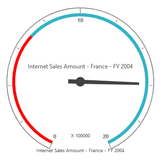

# Pointers

## Pointer types

The pivot gauge has two types of pointers namely,

* Needle
* Marker

Needle type pointer is the default pointer which is always located at the center of the gauge. Following are the supported shapes for needle pointers:

* Rectangle
* Triangle
* Trapezoid
* Arrow
* Image.



    <ej:PivotGauge ID="PivotGauge1" runat="server">
        <Scales>
            <ej:CircularScales>
                <PointerCollection>
                    <ej:Pointers Type="Needle" NeedleType="Trapezoid"></ej:Pointers>
                </PointerCollection>
            </ej:CircularScales>
        </Scales>
    </ej:PivotGauge>



 

For marker pointer, the available shapes are Rectangle, Triangle, Ellipse, Diamond, Pentagon, Circle, Slider, Pointer, Wedge, Trapezoid, RoundedRectangle, and Image.



    <ej:PivotGauge ID="PivotGauge1" runat="server">
        <Scales>
            <ej:CircularScales>
                <PointerCollection>
                    <ej:Pointers Type="Marker" MarkerType="Diamond"></ej:Pointers>
                </PointerCollection>
            </ej:CircularScales>
        </Scales>
    </ej:PivotGauge>



 

## Adding pointer collection

The pointer collection can be directly added to the scales option within the pivot gauge control.



    <ej:PivotGauge ID="PivotGauge1" runat="server">
        <Scales>
            <ej:CircularScales>
                <PointerCollection>
                    <ej:Pointers Type="Needle" NeedleType="Triangle"></ej:Pointers>
                    <ej:Pointers Type="Marker" MarkerType="Diamond"></ej:Pointers>
                </PointerCollection>
            </ej:CircularScales>
        </Scales>
    </ej:PivotGauge>



## Appearance customization

The appearance of the pointer can be customized through the following properties:

* **Border**: Sets the color and width of the pointer border.
* **BackgroundColor**: Sets the background color of the pointer.
* **Length**: Sets the length of the pointer.
* **Width**: Sets the width of the pointer.
* **Opacity**: Sets the opacity of the pointer. By default, the value is 1.
* **Type**: Sets the type of the pointer. By default, the type is needle.



    <ej:PivotGauge ID="PivotGauge1" runat="server">
        <Scales>
            <ej:CircularScales>
                <PointerCollection>
                    //For customizing needle pointer
                    <ej:Pointers Type="Needle" NeedleType="Triangle" BackgroundColor="yellow" Length="120" Width="7" Opacity="60">
                        <Border Color="green" Width="2" />
                    </ej:Pointers>
                    //For customizing marker pointer
                    <ej:Pointers Type="Marker" MarkerType="Diamond" BackgroundColor="yellow" Length="25" Width="15" Opacity="80">
                        <Border Color="green" Width="2" />
                    </ej:Pointers>
                </PointerCollection>
            </ej:CircularScales>
        </Scales>
    </ej:PivotGauge>



 

## Pointer position

The pointer can be positioned with the help of the following two properties:

* **DistanceFromScale**: Defines the distance between the scale and the pointer. By default, the value is 0.
* **Placement**: Defines the location of the pointer. By default, the value is center.

N> Both the properties can be applied only if the pointer type is set to marker. The needle type pointer appears only at the center of the control, which is its default position.



    <ej:PivotGauge ID="PivotGauge1" runat="server">
        <Scales>
            <ej:CircularScales>
                <PointerCollection>
                    <ej:Pointers Type="Marker" Placement="Far" DistanceFromScale="2">
                    </ej:Pointers>
                </PointerCollection>
            </ej:CircularScales>
        </Scales>
    </ej:PivotGauge>



## Pointer image

It is possible to replace the pointers with an image. To view the pointers as an image, set the appropriate location in the `ImageUrl` property.



    <ej:PivotGauge ID="PivotGauge1" runat="server">
        <Scales>
            <ej:CircularScales>
                <PointerCollection>
                    //For replacing needle pointer with image
                    <ej:Pointers Type="Needle" NeedleType="Image" ImageUrl="../image.png"></ej:Pointers>
                    //For replacing marker pointer with image
                    <ej:Pointers Type="Marker" MarkerType="Image" ImageUrl="../image.png"></ej:Pointers>
                </PointerCollection>
            </ej:CircularScales>
        </Scales>
    </ej:PivotGauge>



## Pointer value text

To display the current value of pointers in the pivot gauge control, the **"PointerValueText"** option is used. Following are the properties used to enable and customize the pointer value text:
 
* **ShowValue**: Enables the pointer value text by setting the property to true. By default, its value is true.
* **Distance**: Sets the distance between pointer and text.
* **Color**: Sets the color of the text.
* **Opacity**: Sets the opacity of the text. By default, its value is 1.
* **Angle**: Sets the rotation angle of the text. By default, its value is 0.
* **Font**: Sets the font size, font style, and font family of the text.



    <ej:PivotGauge ID="PivotGauge1" runat="server">
        <Scales>
            <ej:CircularScales>
                <PointerCollection>
                    //For needle type
                    <ej:Pointers Type="Needle">
                        <PointerValueText ShowValue="true" Distance="10" Color="red" Opacity="70" Angle="20">
                            
                        </PointerValueText>
                    </ej:Pointers>
                    //For marker type
                    <ej:Pointers Type="Marker">
                        <PointerValueText ShowValue="true" Distance="40" Color="red" Opacity="70" Angle="-40">
                            
                        </PointerValueText>
                    </ej:Pointers>
                </PointerCollection>
            </ej:CircularScales>
        </Scales>
    </ej:PivotGauge>



