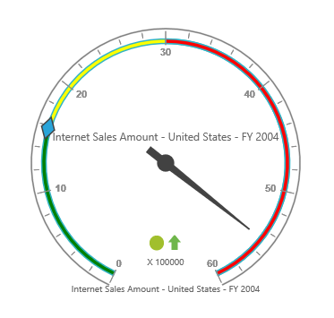

# Ranges

## Adding range collection

The `RangeCollection` can be directly added to the scales option within the pivot gauge control.



    <ej:PivotGauge ID="PivotGauge1" runat="server">
        <Scales>
            <ej:CircularScales ShowRanges="true">
                <RangeCollection>
                    <ej:CircularRanges DistanceFromScale="10"></ej:CircularRanges>
                </RangeCollection>
            </ej:CircularScales>
        </Scales>
    </ej:PivotGauge>



## Appearance customization

The appearance of the range can be customized through the following properties:

* **StartValue**: Defines the start position of the range.
* **EndValue**: Defines the end position of the range.
* **StartWidth**: Sets the width at starting position of the range.
* **EndWidth**: Sets the width at ending position of the range.
* **BackgroundColor**: Sets the background color of the range.
* **Border**: Sets the height and width of the border of the range.
* **Placement**: Sets the position of the range.
* **DistanceFromScale**: Sets the distance between the range and the scale.

Positioning the range can be set through the `Placement` or `DistanceFromScale` property. 

N> By default, the placement takes the value "near", whereas other enumeration values available are "far" and "center".



    <ej:PivotGauge ID="PivotGauge1" runat="server">
        <Scales>
            <ej:CircularScales ShowRanges="true">
                <RangeCollection>
                    <ej:CircularRanges StartValue="20" EndValue="50" StartWidth="2" EndWidth="6" BackgroundColor="yellow" DistanceFromScale="20">
                        <Border Color="red" Width="2" />
                    </ej:CircularRanges>
                    <ej:CircularRanges StartValue="50" EndValue="100" StartWidth="2" EndWidth="7" BackgroundColor="blue" Placement="Near">
                        <Border Color="green" Width="2" />
                    </ej:CircularRanges>
                </RangeCollection>
            </ej:CircularScales>
        </Scales>
    </ej:PivotGauge>



N> When you set both the position properties - "DistanceFromScale" and "Placement" for a range, preference is given to the value that is set in the "DistanceFromScale" property.

## Multiple ranges

Multiple ranges can be added to the `RangeCollection` in the scales option within the pivot gauge control.



    <ej:PivotGauge ID="PivotGauge1" runat="server">
        <Scales>
            <ej:CircularScales ShowRanges="true">
                <RangeCollection>
                    <ej:CircularRanges StartValue="0" EndValue="10" BackgroundColor="green" DistanceFromScale="-5"></ej:CircularRanges>
                    <ej:CircularRanges StartValue="10" EndValue="30" BackgroundColor="yellow" DistanceFromScale="-5"></ej:CircularRanges>
                    <ej:CircularRanges StartValue="30" EndValue="50" BackgroundColor="red" DistanceFromScale="-5"></ej:CircularRanges>
                </RangeCollection>
            </ej:CircularScales>
        </Scales>
    </ej:PivotGauge>



