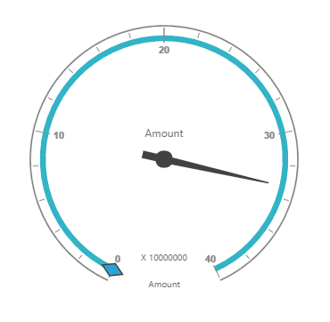

# Getting Started

## Creating a simple application with PivotGauge and Relational datasource (Client Mode)

This section covers the information required to populate a simple PivotGauge with Relational data completely on the client-side.

## Project Initialization

Create a new **ASP.NET Empty Web Application** using Visual Studio IDE and name the project as **“PivotGaugeDemo”**.

Now add a “Web Form” to the ASP.NET Empty Web Application. For adding a “Web Form”, right-click on the project in Solution Explorer and select **Add > New Item**. In the Add New Item window, select “Web Form” and name it as Default.aspx and click “Add”.

Now add the following dependency libraries as references into your Web Application. In order to add them to your application, right-click on **References** in Solution Explorer and select Add Reference. Now in the **Reference Manager** dialog, under **Assemblies > Extension**, the following Syncfusion libraries will be found.

* Syncfusion.EJ
* Syncfusion.EJ.Pivot

Register the referenced assemblies in Web.config files available at the root of the application.



<compilation debug="true" targetFramework="4.5">
    <assemblies> 
        ……
        ……
        <add assembly="Syncfusion.EJ, Version= {{ site.45esreleaseversion }}, Culture=neutral, PublicKeyToken=3d67ed1f87d44c89" />
        <add assembly="Syncfusion.EJ.Pivot, Version= {{ site.45esreleaseversion }}, Culture=neutral, PublicKeyToken=3d67ed1f87d44c89" />
        
    </assemblies>
</compilation>



### Scripts and CSS Initialization

The scripts and style sheets that are mandatorily required to render PivotGauge widget in a  Web Application are mentioned in an appropriate order below:

1. ej.web.all.min.css
2. jQuery-3.0.0.min.js
3. ej.web.all.min.js

[Click here](http://help.syncfusion.com/js/cdn) here to know more about scripts and style sheets available online (CDN Link).

Scripts and style sheets are referred under the <head> tag in **Default.aspx** file.
    


<head>
    <link href="http://cdn.syncfusion.com/{{ site.releaseversion }}/js/web/flat-azure/ej.web.all.min.css" rel="stylesheet" type="text/css" />
    
    
</head>


### Initialize PivotGauge

Either drag and drop the **PivotGauge** control from the toolbox (under Syncfusion BI Web category) or manually define the widget like in the below code sample inside “Default.aspx” page.



<%@ Register Assembly="Syncfusion.EJ.Pivot" Namespace="Syncfusion.JavaScript.Web" TagPrefix="ej" %>
<%@ Register Assembly="Syncfusion.EJ.Pivot" Namespace="Syncfusion.JavaScript.Models" TagPrefix="ej" %>
<%@ Register Assembly="Syncfusion.EJ" Namespace="Syncfusion.JavaScript.DataVisualization.Models" TagPrefix="ej" %> 

<html> 
…… 
……
<body>
<form runat="server">
        <ej:PivotGauge ID="MyPivotGauge1" runat="server" ClientIDMode="Static">
        </ej:PivotGauge>
        <asp:ScriptManager ID="ScriptManager1" runat="server"></asp:ScriptManager>
</form>
</body>

</html>



### Populate PivotGauge With Data

Let us now see how to populate the PivotGauge control using a sample JSON data as shown below. 



<ej:PivotGauge ID="MyPivotGauge1" runat="server" ClientIDMode="Static">
    <ClientSideEvents Load="onLoad" />
</ej:PivotGauge>
<asp:ScriptManager ID="ScriptManager1" runat="server"></asp:ScriptManager>



The JSON data is set to the **"Data"** property present inside the **"DataSource"** object. **"DataSource"** object allows us to set both datasource as well as the fields that needs to be displayed in the row, column, value and filter section of the PivotGauge control.
  


<!DOCTYPE html>
<html>

    //....
    <body>
        <ej:PivotGauge ID="MyPivotGauge1" runat="server" BackgroundColor="transparent" ClientIDMode="Static">
            <DataSource>
                <Rows>
                    <ej:Field FieldName="Country" FieldCaption="Country"></ej:Field>
                    <ej:Field FieldName="State" FieldCaption="State"></ej:Field>
                </Rows>
                <Columns>
                    <ej:Field FieldName="Product" FieldCaption="Product"></ej:Field>
                </Columns>
                <Values>
                    <ej:Field FieldName="Amount" FieldCaption="Amount"></ej:Field>
                    <ej:Field FieldName="Quantity" FieldCaption="Quantity"></ej:Field>
                </Values>
            </DataSource>
            <ClientSideEvents RenderSuccess="loadPivotGaugeTheme" Load ="onLoad"/>
            <Scales>
                <ej:CircularScales ShowRanges="true" Radius="150" ShowScaleBar="true" Size="1"  ShowIndicators="true" ShowLabels="true">
                    <Border Width ="0.5" />
                    <PointerCollection>
                        <ej:Pointers ShowBackNeedle="true" BackNeedleLength="20"  Length="125" Width="7" ></ej:Pointers>
                        <ej:Pointers Type="Marker" MarkerType="Diamond" DistanceFromScale="5" Placement="Center" BackgroundColor="#29A4D9" Length="25" Width="15"></ej:Pointers>
                    </PointerCollection>
                    <TickCollection>
                        <ej:CircularTicks Type="Major" DistanceFromScale="2" Height="16" Width="1" Color="#8c8c8c" />
                        <ej:CircularTicks Type="Minor" Height="6" Width="1" DistanceFromScale="2" Color="#8c8c8c" />
                    </TickCollection>
                    <LabelCollection>
                        <ej:CircularLabels Color="#8c8c8c"></ej:CircularLabels>
                    </LabelCollection>
                    <RangeCollection>
                        <ej:CircularRanges DistanceFromScale="-5" BackgroundColor="#fc0606">
                        <Border Color="#fc0606"/>
                        </ej:CircularRanges>
                        <ej:CircularRanges DistanceFromScale="-5"></ej:CircularRanges>
                    </RangeCollection>
                    <CustomLabelCollection>
                        <ej:CircularCustomLabel Color="#666666">
                        <Position X="180" Y="290" />
                        
                        </ej:CircularCustomLabel>
                        <ej:CircularCustomLabel Color="#666666">
                        <Position X="180" Y="320" />
                        
                        </ej:CircularCustomLabel>
                        <ej:CircularCustomLabel Color="#666666">
                        <Position X="180" Y="150" />
                        
                        </ej:CircularCustomLabel>
                    </CustomLabelCollection>
                </ej:CircularScales>
            </Scales>
            <LabelFormatSettings DecimalPlaces="2" />
            <ClientSideEvents Load="onLoad" />
            </ej:PivotGauge>
            <asp:ScriptManager ID="ScriptManager1" runat="server"></asp:ScriptManager>
            
            
    </body>
</html>



The above code will generate a simple PivotGauge with values in "Country" field as segments, values in "Product" field as series and "Amount" field as points.

 

## Creating a simple application with PivotGauge and Relational datasource (Server Mode)

This section covers the information required to create a simple PivotGauge bound to Relational datasource. 

N> ASP.NET Empty Web Application will contain a service that transfers data to server-side, processes and returns back to client-side for control rendering and re-rendering. The service utilized for communication could be either WCF or WebAPI based on user requirement.

### Project Initialization

Create a new **ASP.NET Empty Web Application** using Visual Studio IDE and name the project as **“PivotGaugeDemo”**.

Now add a “Web Form” to the ASP.NET Empty Web Application. For adding a “Web Form”, right-click on the project in Solution Explorer and select **Add > New Item**. In the Add New Item window, select “Web Form” and name it as Default.aspx and click “Add”.

Now add the following dependency libraries as references into your Web Application. In order to add them to your application, right-click on **References** in Solution Explorer and select Add Reference. Now in the **Reference Manager** dialog, under **Assemblies > Extension**, the following Syncfusion libraries will be found.

* Syncfusion.Compression.Base
* Syncfusion.Linq.Base
* Syncfusion.Olap.Base
* Syncfusion.PivotAnalysis.Base
* Syncfusion.XlsIO.Base
* Syncfusion.Pdf.Base
* Syncfusion.DocIO.Base
* Syncfusion.EJ
* Syncfusion.EJ.Web
* Syncfusion.EJ.Pivot

Register the referenced assemblies in Web.config files available at the root of the application.



<compilation debug="true" targetFramework="4.5">
    <assemblies> 
        …… 
        ……
        <add assembly="Syncfusion.EJ, Version= {{ site.45esreleaseversion }}, Culture=neutral, PublicKeyToken=3d67ed1f87d44c89" />
        <add assembly="Syncfusion.EJ.Web, Version= {{ site.45esreleaseversion }}, Culture=neutral, PublicKeyToken=3d67ed1f87d44c89" />
        <add assembly="Syncfusion.EJ.Pivot, Version= {{ site.45esreleaseversion }}, Culture=neutral, PublicKeyToken=3d67ed1f87d44c89" />
        <add assembly="Syncfusion.Linq.Base, Version= {{ site.45esreleaseversion }}, Culture=neutral, PublicKeyToken=3d67ed1f87d44c89" />
        <add assembly="Syncfusion.Olap.Base, Version= {{ site.45esreleaseversion }}, Culture=neutral, PublicKeyToken=3d67ed1f87d44c89" />
        <add assembly="Syncfusion.Pdf.Base, Version= {{ site.45esreleaseversion }}, Culture=neutral, PublicKeyToken=3d67ed1f87d44c89" />
        <add assembly="Syncfusion.XlsIO.Base, Version= {{ site.45esreleaseversion }}, Culture=neutral, PublicKeyToken=3d67ed1f87d44c89" />
        <add assembly="Syncfusion.DocIO.Base, Version= {{ site.45esreleaseversion }}, Culture=neutral, PublicKeyToken=3d67ed1f87d44c89" /> 
    </assemblies>
</compilation>



### Scripts and CSS Initialization

The scripts and style sheets that are mandatorily required to render PivotGauge widget in a Web Application are mentioned in an appropriate order below:

1. ej.web.all.min.css
2. jQuery-3.0.0.min.js
3. ej.web.all.min.js

[Click here](http://help.syncfusion.com/js/cdn) here to know more about scripts and style sheets available online (CDN Link).

Scripts and style sheets are referred under the **head** tag in **Default.aspx**.
    


<head>
    <link href="http://cdn.syncfusion.com/{{ site.releaseversion }}/js/web/flat-azure/ej.web.all.min.css" rel="stylesheet" type="text/css" />
    
    
</head>


### Control Initialization

Either drag and drop the **PivotGauge** control from the toolbox (under Syncfusion BI Web category) or manually define the widget like in the below code sample inside “Default.aspx” page.



<%@ Register Assembly="Syncfusion.EJ.Pivot" Namespace="Syncfusion.JavaScript.Web" TagPrefix="ej" %>
<%@ Register Assembly="Syncfusion.EJ.Pivot" Namespace="Syncfusion.JavaScript.Models" TagPrefix="ej" %>
<%@ Register Assembly="Syncfusion.EJ" Namespace="Syncfusion.JavaScript.DataVisualization.Models" TagPrefix="ej" %> 

<html> 
…… 
……
<body>
<form runat="server">
        <ej:PivotGauge ID="MyPivotGauge1" runat="server" Url="/Relational"  ClientIDMode="Static">
        </ej:PivotGauge>
        <asp:ScriptManager ID="ScriptManager1" runat="server"></asp:ScriptManager>
</form>
</body>

</html>
    


The **“Url”** property in PivotGauge widget points the service endpoint, where data are processed and fetched in the form of JSON. The services used in PivotGauge widget as endpoint are WCF and WebAPI.

N> The above "Default.aspx" contains WebAPI URL, which is "/Relational". If WCF service is used as endpoint, the URL would look like "/RelationalService.svc".

### WebAPI

**Adding a WebAPI Controller**

To add a WebAPI controller in an existing Empty Web Application, right-click on the project in Solution Explorer and select **Add > New Item**. In the **Add New Item** window, select **WebAPI Controller Class** and name it as **“RelationalController.cs”**, click **Add**.

Now, WebAPI controller is added to the application successfully with the file **“RelationalController.cs”**.

N> While adding WebAPI Controller Class, name it with the suffix “Controller” that is mandatory. For example, in demo the controller is named as “RelationalController”.

Next, remove all the existing methods such as “Get”, “Post”, “Put” and “Delete” present inside `RelationalController.cs` file.



namespace PivotGaugeDemo
{
    public class RelationalController: ApiController
    {
    
    }
}



**List of Namespaces**

Following are the list of namespaces to be added on top of the main class inside `RelationalController.cs` file.
 


using Syncfusion.JavaScript;
using Syncfusion.PivotAnalysis.Base; 

namespace PivotGaugeDemo
{
    public class RelationalController : ApiController
    {

    }
}


**Datasource Initialization**

A simple collection is provided as a datasource for the PivotGauge in this demo section. This datasource is placed inside a separate class “ProductSales” in `RelationalController.cs` file. Refer to the following code example.



namespace PivotGaugeDemo
{
    //....
    //....
    
    internal class ProductSales
    {
        public string Product { get; set; }

        public string Date { get; set; }

        public string Country { get; set; }

        public string State { get; set; }

        public int Quantity { get; set; }

        public double Amount { get; set; }

        public static ProductSalesCollection GetSalesData()
        {
            /// Geography
            string[] countries = new string[] { "Australia", "Canada", "France", "Germany", "United Kingdom", "United States" };
            string[] ausStates = new string[] { "New South Wales", "Queensland", "South Australia", "Tasmania", "Victoria" };
            string[] canadaStates = new string[] { "Alberta", "British Columbia", "Brunswick", "Manitoba", "Ontario", "Quebec" };
            string[] franceStates = new string[] { "Charente-Maritime", "Essonne", "Garonne (Haute)", "Gers", };
            string[] germanyStates = new string[] { "Bayern", "Brandenburg", "Hamburg", "Hessen", "Nordrhein-Westfalen", "Saarland" };
            string[] ukStates = new string[] { "England" };
            string[] ussStates = new string[] { "New York", "North Carolina", "Alabama", "California", "Colorado", "New Mexico", "South Carolina" };

            /// Time
            string[] dates = new string[] { "FY 2005", "FY 2006", "FY 2007", "FY 2008", "FY 2009" };

            /// Products
            string[] products = new string[] { "Bike", "Van", "Car" };
            Random r = new Random(123345345);

            int numberOfRecords = 2000;
            ProductSalesCollection listOfProductSales = new ProductSalesCollection();
            for (int i = 0; i < numberOfRecords; i++)
            {
                ProductSales sales = new ProductSales();
                sales.Country = countries[r.Next(1, countries.GetLength(0))];
                sales.Quantity = r.Next(1, 12);
                /// 1 percent discount for 1 quantity
                double discount = (30000 * sales.Quantity) * (double.Parse(sales.Quantity.ToString()) / 100);
                sales.Amount = (30000 * sales.Quantity) - discount;
                sales.Date = dates[r.Next(r.Next(dates.GetLength(0) + 1))];
                sales.Product = products[r.Next(r.Next(products.GetLength(0) + 1))];
                switch (sales.Product)
                {
                    case "Car":
                    {
                        sales.Date = "FY 2005";
                        break;
                    }
                }
                switch (sales.Country)
                {
                    case "Australia":
                    {
                        sales.State = ausStates[r.Next(ausStates.GetLength(0))];
                        break;
                    }
                    case "Canada":
                    {
                        sales.State = canadaStates[r.Next(canadaStates.GetLength(0))];
                        break;
                    }
                    case "France":
                    {
                        sales.State = franceStates[r.Next(franceStates.GetLength(0))];
                        break;
                    }
                    case "Germany":
                    {
                        sales.State = germanyStates[r.Next(germanyStates.GetLength(0))];
                        break;
                    }
                    case "United Kingdom":
                    {
                        sales.State = ukStates[r.Next(ukStates.GetLength(0))];
                        break;
                    }
                    case "United States":
                    {
                        sales.State = ussStates[r.Next(ussStates.GetLength(0))];
                        break;
                    }
                }
                listOfProductSales.Add(sales);
            }
            return listOfProductSales;
        }

        public override string ToString()
        {
            return string.Format("{0}-{1}-{2}", this.Country, this.State, this.Product);
        }

        public class ProductSalesCollection : List<ProductSales>
        {
        }
    }
}


**Service methods in WebAPI Controller**

Now you need to define the service methods inside RelationalController class, found inside `RelationalController.cs` file, created while adding WebAPI Controller Class to your Web Application.
 


namespace PivotGaugeDemo
{
    public class RelationalController : ApiController
    {
        PivotGauge htmlHelper = new PivotGauge();
        Dictionary<string, object> dict = new Dictionary<string, object>();

        [HttpPost]
        [ActionName("InitializeGauge")]
        public Dictionary<string, object> InitializeGauge(Dictionary<string, object> jsonResult)
        {
            htmlHelper.PivotReport = BindDefaultData();
            dict = htmlHelper.GetJsonData(jsonResult["action"].ToString(), ProductSales.GetSalesData());
            return dict;
        }

        private PivotReport BindDefaultData()
        {
            PivotReport pivotSetting = new PivotReport();
            pivotSetting.PivotRows.Add(new PivotItem { FieldMappingName = "Date", FieldHeader = "Date", TotalHeader = "Total" });
            pivotSetting.PivotColumns.Add(new PivotItem { FieldMappingName = "Product", FieldHeader = "Product", TotalHeader = "Total" });
            pivotSetting.PivotCalculations.Add(new PivotComputationInfo { CalculationName = "Amount", Description = "Amount", FieldHeader = "Amount", FieldName = "Amount", Format = "C", SummaryType = Syncfusion.PivotAnalysis.Base.SummaryType.DoubleTotalSum });
            return pivotSetting;
        }
    }
    .....
    ..... // Datasource initialization
    .....
}


**Configure routing in Global Application Class**

To add a Global.asax in your existing Web Application, right-click on the project in Solution Explorer and select **Add > New** Item. In the **Add New Item** window, select **Global Application** Class and name it as **“Global.asax”**, click **Add.**
 
Once you finish adding the **Global.asax** file, delete all the methods inside the **Global** class and add the namespace **“using System.Web.Http;”** and then you can configure routing like in the following code example.



public class Global : System.Web.HttpApplication
{
    protected void Application_Start(object sender, EventArgs e)
    {
        GlobalConfiguration.Configuration.Routes.MapHttpRoute(
            name: "DefaultApi",
            routeTemplate: "{controller}/{action}/{id}",
            defaults: new { id = RouteParameter.Optional });
        AppDomain.CurrentDomain.SetData("SQLServerCompactEditionUnderWebHosting", true);
    }
}


Now, **PivotGauge** will be rendered as shown in the below figure.

 

### WCF

This section demonstrates the utilization of WCF service as endpoint binding Relational datasource to a simple PivotGauge. For more details on this topic, [click here](http://help.syncfusion.com/aspnet/PivotGauge/relational-connectivity#wcf-1).