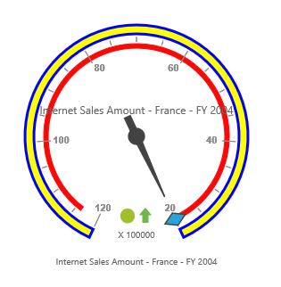

# Scale

## Adding scale

The scale can be added within the pivot gauge control.



    <ej:PivotGauge ID="PivotGauge1" runat="server">
        <Scales>
            <ej:CircularScales ShowScaleBar="true" Radius="150"></ej:CircularScales>
        </Scales>
    </ej:PivotGauge>



 

## Scale customization

### Pointer cap

The pointer cap is a circular shape element which is located at the center of the pivot gauge. It can be customized with the `PointerCap` property in the scales option. Following are the properties used to customize its appearance:

* **Radius**: Sets the radius of the pointer cap.
* **BorderColor**: Sets the color of the pointer cap border.
* **BorderWidth**: Sets the width of the pointer cap border.
* **BackgroundColor**: Sets the background color of the pointer cap.



    <ej:PivotGauge ID="PivotGauge1" runat="server">
        <Scales>
            <ej:CircularScales ShowScaleBar="true" Radius="150">
                <PointerCap BackgroundColor="yellow" BorderColor="green" Radius="5" BorderWidth="2"></PointerCap>
            </ej:CircularScales>
        </Scales>
    </ej:PivotGauge>



### Appearance
The appearance of the scale can be customized through the following properties:

* **Radius**: Sets the radius of the scale.
* **BackgroundColor**: Sets the background color of the scale.
* **Border**: Sets the border of the scale with color and width properties.
* **Size**: Sets the size of the scale.
* **Minimum**: Sets the least value of the scale.
* **Maximum**: Sets the highest value of the scale.
* **MajorIntervalValue**: Sets the interval between minor ticks in the scale.
* **MinorIntervalValue**: Sets the interval between major ticks in the scale.
* **Direction**: Sets the direction of the scale. By default, it takes the clockwise direction.

The `ShowIndicators`, `ShowTicks`, `ShowRanges`, `ShowPointers`, and `ShowScaleBar` properties are used to enable/disable the indicators, ticks, ranges, pointers, and scale bar respectively.  By default, `ShowTicks` and `ShowPointers` are set to true, other properties are set as false. 



    <ej:PivotGauge ID="PivotGauge1" runat="server">
        <Scales>
            <ej:CircularScales ShowScaleBar="true" Radius="120" BackgroundColor="yellow" Size="10" Minimum="20" Maximum="120" MajorIntervalValue="20" MinorIntervalValue="5" Direction="CounterClockwise">
                <Border Color="blue" Width="3" />
            </ej:CircularScales>
        </Scales>
    </ej:PivotGauge>



