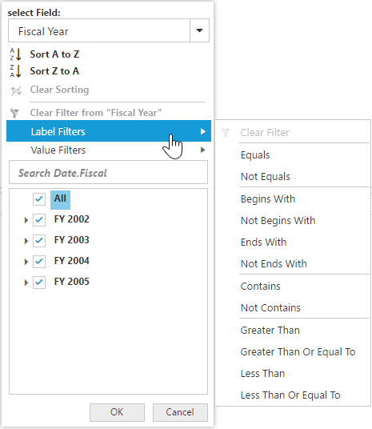
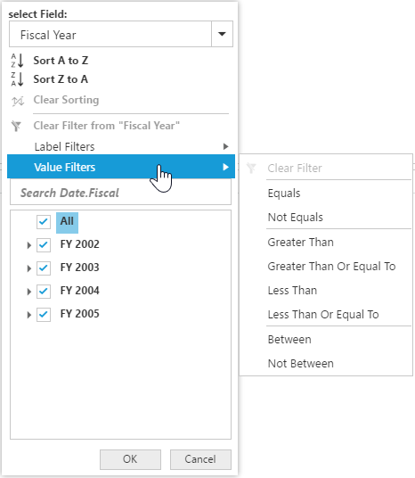
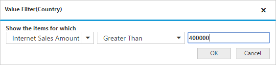

# Advanced filtering and sorting

It allows you to filter and sort the field members in the pivot grid.

### Client mode

In client mode, you can enable the Advanced Filtering and Sorting option in the pivot grid by setting the `EnableAdvancedFilter` property under the `DataSource` to true.



<ej:PivotGrid ID="PivotGrid1" EnableAdvancedFilter ="true" runat="server">
    <%--...--%>
</ej:PivotGrid>



### Server mode

In server mode, you can enable the Advanced Filtering and Sorting option in the pivot grid by setting the [`EnableAdvancedFilter`] property to true.



<ej:PivotGrid ID=" PivotGrid1" runat="server" EnableAdvancedFilter ="true">
    <%--...--%>
</ej:PivotGrid>



## Sorting

Sorting provides an option to sort the members of a field either in ascending or descending order.

I> This feature is not applicable for the OLAP data source bound from the server-side.

## Label filtering

The label filtering provides an option to filter the members of a field purely based on their caption.

## Value filtering

The value filtering provides an option to filter the members based on total values of the appropriate measure between the members of the level.

