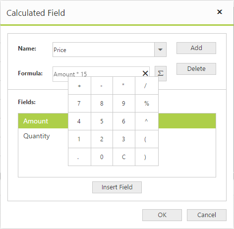
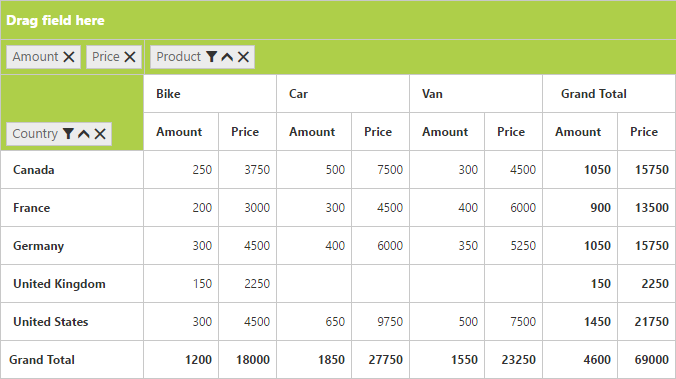

# Calculated field

N> This feature is applicable only for the relational data source.

The pivot grid provides support to insert a new calculated field based on existing pivot fields either through the Calculated Field dialog or code behind.

### Through UI
To insert a new calculated field, open the Calculated Field dialog by using the grouping bar context menu. You can define the name for the new calculated field, and the formula can be entered by inserting required fields through the fields section. For inserting numbers and operators, you can use the formula pop-up as shown in the following screen-shot:

Click **Add** for adding the respective calculated field and click **OK** to populate the pivot grid control.

### Through code-behind

For client mode, the calculated field can be created at code-behind by defining the formula based on the existing pivot fields in the pivot grid. To indicate a field as a calculated field, set the `IsCalculatedField` property to true and `Formula` property to set the expression.



    <ej:PivotGrid ID="PivotGrid1" EnableGroupingBar="true" runat="server" ClientIDMode="Static">
        <DataSource>
            //...
            <Values>
                <ej:Field FieldName="Amount" FieldCaption="Amount"></ej:Field>
                <ej:Field FieldName="Price" FieldCaption="Price" IsCalculatedField="true" Formula="Amount * 15"></ej:Field>
            </Values>
        </DataSource>
  </ej:PivotGrid>



For server mode, set **CalculationType** property to **CalculationType.Formula** and **Formula** property to set the expression for the pivot computation item in the pivot report.



    private PivotReport BindDefaultData()
    {
        PivotReport pivotSetting = new PivotReport();
        pivotSetting.PivotRows.Add(new PivotItem { FieldMappingName = "Country", FieldHeader = "Country", TotalHeader = "Total" });
        pivotSetting.PivotColumns.Add(new PivotItem { FieldMappingName = "Product", FieldHeader = "Product", TotalHeader = "Total" });
        pivotSetting.PivotCalculations.Add(new PivotComputationInfo { CalculationName = "Amount", Description = "Amount", FieldHeader = "Amount", FieldName = "Amount", SummaryType = Syncfusion.PivotAnalysis.Base.SummaryType.DoubleTotalSum });
        pivotSetting.PivotCalculations.Add(new PivotComputationInfo  {
            CalculationName = "Price",
            FieldHeader = "Price",
            FieldName = "Price",
            CalculationType = CalculationType.Formula,
            Formula = "Amount * 10 + 12"
        });
        return pivotSetting;
    }



