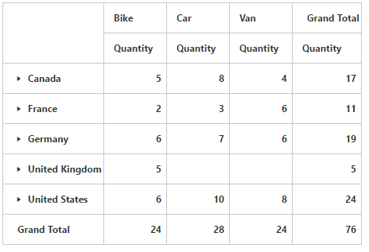

# Collapse by default

I> This feature is applicable only for the relational data source.

Allows you to collapse all members that are displayed in the grid. You can enable collapsing all members by default in the pivot grid by setting the `EnableCollapseByDefault` property to true.



<ej:PivotGrid ID="PivotGrid1" runat="server" EnableCollapseByDefault="true"></ej:PivotGrid>



