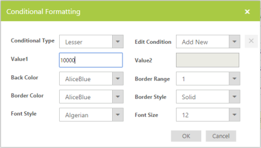
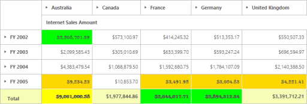

# Conditional Formatting

Conditional formatting in the PivotGrid control allows you to define conditions on the meeting that the cells can be formatted with font, color, and border settings. Conditional formatting dialog provides options at the UI-level to customize the appearance of the PivotGrid when the conditions are satisfied. 

Conditional Formatting dialog
{:.caption}

Conditional formatting dialog can be launched by clicking a simple button in the application. The following code example explains on how to launch the conditional formatting dialog.




<ej:PivotGrid ID="PivotGrid1" IsResponsive="true" runat="server" url="../wcf/OLAPService.svc" ClientIDMode="Static" 

EnableConditionalFormatting="true">

</ej:PivotGrid>

<ej:Button ClientSideOnClick="applyChanges" runat="server" Text="Apply"></ej:Button>




function applyChanges(e) {

    pgridObj = $('#PivotGrid1').data("ejPivotGrid");

    if(pgridObj.model.enableConditionalFormatting){

        pgridObj.createConditionalDialog();

    }
}




The PivotGrid is formatted with the following three conditions:

* Value < 10000 is marked in light brown color.
* Value > 2500000 and Value < 3000000 are marked in green color.
* Value > 5000000 is marked in yellow color.

Formatted PivotGrid
{:.caption}