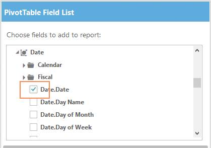
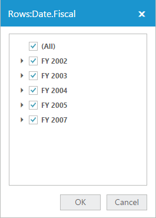

# Field List

N> This feature is applicable only for relational datasource.

Field List (also known as Pivot Schema Designer) is powerful tool that allows you to create and manage PivotTable (PivotGrid) with multi-dimensional/relational data. Using this PivotGrid you can visualize large amount of data in cross-tabular format and the Field List also allows you to filter members and also to customize the report dynamically on the fly using drag-and-drop operation.



  <ej:PivotGrid ID="PivotGrid1" runat=server url="../wcf/OLAPService.svc">

    <ClientSideEvents  AfterServiceInvoke="OnAfterServiceInvoke"/>

</ej:PivotGrid>

<ej:PivotSchemaDesigner ID="PivotSchemaDesigner" runat=server></ej:PivotSchemaDesigner>



  

##Interactions

###Drag and Drop

You can change the report on the fly through simple drag-and-drop operation. You can drag from the filed list and drop them either into the column, row, value or filter section available at the bottom of the Field list. 

  

###Check and Uncheck

You can alter the report on the fly through check and uncheck option (as an alternate). By default, fields are added to the row label when checked.

 

## Filtering 

Filter pop-up window can be launched by clicking on the expander icon available at the right-hand corner of each field item. Values can be filtered by checking/unchecking the check box besides them in the filter pop-up window. As a result of the filtering operation, PivotGrid is refresh showing the updated values. 

 

  

## Layout Section

The layout section is used to rearrange and reposition the fields in a PivotGrid. It has the following areas:

#### Report Filter

Report filter is used to filter the entire report based on the selected item in the report filter. The Report filter pop-up window can be launched by clicking on the expander icon available in the right corner of each field item.

#### Column Label

The column label is used to display fields as columns at the top of a report. A column lower in position is nested within another column immediately above it in the PivotGrid.

#### Row Label

The row label is used to display fields as rows at the top of a report. A row lower in position is nested within another row immediately besides it in the PivotGrid.

#### Value Label

The value label usually displays the selected numeric value filed of the pivot report and numeric value can be directly dragged into the value label.

