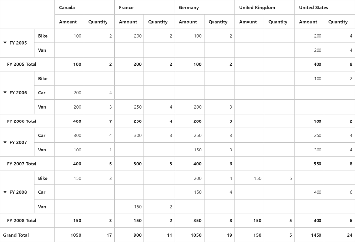
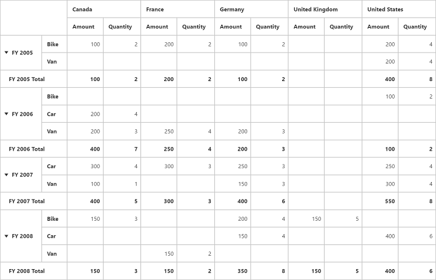

# Grand total hiding

Grand total hiding can be classified into three categories as follows:

* Row grand total hiding
* Column grand total hiding
* Both

## Row grand total hiding

You can hide the **Grand Total** in row alone by setting the `EnableRowGrandTotal` property to `false`.



<ej:PivotGrid ID="PivotGrid1" runat="server" EnableRowGrandTotal="false">
    <%--...--%>
</ej:PivotGrid>



## Column grand total hiding

You can hide the **Grand Total** in column alone by setting the `EnableColumnGrandTotal` property to `false`.



<ej:PivotGrid ID="PivotGrid1" runat="server" EnableColumnGrandTotal="false">
   <%--...--%>
</ej:PivotGrid>



## Both

You can hide the **Grand Total** in both row and column by setting the `EnableGrandTotal` property to `false`.



<ej:PivotGrid ID="PivotGrid1" runat="server" EnableGrandTotal="false">
    <%--...--%>
</ej:PivotGrid>



