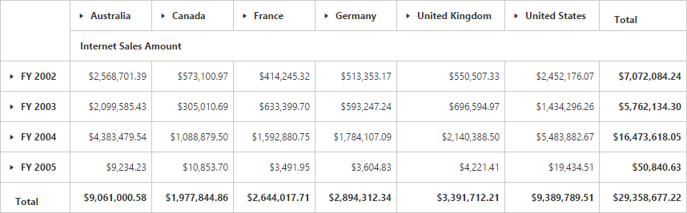
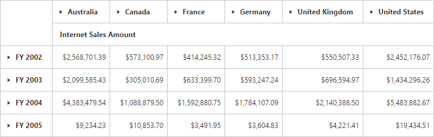
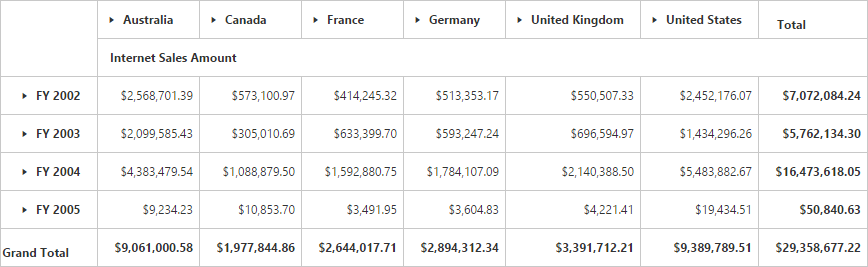
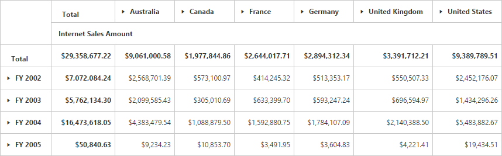

# Grid layout

## Normal layout

A layout in summary cells, which are positioned at the bottom of each parent member and their child members appear next to them. Normal layout is the default layout in the pivot grid control. The `Layout` enumeration property should be set to **"Normal"** to view the pivot grid in normal layout.



<ej:PivotGrid ID="PivotGrid1" runat="server" Url="/PivotGridService.svc" Layout="Normal"></ej:PivotGrid>



## No summaries layout

I> This feature is applicable only for the OLAP data source.

A layout in summary cells, which are completely hidden and the child members appear next to their parent member. The `Layout` enumeration property should be set to **"NoSummaries"** to view the pivot grid without summaries.



<ej:PivotGrid ID="PivotGrid1" runat="server" Url="/PivotGridService.svc" Layout="NoSummaries"></ej:PivotGrid>



## Excel-like layout

A layout in summary cells, which are positioned besides each parent member and their child members appear next to them. The `Layout` enumeration property should be set to **"ExcelLikeLayout"** to view the pivot grid in Microsoft Excel.



<ej:PivotGrid ID="PivotGrid1" runat="server" Url="/PivotGridService.svc" Layout="ExcelLikeLayout"></ej:PivotGrid>



## Top summary Layout

I> This feature is applicable only for the OLAP data source at server mode.

A layout in summary cells, which are positioned at the top of each parent member and their child members appear next to them. The `Layout` enumeration property should be set to **"NormalTopSummary"** to view the pivot grid in the top summaries layout.



<ej:PivotGrid ID="PivotGrid1" runat="server" Url="/PivotGridService.svc" Layout="NormalTopSummary"></ej:PivotGrid>



