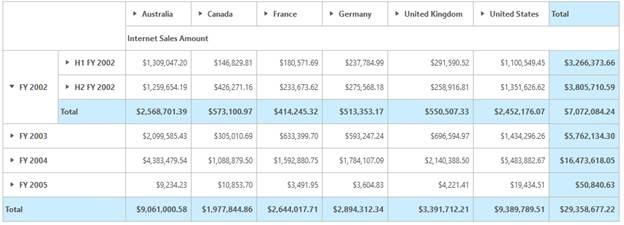
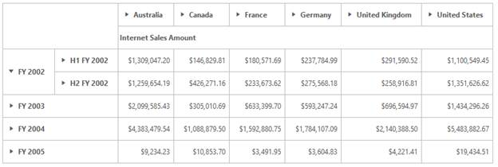

# Grid Layout

> Note: This feature is applicable only for OLAP datasource.

GridLayouts customize the position of summary elements in the PivotGrid control. Summary elements can be positioned at the top or bottom of each parent member.

The four kinds of Layouts supported by the PivotGrid are as follows:

* Normal
* Excel-like
* Normal top summary
* No summaries

####Normal

The Normal layout is the default Layout of the PivotGrid where the summary cells are positioned at the bottom of each parent member and child members appear next to their parent.

  



 

<ej:PivotGrid ID="PivotGrid1" runat="server" Url="../wcf/PivotGridService.svc" Layout="Normal"></ej:PivotGrid>



####Excel-like Layout

In the Excel-like layout, the summary cells are positioned at the bottom of the Grid and the child members appear under their parent member with a small indent.

 



<ej:PivotGrid ID="PivotGrid1" runat="server" Url="../wcf/PivotGridService.svc" Layout="ExcelLikeLayout"></ej:PivotGrid>



####Normal Top Summary

In the NormalTopSummary Layout, the summary cells are positioned at the top of each parent member and the child member appears next to their parent.

  



<ej:PivotGrid ID="PivotGrid1" runat="server" Url="../wcf/PivotGridService.svc" Layout="NormalTopSummary"></ej:PivotGrid>



####No Summaries

In No Summaries Layout, the summary cells are hidden and the child members appear next to their parent member.

  



<ej:PivotGrid ID="PivotGrid1" runat="server" Url="../wcf/PivotGridService.svc" Layout="NoSummaries"></ej:PivotGrid>



