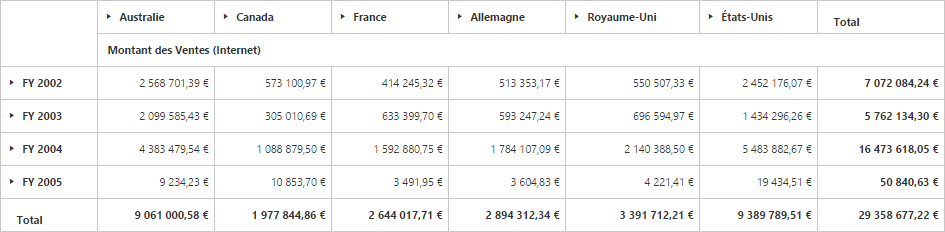
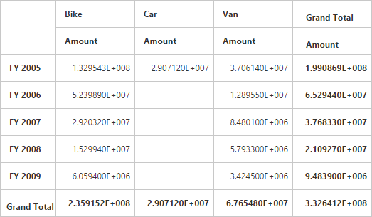
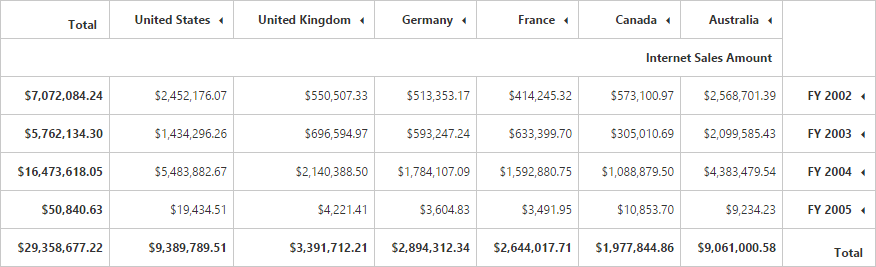

# Localization and Globalization

## Localization in PivotGrid 

You can localize the PivotGrid controls text with a collection of localized strings using **"ej.PivotGrid.locale"** for different cultures. By default, the PivotGrid control is localized in **"en-US"** culture.



<ej:PivotGrid ID="PivotGrid1" runat="server" Url="../PivotGridService" Locale="fr-FR" EnableVirtualScrolling="false">
        <ClientSideEvents AfterServiceInvoke="OnAfterServiceInvoke" />
</ej:PivotGrid>

<ej:PivotSchemaDesigner ID="PivotSchemaDesigner1" runat=server></ej:PivotSchemaDesigner>
    
<ej:PivotPager ID="PivotPager1" runat="server" Mode="Both" TargetControlID="PivotGrid1"></ej:PivotPager> 



The following table lists the default keywords in French culture for PivotGrid.
<table>
<tr>
<th>
Keyword
</th>
<th>
Values
</th>
</tr>
<tr>
<td>
ToolTipRow
</td>
<td>
Rangée
</td>
</tr>
<tr>
<td>
ToolTipColumn
</td>
<td>
Colonne
</td>
</tr>
<tr>
<td>
ToolTipValue
</td>
<td>
Valeur
</td>
</tr>
<tr>
<td>
DragFieldHere
</td>
<td>
Champ de glisser ici
</td>
</tr>
<tr>
<td>
ColumnArea
</td>
<td>
Colonne zone
</td>
</tr>
<tr>
<td>
RowArea
</td>
<td>
Déposez ligne ic
</td>
</tr>
<tr>
<td>
ValueArea
</td>
<td>
Valeurs de déposer ici
</td>
</tr>
<tr>
<td>
OK
</td>
<td>
D'accord
</td>
</tr>
<tr>
<td>
Cancel
</td>
<td>
Annuler
</td>
</tr>
<tr>
<td>
Remove
</td>
<td>
Supprimer
</td>
</tr>
<tr>
<td>
ConditionalFormatting
</td>
<td>
Mise en forme conditionnelle
</td>
</tr>
<tr>
<td>
Condition
</td>
<td>
Type de condition
</td>
</tr>
<tr>
<td>
Value1
</td>
<td>
Valeur1
</td>
</tr>
<tr>
<td>
Value2
</td>
<td>
Valeur2
</td>
</tr>
<tr>
<td>
Editcondtion
</td>
<td>
Modifier l'état
</td>
</tr>
<tr>
<td>
Backcolor
</td>
<td>
Couleur d'arrière
</td>
</tr>
<tr>
<td>
Borderrange
</td>
<td>
Gamme de frontière
</td>
</tr>
<tr>
<td>
Borderstyle
</td>
<td>
Style de bordure
</td>
</tr>
<tr>
<td>
Fontsize
</td>
<td>
Taille de police
</td>
</tr>
<tr>
<td>
Fontstyle
</td>
<td>
Le style de police
</td>
</tr>
<tr>
<td>
Bordercolor
</td>
<td>
Couleur de la bordure
</td>
</tr>
</table>

The following table lists the default keywords in French culture for PivotTable Field List.

<table>
<tr>
<th>
Keywords</th>
<th>Values</th>
</tr>
<tr>
<td>
PivotTableFieldList</td>
<td>Liste de champs de tableau croisé dynamique</td>
</tr>
<tr>
<td>ChooseFieldsToAddToReport</td>
<td>Choisissez champs à ajouter à Signaler"</td>
</tr>
<tr>
<td>DragFieldBetweenAreasBelow</td>
<td>Faites glisser terrain entre les zones ci-dessous</td>
</tr>
<tr>
<td>ReportFilter</td>
<td>Rapport Filtre</td>
</tr>
<tr>
<td>ColumnLabel</td>
<td>colonne Étiquette</td>
</tr>
<tr>
<td>RowLabel</td>
<td>Label Row</td>
</tr>
<tr>
<td>Values</td>
<td>Valeurs</td>
</tr>
</table>

The following table lists the default keywords in French culture for Pivot Pager.

<table>
<tr>
<th>Keywords</th>
<th>Values</th>
</tr>
<tr>
<td>SeriesPage</td>
<td>Série Page</td>
</tr>
<tr>
<td>CategoricalPage</td>
<td>Catégorique Page</td>
</tr>
</table>

## Localization and Globalization of Cube Info
Content displayed within the PivotGrid control are obtained from the OLAP Cube. So following are the steps that needs to be done to get the localized and globalized Cube content.
 
* To get the localized string based on different cultures, from OLAP Cube, you need to set **"Locale Identifier"** in the connection string to a specific culture.
* To bind the globalized content in PivotGrid control, you need to set **"Culture"** and `OverrideDefaultFormatStrings` properties in OlapDataManager class to a specific culture. 



//1036 refers to "fr-FR" culture.
string connectionString = "Data Source=localhost; Initial Catalog=Adventure Works DW; Locale Identifier=1036;";
DataManager = new OlapDataManager(connectionString);
DataManager.Culture = new System.Globalization.CultureInfo(1036);
DataManager.OverrideDefaultFormatStrings = true;



## Localization and Globalization of Relational Info
Content displayed within the PivotGrid control are obtained from the Relational datasource. So following are the steps that needs to done to get localized as well as globalized content.
 
* To get the localized content, the Relational datasource must have localized headers in them which will be directly applied to PivotGrid.  
* **“Format”** settings in PivotComputationInfo class would globalize the values appear in PivotGrid.



PivotReport pivotSetting = new PivotReport();
//...
pivotSetting.PivotCalculations.Add(new PivotComputationInfo {
    CalculationName = "Amount", Description = "Amount", FieldHeader = "Amount", FieldName = "Amount", Format = "E", SummaryType = Syncfusion.PivotAnalysis.Base.SummaryType.DoubleTotalSum
});
//...



## RTL

You can render our PivotGrid control from Right to Left by setting `EnableRTL` property to true.



<ej:PivotGrid ID="PivotGrid1" runat="server" Url="../PivotGridService" EnableRTL="true"></ej:PivotGrid>



 

