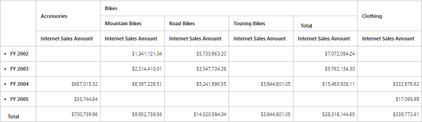
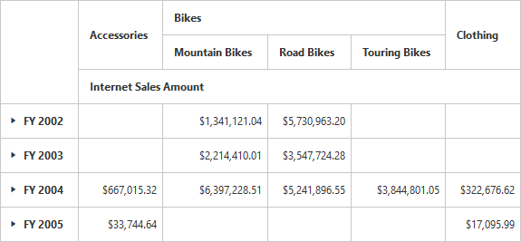

# Named set

Named set is a multidimensional expression (MDX) that returns a set of dimension members, which can be created by combining the cube data, arithmetic operators, numbers, and functions. You can set the named set option in the pivot grid by setting the `isNamedSets` property to true for client mode.

## Client mode

You can bind the named sets in the pivot grid by setting it's unique name in the `FieldName` property either in row or column axis and `isNamedSets` Boolean property to true.



<ej:PivotGrid ID="PivotGrid1" runat="server">
    <DataSource Catalog="Adventure Works DW 2008 SE" Cube="Adventure Works" Data="https://bi.syncfusion.com/olap/msmdpump.dll">
        <Rows>
            <ej:Field FieldName="[Date].[Fiscal]"></ej:Field>
        </Rows>
        <Columns>
            <ej:Field FieldName="[Core Product Group]" isNamedSets="true"></ej:Field>
        </Columns>
        <Values>
            <ej:Field Axis="Column">
                <Measures>
                    <ej:MeasuresItems FieldName="[Measures].[Internet Sales Amount]" />
                </Measures>
            </ej:Field>
        </Values>
    </DataSource>
</ej:PivotGrid>



## Server mode

You can add the named sets in the pivot grid by using the NamedSetElement Class in the OLAP report.



OlapReport olapReport = new OlapReport();
olapReport.Name = "Customer Report";
olapReport.CurrentCubeName = "Adventure Works";

DimensionElement dimensionElementRow = new DimensionElement();
dimensionElementRow.Name = "Date";
dimensionElementRow.AddLevel("Fiscal", "Fiscal Year");

MeasureElements measureElementColumn = new MeasureElements();
measureElementColumn.Elements.Add(new MeasureElement {
Name = "Internet Sales Amount"
});

NamedSetElement dimensionElementColumn = new NamedSetElement();
dimensionElementColumn.Name = "Core Product Group";

olapReport.CategoricalElements.Add(dimensionElementColumn);
olapReport.CategoricalElements.Add(measureElementColumn);
olapReport.SeriesElements.Add(dimensionElementRow);



