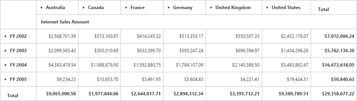

# Data binding

## Binding pivot grid to offline cube

To connect an OLAP cube available in the local machine, the physical path of the cube should be set in the connection string. The following code sample illustrates this process:



string connectionString = @"DataSource = system drive:\OfflineCube\Adventure_Works_Ext.cub; Provider = MSOLAP;";
OlapDataManager DataManager = new OlapDataManager(connectionString);



## Binding pivot grid to cube in local SQL Server

To connect to an OLAP cube available in the SQL Server Analysis Service of the local machine, the server name and database name should be set in the connection string. If you have any credentials to connect your cube, then set the user ID and password attributes accordingly. The following code sample illustrates this process:



string connectionString = "Data source=localhost; Initial Catalog=Adventure Works DW;";
OlapDataManager DataManager = new OlapDataManager(connectionString);



## Binding pivot grid to cube in online SQL Server

To connect to an OLAP cube available in the SQL Server Analysis Service in online server through XML/A, the host server link and database name should be set in the connection string. If you have any credentials to connect your cube, then set the user ID and password attributes accordingly. The following code sample illustrates this process:



string connectionString = "Data Source=https://bi.syncfusion.com/olap/msmdpump.dll; Initial Catalog=Adventure Works DW 2008 SE;";
OlapDataManager DataManager = new OlapDataManager(connectionString);



## Binding pivot grid to cube in online Mondrian Server

To connect to an OLAP cube available in the Mondrian Server through XML/A, the host server link and database name should be set in the connection string. If you have any credentials to connect your cube, then set the user ID and password attributes accordingly. The following code sample illustrates this process:



string connectionString = @"Data Source = https://localhost:8080/mondrian/xmla; Initial Catalog =FoodMart;";
OlapDataManager DataManager = new OlapDataManager(connectionString);
DataManager.DataProvider.ProviderName = Syncfusion.Olap.DataProvider.Providers.Mondrian;



## Binding pivot grid to cube in online Active Pivot Server



string connectionString = @"Data Source = https://localhost:8080/cva_s/xmla; Initial Catalog = CVAS;";
OlapDataManager DataManager = new OlapDataManager(connectionString);
DataManager.DataProvider.ProviderName=Syncfusion.Olap.DataProvider.Providers.ActivePivot;



## WCF
**Adding a WCF service**

To add a WCF service in an existing web application, right-click the project in the solution explorer and select **Add > New Item**. In the **Add New Item** window, select the WCF service and name it `OlapService.svc`, and then click Add.

Now, the WCF service is added to the application that comprises the following files. The utilization of these files will be explained in the immediate sections.

* OlapService.svc
* OlapService.svc.cs
* IOlapService.cs

**Configuring WCF service class**

Remove the **“DoWork”** method present in both `OlapService.svc.cs` and `IOlapService.cs` files. Next, add **“AspNetCompatibilityRequirements”** attribute on top of the main class present in OlapService.svc.cs file and set the **“RequirementsMode”** value to **“Allowed”**.



namespace PivotGridDemo
{
    [AspNetCompatibilityRequirements(RequirementsMode = AspNetCompatibilityRequirementsMode.Allowed)]
    public class OlapService : IOlapService
    {

    }
}



**List of dependency libraries**

Next, you can add the below-mentioned dependency libraries to your web application. These libraries can be found in the GAC (Global Assembly Cache).

To add them to your web application, right-click **References** in the solution explorer and select **Add Reference**. In the **Reference Manager** dialog, under **Assemblies > Extension**, the following Syncfusion libraries are found.

N> If you have installed any version of SQL Server Analysis Service (SSAS) or Microsoft ADOMD.NET utility, then the location of Microsoft.AnalysisServices.AdomdClient library is [system drive:\Program Files (x86)\Microsoft.NET\ADOMD.NET]. And if you have installed any version of Essential Studio, then the location of Syncfusion libraries is [system drive:\Program Files (x86)\Syncfusion\Essential Studio\{{ site.releaseversion }}\Assemblies].

* Microsoft.AnalysisServices.AdomdClient
* Syncfusion.Compression.Base
* Syncfusion.Linq.Base
* Syncfusion.Olap.Base
* Syncfusion.PivotAnalysis.Base
* System.Data.SqlServerCe (Version: 4.0.0.0)
* Syncfusion.XlsIO.Base
* Syncfusion.Pdf.Base
* Syncfusion.DocIO.Base
* Syncfusion.EJ
* Syncfusion.EJ.Web
* Syncfusion.EJ.Export
* Syncfusion.EJ.Pivot

**List of namespaces**

Following are the list of namespaces to be added on top of the main class in the `OlapService.svc.cs` file:



using System;
using System.Web;
using System.Collections.Generic;
using System.Linq;
using System.ServiceModel;
using System.Text;
using System.ServiceModel.Activation;
using System.Web.Script.Serialization;
using Syncfusion.Olap.Manager;
using Syncfusion.Olap.Reports;
using Syncfusion.JavaScript.Olap;
using System.Data.SqlServerCe;
using System.Data;
using OLAPUTILS = Syncfusion.JavaScript.Olap;

namespace PivotGridDemo
{
    [AspNetCompatibilityRequirements(RequirementsMode = AspNetCompatibilityRequirementsMode.Allowed)]
    public class OlapService : IOlapService
    {

    }
}



**Data source initialization**

Now, the connection string to connect the OLAP cube, pivot grid and JavaScriptSerializer instances is created immediately in the main class of the `OlapService.svc.cs` file.



namespace PivotGridDemo
{
    [AspNetCompatibilityRequirements(RequirementsMode = AspNetCompatibilityRequirementsMode.Allowed)]
    public class OlapService: IOlapService
    {
        Syncfusion.JavaScript.PivotGrid htmlHelper = new Syncfusion.JavaScript.PivotGrid();
        static int cultureIDInfoval = 1033;
        string connectionString = "Data Source=https://bi.syncfusion.com/olap/msmdpump.dll; Initial Catalog=Adventure Works DW 2008 SE;";
        JavaScriptSerializer serializer = new JavaScriptSerializer();
        string conStringforDB = ""; //Enter appropriate connection string to connect database for saving and loading operation of reports            public Dictionary<string, object> InitializeGrid(string action, string gridLayout, bool enablePivotFieldList, object customObject)
        public Dictionary<string, object> InitializeGrid(string action, string gridLayout, bool enablePivotFieldList, object customObject)
        //Other codes

    }
}



**Service methods in WCF service**

First, declare the service methods in the **IOlapService** interface, find in the `IOlapService.cs` file which was created while adding the WCF Service to the application.



namespace PivotGridDemo
{
    [ServiceContract]
    public interface IOlapService
    {
        [OperationContract]
        Dictionary<string, object> InitializeGrid(string action, string gridLayout, bool enablePivotFieldList, object customObject);

        [OperationContract]
        Dictionary<string, object> DrillGrid(string action, string cellPosition, string currentReport, string headerInfo, string layout, object customObject);

        [OperationContract]
        Dictionary<string, object> Paging(string action, string pagingInfo, string currentReport, string gridLayout, object customObject);

        [OperationContract]
        Dictionary<string, object> NodeDropped(string action, string dropType, string nodeInfo, string filterParams, string gridLayout, string currentReport);

        [OperationContract]
        Dictionary<string, object> RemoveButton(string action, string headerInfo, string gridLayout, string currentReport);

        [OperationContract]
        Dictionary<string, object> FetchMembers(string action, string headerTag, string currentReport);

        [OperationContract]
        Dictionary<string, object> Filtering(string action, string filterParams, string gridLayout, string currentReport);

        [OperationContract]
        Dictionary<string, object> MemberExpanded(string action, bool checkedStatus, string parentNode, string tag, string cubeName, string currentReport);

        [OperationContract]
        void Export(System.IO.Stream stream);

        [OperationContract]
        Dictionary<string, object> DeferUpdate(string action, string filterParams, string currentReport);

        [OperationContract]
        Dictionary<string, object> SaveReport(string reportName, string operationalMode, string olapReport, string clientReports);

        [OperationContract]
        Dictionary<string, object> LoadReportFromDB(string action, string gridLayout, bool enablePivotFieldList, object customObject, string reportName, string operationalMode, string olapReport, string clientReports);
    }
}



Then, elaborate the service methods in the main class that is found in the `OlapService.svc.cs` file.



namespace PivotGridDemo
{
    [AspNetCompatibilityRequirements(RequirementsMode = AspNetCompatibilityRequirementsMode.Allowed)]
    public class OlapService : IOlapService
    {
        Syncfusion.JavaScript.PivotGrid htmlHelper = new Syncfusion.JavaScript.PivotGrid();
        static int cultureIDInfoval = 1033;
        string connectionString = "Data Source=https://bi.syncfusion.com/olap/msmdpump.dll; Initial Catalog=Adventure Works DW 2008 SE;";
        JavaScriptSerializer serializer = new JavaScriptSerializer();
        string conStringforDB = ""; //Enter appropriate connection string to connect database for saving and loading operation of reports            public Dictionary<string, object> InitializeGrid(string action, string gridLayout, bool enablePivotFieldList, object customObject)
        public Dictionary<string, object> InitializeGrid(string action, string gridLayout, bool enablePivotFieldList, object customObject)
        {
            OlapDataManager DataManager = null;
            DataManager = new OlapDataManager(connectionString);
            DataManager.SetCurrentReport(CreateOlapReport());
            return htmlHelper.GetJsonData(action, DataManager, gridLayout, enablePivotFieldList);
        }

        public Dictionary<string, object> DrillGrid(string action, string cellPosition, string currentReport, string headerInfo, string layout, object customObject)
        {
            OlapDataManager DataManager = new OlapDataManager(connectionString);
            DataManager = new OlapDataManager(connectionString);
            DataManager.SetCurrentReport(Utils.DeserializeOlapReport(currentReport));
            return htmlHelper.GetJsonData(action, connectionString, DataManager, cellPosition, headerInfo, layout);
        }

        public Dictionary<string, object> NodeDropped(string action, string dropType, string nodeInfo, string filterParams, string gridLayout, string currentReport)
        {
            OlapDataManager DataManager = new OlapDataManager(connectionString);
            DataManager.SetCurrentReport(Utils.DeserializeOlapReport(currentReport));
            return htmlHelper.GetJsonData(action, DataManager, dropType, nodeInfo, filterParams, gridLayout, true);
        }

        public Dictionary<string, object> Filtering(string action, string filterParams, string gridLayout, string currentReport)
        {
            OlapDataManager DataManager = new OlapDataManager(connectionString);
            DataManager.SetCurrentReport(Utils.DeserializeOlapReport(currentReport));
            return htmlHelper.GetJsonData(action, connectionString, DataManager, null, filterParams, gridLayout);
        }

        public Dictionary<string, object> FetchMembers(string action, string headerTag, string currentReport)
        {
            OlapDataManager DataManager = new OlapDataManager(connectionString);
            DataManager.SetCurrentReport(Utils.DeserializeOlapReport(currentReport));
            return htmlHelper.GetJsonData(action, DataManager, null, headerTag);
        }

        public Dictionary<string, object> Paging(string action, string pagingInfo, string currentReport, string gridLayout, object customObject)
        {
            OlapDataManager DataManager = new OlapDataManager(connectionString);
            DataManager.SetCurrentReport(htmlHelper.SetPaging(currentReport, pagingInfo));
            return htmlHelper.GetJsonData(action, DataManager, gridLayout);
        }

        public Dictionary<string, object> RemoveButton(string action, string headerInfo, string gridLayout, string currentReport)
        {
            OlapDataManager DataManager = new OlapDataManager(connectionString);
            DataManager.SetCurrentReport(Utils.DeserializeOlapReport(currentReport));
            return htmlHelper.GetJsonData(action, connectionString, DataManager, null, headerInfo, gridLayout);
        }

        public Dictionary<string, object> MemberExpanded(string action, bool checkedStatus, string parentNode, string tag, string cubeName, string currentReport)
        {
            OlapDataManager DataManager = new OlapDataManager(connectionString);
            if (!string.IsNullOrEmpty(currentReport))
                DataManager.SetCurrentReport(Utils.DeserializeOlapReport(currentReport));
            return htmlHelper.GetJsonData(action, DataManager, checkedStatus, parentNode, tag, cubeName);
        }

        public void Export(System.IO.Stream stream)
        {
            System.IO.StreamReader sReader = new System.IO.StreamReader(stream);
            string args = System.Web.HttpContext.Current.Server.UrlDecode(sReader.ReadToEnd()).Remove(0, 5); ;
            OlapDataManager DataManager = new OlapDataManager(connectionString);
            string fileName = "Sample";
            htmlHelper.ExportPivotGrid(DataManager, args, fileName, System.Web.HttpContext.Current.Response);
        }

        public Dictionary<string, object> SaveReport(string reportName, string operationalMode, string olapReport, string clientReports)
        {
            string mode = operationalMode;
            bool isDuplicate = true;
            SqlCeConnection con = new SqlCeConnection() { ConnectionString = conStringforDB };
            con.Open();
            SqlCeCommand cmd1 = null;
            foreach (DataRow row in GetDataTable().Rows)
            {
                if ((row.ItemArray[0] as string).Equals(reportName))
                {
                    isDuplicate = false;
                    cmd1 = new SqlCeCommand("update ReportsTable set Report=@Reports where ReportName like @ReportName", con);
                }
            }
            if (isDuplicate)
            {
                cmd1 = new SqlCeCommand("insert into ReportsTable Values(@ReportName,@Reports)", con);
            }
            cmd1.Parameters.Add("@ReportName", reportName);
            //cmd1.Parameters.Add("@Reports", OLAPUTILS.Utils.GetReportStream(clientReports).ToArray());
            if (mode == "serverMode")
                cmd1.Parameters.Add("@Reports", OLAPUTILS.Utils.GetReportStream(clientReports).ToArray());
            else if (mode == "clientMode")
                cmd1.Parameters.Add("@Reports", Encoding.UTF8.GetBytes(clientReports).ToArray());
            cmd1.ExecuteNonQuery();
            con.Close();
            return null;
        }

        public Dictionary<string, object> LoadReportFromDB(string action, string layout, bool enablePivotFieldList, object customObject, string reportName, string operationalMode, string olapReport, string clientReports)
        {
            string mode = operationalMode;
            var reports = "";
            byte[] reportString = new byte[4 * 1024];
            Dictionary<string, object> dictionary = new Dictionary<string, object>();
            if (mode == "serverMode" && !string.IsNullOrEmpty(clientReports))
            {
                reports = clientReports;
            }
            else
            {
                foreach (DataRow row in GetDataTable().Rows)
                {
                    if ((row.ItemArray[0] as string).Equals(reportName))
                    {
                        if (mode == "clientMode")
                        {
                            reportString = row.ItemArray[1] as byte[];
                            dictionary.Add("report", Encoding.UTF8.GetString(reportString));
                            break;
                        }
                        else if (mode == "serverMode")
                        {
                            reports = OLAPUTILS.Utils.CompressData(row.ItemArray[1] as byte[]);
                            break;
                        }
                    }
                }
            }
            if (reports != "")
            {
                OlapDataManager DataManager = new OlapDataManager(connectionString);
                dynamic customData = serializer.Deserialize<dynamic>(customObject.ToString());
                var cultureIDInfo = new System.Globalization.CultureInfo(("en-US")).LCID;
                if (customData is Dictionary<string, object> && customData.ContainsKey("Language"))
                {
                    cultureIDInfo = new System.Globalization.CultureInfo((customData["Language"])).LCID;
                }
                connectionString = connectionString.Replace("" + cultureIDInfoval + "", "" + cultureIDInfo + "");
                cultureIDInfoval = cultureIDInfo;
                DataManager.Culture = new System.Globalization.CultureInfo((cultureIDInfo));
                DataManager.SetCurrentReport(OLAPUTILS.Utils.DeserializeOlapReport(reports));
                DataManager.OverrideDefaultFormatStrings = true;
                dictionary = htmlHelper.GetJsonData(action, DataManager, layout, enablePivotFieldList);
            }
            return dictionary;
        }

        private DataTable GetDataTable()
        {
            SqlCeConnection con = new SqlCeConnection() { ConnectionString = conStringforDB };
            con.Open();
            DataSet dSet = new DataSet();
            new SqlCeDataAdapter("Select * from ReportsTable", con).Fill(dSet);
            con.Close();
            return dSet.Tables[0];
        }
        public Dictionary<string, object> DeferUpdate(string action, string filterParams, string currentReport)
        {
            OlapDataManager DataManager = new OlapDataManager(connectionString);
            DataManager.SetCurrentReport(Utils.DeserializeOlapReport(currentReport));
            return htmlHelper.GetJsonData(action, DataManager, null, filterParams);
        }
        private OlapReport CreateOlapReport()
        {
            OlapReport olapReport = new OlapReport();
            olapReport.CurrentCubeName = "Adventure Works";

            MeasureElements measureElement = new MeasureElements();
            measureElement.Elements.Add(new MeasureElement { UniqueName = "[Measures].[Internet Sales Amount]" });

            DimensionElement dimensionElementRow = new DimensionElement();
            dimensionElementRow.Name = "Date";
            dimensionElementRow.AddLevel("Fiscal", "Fiscal Year");

            DimensionElement dimensionElementColumn = new DimensionElement();
            dimensionElementColumn.Name = "Customer";
            dimensionElementColumn.AddLevel("Customer Geography", "Country");

            olapReport.SeriesElements.Add(dimensionElementRow);
            olapReport.CategoricalElements.Add(dimensionElementColumn);
            olapReport.CategoricalElements.Add(measureElement);

            return olapReport;
        }
    }
}



**Configuring web configuration file**

The services can be exposed through the properties such as, binding, contract, and address by using an endpoint.

* Contract: This property indicates that the contract of the endpoint is exposed. Refer to the `IOlapService` contract, and it is written as `PivotGridDemo.IOlapService`.
* Binding: In your application, you can use the `webHttpBinding` to post and receive requests and responses between the client-end and the service.
* BehaviorConfiguration: This property contains the name of the behavior to be used in the endpoint.

The endpointBehaviors are illustrated as follows:



<system.serviceModel>
    ……
    ……
    <services>
        <service name="PivotGridDemo.OlapService">
            <endpoint address="" behaviorConfiguration="PivotGridDemo.OlapServiceAspNetAjaxBehavior" binding="webHttpBinding" contract="PivotGridDemo.IOlapService" /> </service>
    </services>
</system.serviceModel>



The endpointBehaviors contain all behaviors for an endpoint. You can link each endpoint to the respective behavior only by using the name property.



<system.serviceModel>
    ……
    ……
    <behaviors>
        ……
        ……
        <endpointBehaviors>
            <behavior name="PivotGridDemo.OlapServiceAspNetAjaxBehavior">
                <enableWebScript /> </behavior>
        </endpointBehaviors>
    </behaviors>
</system.serviceModel>



N> In this example, the **"PivotGridDemo"** indicates the name and root namespace of the application that is created in the Visual Studio IDE, and the **"OlapService"** indicates the name of the created WCF service.

Now, the **pivot grid** will be rendered with internet sales amount over a period of fiscal years across different customer geographic locations.

