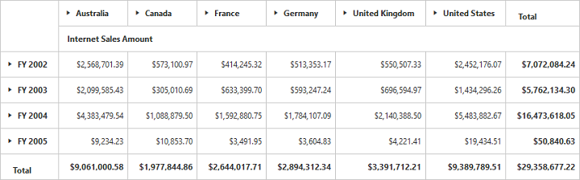

# Getting Started

## Creating a simple application with PivotGrid and OLAP datasource (Client Mode)

This section covers the information that you need to know to populate a simple PivotGrid with OLAP data completely on the client-side.

### Scripts and CSS References  

Create a Default.aspx page and scripts and style sheets that are mandatorily required to render PivotGrid control in a Web Application are mentioned in an appropriate order below:

1. ej.web.all.min.css
2. jQuery-1.10.2.min.js
3. jQuery.easing.1.3.min.js
5. ej.web.all.min.js

Scripts and style sheets are referred under the <head> tag in Default.aspx page.

    

<head>
    <link href="http://cdn.syncfusion.com/{{ site.releaseversion }}/js/web/flat-azure/ej.web.all.min.css" rel="stylesheet" type="text/css" />
    
    
    
    
    
</head>    



### Initialize PivotGrid

Either drag and drop the PivotGrid control from the toolbox (under Syncfusion BI Web category) or manually define the control like in the below code sample inside "GettingStarted.aspx" page.



<%@ Register Assembly="Syncfusion.EJ.Olap" Namespace="Syncfusion.JavaScript.Web" TagPrefix="ej" %>
<%@ Register Assembly="Syncfusion.EJ.Olap" Namespace="Syncfusion.JavaScript.Models" TagPrefix="ej" %>

<html> 
    …… 
    ……

<body>
    <form runat="server">
         <ej:PivotGrid ID="PivotGrid1" runat="server" ClientIDMode="Static">
         </ej:PivotGrid>
    </form>
</body>

</html>



### Populate PivotGrid with dataSource

Initializes the OLAP datasource for PivotGrid control as shown below.


<ej:PivotGrid ID="PivotGrid1" runat="server">
    <DataSource Catalog="Adventure Works DW 2008 SE" Cube="Adventure Works" Data="http://bi.syncfusion.com/olap/msmdpump.dll">
        <Rows>
            <ej:Field FieldName="[Date].[Fiscal]"></ej:Field>
        </Rows>
        <Columns>
            <ej:Field FieldName="[Customer].[Customer Geography]"></ej:Field>
        </Columns>
        <Values>
            <ej:Field Axis="Column">
                <Measures>
                    <ej:MeasuresItems FieldName="[Measures].[Internet Sales Amount]" />
                </Measures>
            </ej:Field>
        </Values>
    </DataSource>
</ej:PivotGrid>
     


The above code will generate a simple PivotGrid with "Fiscal" field in Row, "Customer Geography" field in Column and "Internet Sales Amount" field in Value section.

## Creating a simple application PivotGrid and OLAP datasource (Server Mode)

This section covers the information required to create a simple PivotGrid bound to OLAP datasource. 

N> ASP.NET MVC Web Application will contain a service that transfers data to server-side, processes and returns back to client-side for control rendering and re-rendering. The service utilized for communication could be either WCF or WebAPI based on user requirement.

### Project Initialization

Create a new **ASP.NET Empty Web Application** using Visual Studio IDE and name the project as **“PivotGridDemo”**.

Now add a "Web Form" to the Empty Web Application. For adding a "Web Form", right-click on the project in Solution Explorer and select **Add > New Item**. In the **Add New Item** window, select "Web Form" and name it as `GettingStarted.aspx` and click **"Add"**.

To set an appropriate start page, right-click on the **"GettingStarted.aspx"** in Solution Explorer and select **"Set As Start Page"**.

Now add the following dependency libraries as references into your Web Application. In order to add them to your application, right-click on **References** in Solution Explorer and select **Add Reference**. Now in the **Reference Manager** dialog, under **Assemblies > Extension**, the following Syncfusion libraries will be found.  

* Microsoft.AnalysisServices.AdomdClient
* Syncfusion.Compression.Base
* Syncfusion.Linq.Base
* Syncfusion.Olap.Base
* Syncfusion.PivotAnalysis.Base
* Syncfusion.XlsIO.Base
* Syncfusion.Pdf.Base
* Syncfusion.DocIO.Base
* Syncfusion.EJ
* Syncfusion.EJ.Olap

N> If any version of SQL Server Analysis Service (SSAS) or Microsoft ADOMD.NET utility is installed, then the location of Microsoft.AnalysisServices.AdomdClient library is [system drive:\Program Files (x86)\Microsoft.NET\ADOMD.NET].

### Scripts and CSS Initialization

The scripts and style sheets that are mandatorily required to render PivotGrid control in a Web Application are mentioned in an appropriate order below:

1. ej.web.all.min.css
2. jQuery-1.10.2.min.js
3. jQuery.easing.1.3.min.js
4. ej.web.all.min.js

[Click here](http://help.syncfusion.com/js/cdn) to know more about scripts and style sheets available online (CDN Link).

Scripts and style sheets are referred under the <head> tag in **GettingStarted.aspx** page.



<head>
    <link href="http://cdn.syncfusion.com/{{ site.releaseversion }}/js/web/flat-azure/ej.web.all.min.css" rel="stylesheet" />
    
    
    
</head>



### Control Initialization

Either drag and drop the **PivotGrid** control from the toolbox (under **Syncfusion BI Web** category) or manually define the control like in the below code sample inside **"GettingStarted.aspx"** page.
 
Once the control is placed into the web page, add **'ScriptManager'** next to it in-order to generate appropriate scripts.



<%@ Register Assembly="Syncfusion.EJ.Olap, Version={{ site.45esreleaseversion }}, Culture=neutral, PublicKeyToken=3d67ed1f87d44c89" Namespace="Syncfusion.JavaScript.Web.Olap" TagPrefix="ej" %> 
<html> 
    …… 
    ……

<body>
    <form runat="server">
        <ej:PivotGrid ID="PivotGrid1" Url="/PivotGridService" runat="server" ClientIDMode="Static"></ej:PivotGrid>
        <asp:ScriptManager ID="ScriptManager1" runat="server"></asp:ScriptManager>
    </form>
</body>

</html>



The **“Url”** property in PivotGrid control points the service endpoint, where data are processed and fetched in the form of JSON. The services used in PivotGrid control as endpoint are WCF and WebAPI.

N> The above “GettingStarted.aspx” contains WebAPI URL, which is “/PivotGridService”. If WCF service is used as endpoint, the URL would look like “/PivotGridService.svc”.

If you are manually entering the code instead of drag and drop operation from toolbox, then you need to register the referenced assemblies in Web.config file. 



<compilation debug="true" targetFramework="4.5">
    <assemblies> 
        …… 
        ……
        <add assembly="Syncfusion.EJ, Version= {{ site.45esreleaseversion }}, Culture=neutral, PublicKeyToken=3d67ed1f87d44c89" />
        <add assembly="Syncfusion.EJ.Olap, Version= {{ site.45esreleaseversion }}, Culture=neutral, PublicKeyToken=3d67ed1f87d44c89" />
         <add assembly="Syncfusion.Compression.Base, Version= {{ site.45esreleaseversion }}, Culture=neutral, PublicKeyToken=3d67ed1f87d44c89" />
        <add assembly="Syncfusion.Linq.Base, Version= {{ site.45esreleaseversion }}, Culture=neutral, PublicKeyToken=3d67ed1f87d44c89" />
        <add assembly="Syncfusion.Olap.Base, Version= {{ site.45esreleaseversion }}, Culture=neutral, PublicKeyToken=3d67ed1f87d44c89" />
        <add assembly="Syncfusion.PivotAnalysis.Base, Version= {{ site.45esreleaseversion }}, Culture=neutral, PublicKeyToken=3d67ed1f87d44c89" />
        <add assembly="Syncfusion.Pdf.Base, Version= {{ site.45esreleaseversion }}, Culture=neutral, PublicKeyToken=3d67ed1f87d44c89" />
        <add assembly="Syncfusion.XlsIO.Base, Version= {{ site.45esreleaseversion }}, Culture=neutral, PublicKeyToken=3d67ed1f87d44c89" />
        <add assembly="Syncfusion.DocIO.Base, Version= {{ site.45esreleaseversion }}, Culture=neutral, PublicKeyToken=3d67ed1f87d44c89" /> 
       
    </assemblies>
</compilation>
    


### WebAPI

**Adding a WebAPI Controller**

To add a WebAPI controller in an existing Web Application, right-click on the project in Solution Explorer and select **Add > New Item**. In the **Add New Item** window, select **WebAPI Controller Class** and name it as `PivotGridServiceController.cs`, click Add.

Now, WebAPI controller is added to the application successfully containing the file **“PivotGridServiceController.cs”**.

N> While adding WebAPI Controller Class, name it with the suffix 'Controller' that is mandatory. For example, in this demo the controller is named as "PivotGridServiceController".

Next, remove all the existing methods such as "Get", "Post", "Put" and "Delete" present inside `PivotGridServiceController.cs` file.



namespace PivotGridDemo
{
    public class PivotGridServiceController : ApiController
    {
        
    }
}



**Adding the List of Namespaces**

The following are the list of namespaces to be added on top of the main class inside `PivotGridServiceController.cs` file.



using System;
using System.Collections.Generic;
using System.Configuration;
using System.Linq;
using System.Net;
using System.Net.Http;
using System.Web;
using System.Web.Http;
using System.Web.Script.Serialization;
using Syncfusion.JavaScript.Olap;
using Syncfusion.Olap.Manager;
using Syncfusion.Olap.Reports;

namespace PivotGridDemo
{
    public class PivotGridServiceController: ApiController
    {
    
    }
}



**Datasource Initialization**

Now, the connection string to connect OLAP Cube, PivotGrid and JavaScriptSerializer instances are created immediately inside the main class in PivotGridServiceController.cs file.



namespace PivotGridDemo
{
    public class PivotGridServiceController : ApiController
    {
        PivotGrid htmlHelper = new PivotGrid();
        string connectionString = "Data Source=http://bi.syncfusion.com/olap/msmdpump.dll; Initial Catalog=Adventure Works DW 2008 SE;";
        JavaScriptSerializer serializer = new JavaScriptSerializer();
        //Other codes

    }
}



**Service methods in WebAPI Controller**

Define the service methods inside PivotGridServiceController class, found inside `PivotGridServiceController.cs` file, created while adding WebAPI Controller Class to the Application.


namespace PivotGridDemo
{
    public class PivotGridServiceController : ApiController
    {
        PivotGrid htmlHelper = new PivotGrid();
        string connectionString = "Data Source=http://bi.syncfusion.com/olap/msmdpump.dll; Initial Catalog=Adventure Works DW 2008 SE;";
        JavaScriptSerializer serializer = new JavaScriptSerializer();

        [System.Web.Http.ActionName("InitializeGrid")]
        [System.Web.Http.HttpPost]
        public Dictionary<string, object> InitializeGrid(Dictionary<string, object> jsonResult)
        {
            Dictionary<string, object> customDict = new Dictionary<string, object>();
            OlapDataManager DataManager = new OlapDataManager(connectionString);
            DataManager.SetCurrentReport(CreateOlapReport());
            customDict = htmlHelper.GetJsonData(jsonResult["action"].ToString(), DataManager, jsonResult.ContainsKey("gridLayout") ? jsonResult["gridLayout"].ToString() : null, Convert.ToBoolean(jsonResult["enablePivotFieldList"].ToString()));
            return customDict;
        }

        [System.Web.Http.ActionName("DrillGrid")]
        [System.Web.Http.HttpPost]
        public Dictionary<string, object> DrillGrid(Dictionary<string, object> jsonResult)
        {
            dynamic customData = serializer.Deserialize<dynamic>(jsonResult["customObject"].ToString());
            OlapDataManager DataManager = new OlapDataManager(connectionString);
            DataManager = new OlapDataManager(connectionString);
            if ((customData.ContainsKey("Language")))
            {
                DataManager.Culture = new System.Globalization.CultureInfo((customData["Language"]));
                DataManager.OverrideDefaultFormatStrings = true;
            }
            DataManager.SetCurrentReport(Syncfusion.JavaScript.Olap.Utils.DeserializeOlapReport(jsonResult["currentReport"].ToString()));
            return htmlHelper.GetJsonData(jsonResult["action"].ToString(), connectionString, DataManager, jsonResult["cellPosition"].ToString(), jsonResult
["headerInfo"].ToString(), jsonResult["layout"].ToString());
        }

        [System.Web.Http.ActionName("NodeDropped")]
        [System.Web.Http.HttpPost]
        public Dictionary<string, object> NodeDropped(Dictionary<string, object> jsonResult)
        {
            OlapDataManager DataManager = new OlapDataManager(connectionString);
            DataManager.SetCurrentReport(Syncfusion.JavaScript.Olap.Utils.DeserializeOlapReport(jsonResult["currentReport"].ToString()));
            return htmlHelper.GetJsonData(jsonResult["action"].ToString(), DataManager, jsonResult["dropType"].ToString(), jsonResult["nodeInfo"].ToString(), null,
true);
        }

        [System.Web.Http.ActionName("Filtering")]
        [System.Web.Http.HttpPost]
        public Dictionary<string, object> Filtering(Dictionary<string, object> jsonResult)
        {
            OlapDataManager DataManager = new OlapDataManager(connectionString);
            DataManager.SetCurrentReport(Syncfusion.JavaScript.Olap.Utils.DeserializeOlapReport(jsonResult["currentReport"].ToString()));
            return htmlHelper.GetJsonData(jsonResult["action"].ToString(), DataManager, null, jsonResult["filterParams"].ToString());
        }

        [System.Web.Http.ActionName("FetchMembers")]
        [System.Web.Http.HttpPost]
        public Dictionary<string, object> FetchMembers(Dictionary<string, object> jsonResult)
        {
            OlapDataManager DataManager = new OlapDataManager(connectionString);
            DataManager.SetCurrentReport(Syncfusion.JavaScript.Olap.Utils.DeserializeOlapReport(jsonResult["currentReport"].ToString()));
            return htmlHelper.GetJsonData(jsonResult["action"].ToString(), DataManager, null, jsonResult["headerTag"].ToString());
        }

        [System.Web.Http.ActionName("Paging")]
        [System.Web.Http.HttpPost]
        public Dictionary<string, object> Paging(Dictionary<string, object> jsonResult)
        {
            OlapDataManager DataManager = new OlapDataManager(connectionString);
            DataManager.SetCurrentReport(htmlHelper.SetPaging(jsonResult["currentReport"].ToString(), jsonResult["pagingInfo"].ToString()));
            return htmlHelper.GetJsonData(jsonResult["action"].ToString(), DataManager, jsonResult["gridLayout"].ToString());
        }

        [System.Web.Http.ActionName("RemoveButton")]
        [System.Web.Http.HttpPost]
        public Dictionary<string, object> RemoveButton(Dictionary<string, object> jsonResult)
        {
            OlapDataManager DataManager = new OlapDataManager(connectionString);
            DataManager.SetCurrentReport(Syncfusion.JavaScript.Olap.Utils.DeserializeOlapReport(jsonResult["currentReport"].ToString()));
            return htmlHelper.GetJsonData(jsonResult["action"].ToString(), DataManager, null, jsonResult["headerInfo"].ToString());
        }

        [System.Web.Http.ActionName("MemberExpanded")]
        [System.Web.Http.HttpPost]
        public Dictionary<string, object> MemberExpanded(Dictionary<string, object> jsonResult)
        {
            OlapDataManager DataManager = new OlapDataManager(connectionString);
            if (!string.IsNullOrEmpty(jsonResult["currentReport"].ToString()))
                DataManager.SetCurrentReport(Syncfusion.JavaScript.Olap.Utils.DeserializeOlapReport(jsonResult["currentReport"].ToString()));
            return htmlHelper.GetJsonData(jsonResult["action"].ToString(), DataManager, jsonResult["checkedStatus"].ToString(), jsonResult["parentNode"].ToString(),
jsonResult["tag"].ToString(), jsonResult["cubeName"].ToString());
        }

        [System.Web.Http.ActionName("Export")]
        [System.Web.Http.HttpPost]
        public void Export(System.IO.Stream stream)
        {
            System.IO.StreamReader sReader = new System.IO.StreamReader(stream);
            string args = System.Web.HttpContext.Current.Server.UrlDecode(sReader.ReadToEnd());
            OlapDataManager DataManager = new OlapDataManager(connectionString);
            string fileName = "Sample";
            htmlHelper.ExportPivotGrid(DataManager, args, fileName, System.Web.HttpContext.Current.Response);
        }

        [System.Web.Http.ActionName("DeferUpdate")]
        [System.Web.Http.HttpPost]
        public Dictionary<string, object> DeferUpdate(Dictionary<string, object> jsonResult)
        {
            OlapDataManager DataManager = new OlapDataManager(connectionString);
            DataManager.SetCurrentReport(Syncfusion.JavaScript.Olap.Utils.DeserializeOlapReport(jsonResult["currentReport"].ToString()));
            return htmlHelper.GetJsonData(jsonResult["action"].ToString(), DataManager, null, jsonResult["filterParams"].ToString());
        }
        
        private OlapReport CreateOlapReport()
        {
            OlapReport olapReport = new OlapReport();
            olapReport.CurrentCubeName = "Adventure Works";

            MeasureElements measureElement = new MeasureElements();
            measureElement.Elements.Add(new MeasureElement { UniqueName = "[Measures].[Internet Sales Amount]" });

            DimensionElement dimensionElementRow = new DimensionElement();
            dimensionElementRow.Name = "Date";
            dimensionElementRow.AddLevel("Fiscal", "Fiscal Year");

            DimensionElement dimensionElementColumn = new DimensionElement();
            dimensionElementColumn.Name = "Customer";
            dimensionElementColumn.AddLevel("Customer Geography", "Country");

            olapReport.SeriesElements.Add(dimensionElementRow);
            olapReport.CategoricalElements.Add(dimensionElementColumn);
            olapReport.CategoricalElements.Add(measureElement);

            return olapReport;
        }
    }
}



**Configure routing in Global Application Class**

To add a Global.asax, right-click on the project in Solution Explorer and select **Add > New Item**. In the **Add New Item** window, select **Global Application Class** and name it as `Global.asax`, click **Add**. After the addition of **Global.asax** file, immediately add the namespace **“using System.Web.Http;”** and then you can configure routing like in the following code example.



public class Global : System.Web.HttpApplication
    {
        protected void Application_Start(object sender, EventArgs e)
        {
            System.Web.Http.GlobalConfiguration.Configuration.Routes.MapHttpRoute(
                name: "DefaultApi",
                routeTemplate: "{controller}/{action}/{id}",
                defaults: new { id = RouteParameter.Optional });
            AppDomain.CurrentDomain.SetData("SQLServerCompactEditionUnderWebHosting", true);
        }
}



Now, **PivotGrid** will be rendered with Internet Sales Amount over a period of fiscal years across different customer geographic locations.

 

### WCF

This section demonstrates the utilization of WCF service as endpoint binding OLAP datasource to a simple PivotGrid. For more details on this topic, [click here](http://help.syncfusion.com/aspnet/pivotgrid/olap-connectivity#wcf).

