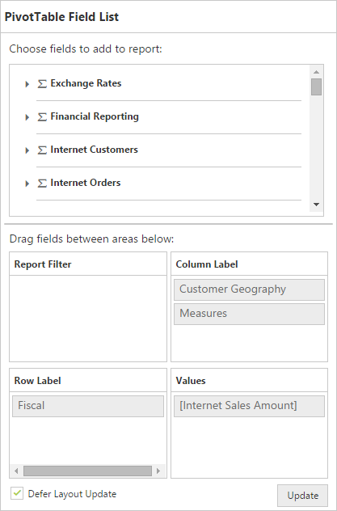

# Defer Update

I> This feature is applicable for OLAP datasource only at Server Mode.

Defer Update support allows you to refresh the control only on-demand and not during every UI interaction.

 

<cc1:PivotGrid ID="PivotGrid1" runat=server url="/PivotGridService" ClientIDMode="Static">
    <ClientSideEvents AfterServiceInvoke="OnAfterServiceInvoke" /> </cc1:PivotGrid>

<cc1:PivotSchemaDesigner ID="PivotSchemaDesigner" runat=server></cc1:PivotSchemaDesigner>



