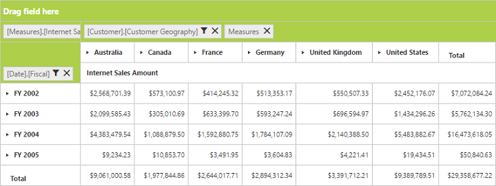
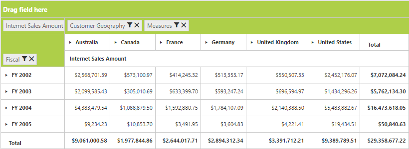
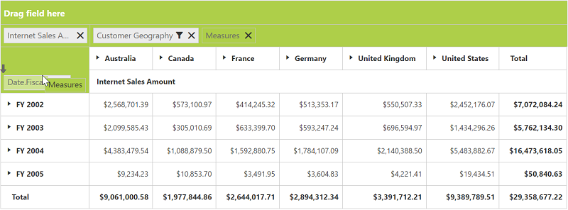
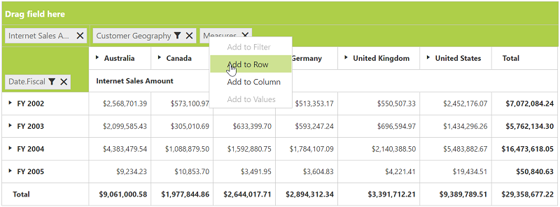
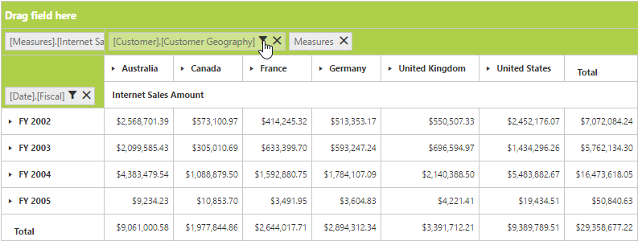
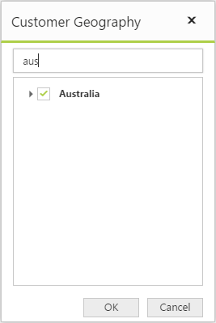
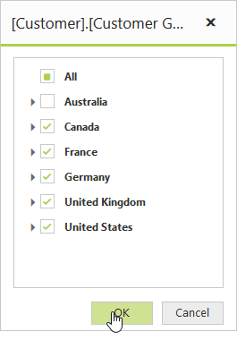
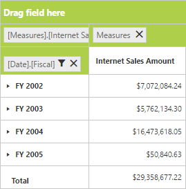

# Grouping bar

## Initialization

Grouping bar allows you to dynamically alter the report by filter and remove operations in the pivot grid control. Based on the OLAP data source and report bound to the pivot grid control, the grouping bar will be automatically populated. You can enable the grouping bar option in the pivot grid by setting the `EnableGroupingBar` property to true.

### Client mode



<ej:PivotGrid ID="PivotGrid1" runat="server" EnableGroupingBar="true">
    <DataSource Catalog="Adventure Works DW 2008 SE" Cube="Adventure Works" Data="https://bi.syncfusion.com/olap/msmdpump.dll">
        <Rows>
            <ej:Field FieldName="[Date].[Fiscal]"></ej:Field>
        </Rows>
        <Columns>
            <ej:Field FieldName="[Customer].[Customer Geography]"></ej:Field>
        </Columns>
        <Values>
            <ej:Field Axis="Column">
                <Measures>
                    <ej:MeasuresItems FieldName="[Measures].[Internet Sales Amount]" />
                </Measures>
            </ej:Field>
        </Values>
    </DataSource>
</ej:PivotGrid>

</ej:PivotGrid>



### Server mode



<ej:PivotGrid ID="PivotGrid1" runat=server url="/PivotGridService" EnableGroupingBar="true">
</ej:PivotGrid>



## Drag and drop

You can alter the report on fly through the drag and drop operation.

## Context menu

You can also alter the report by using the context menu.

## Searching values

Search option available in the grouping bar allows you to search a specific value that should be filtered from the list of values in the filter pop-up window.

## Filtering values

The filtering option available in the grouping bar allows you to select a specific set of values that should be displayed in the pivot grid control. At least, one value should present in the checked state while filtering. If else, the OK button will be disabled.

## Removing field

The remove option available in the grouping bar allows you to completely remove a specific field from the pivot grid control. The remove operation can be achieved by clicking the remove icon available in each field or by dragging and dropping the field out of the grouping bar region.

