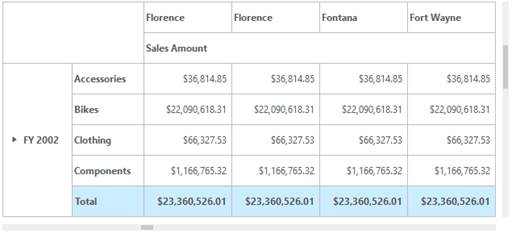
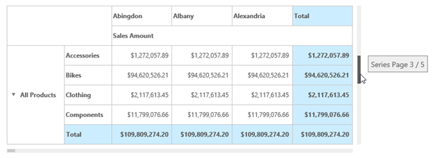

# Paging

N> This feature is applicable only for OLAP datasource.

## Pager

The PivotGrid is viewed page-by-page through Pager option. The Pager is set to PivotGrid using following code example.


<ej:PivotGrid ID="PivotGrid1" runat="server" Url="../wcf/PivotGridService.svc"  >

</ej:PivotGrid>

<ej:PivotPager ID="PivotPager1" runat="server"  Mode="Both" TargetControlID="PivotGrid1" > </ej:PivotPager>


The page size for categorical and series axes are set in the OlapReport. Pager is loaded with current page and total pages of PivotGrid is automatically displayed as illustrated in the following screenshot. The icons to move pages to next, last, previous and first are added.  Also you can directly navigate to the desired page by entering the appropriate numeric value into the text box.

 

PivotGrid in paging mode
{:.caption}

## Virtual Scrolling

The large PivotGrid data content is viewed page-by-page using VirtualScrolling. The page size for categorical and series axes are set in OlapReport. By enabling VirtualScrolling, the number of rows and columns for the PivotGrid are set as entered in the OlapReport. By scrolling the horizontal and vertical scrollbars, the categorical and series page numbers are obtained and PivotGrid contents are refreshed accordingly.



<ej:PivotGrid ID="PivotGrid1" runat="server" Url="../wcf/PivotGridService.svc"  EnableVirtualScrolling="true">


 

PivotGrid with Virtual Scroller
{:.caption}

Page indication while scrolling
{:.caption}

### OLAP Report for Paging and Virtual Scrolling


OlapReport olapReport = new OlapReport();

olapReport.CurrentCubeName = "Adventure Works";

olapReport.Name = "Default Report";

//NOTE: Below code enables the paging option and also sets the page size.

olapReport.EnablePaging = true;

olapReport.PagerOptions.SeriesPageSize = 5;

olapReport.PagerOptions.CategorialPageSize = 4;

DimensionElement dimensionElementColumn = new DimensionElement() { Name ="Customer" };

dimensionElementColumn.AddLevel("City", "City");

olapReport.CategoricalElements.Add(dimensionElementColumn);

DimensionElement dimensionElementRow = new DimensionElement() { Name = "Date"};

dimensionElementRow.AddLevel("Fiscal", "Fiscal Year");

olapReport.SeriesElements.Add(dimensionElementRow);

dimensionElementRow = new DimensionElement() { Name = "Product" };

dimensionElementRow.AddLevel("Category", "Category");

olapReport.SeriesElements.Add(dimensionElementRow);

MeasureElements measureElementColumn = new MeasureElements();

measureElementColumn.Elements.Add(new MeasureElement { Name = "Sales Amount"});

olapReport.CategoricalElements.Add(measureElementColumn);
