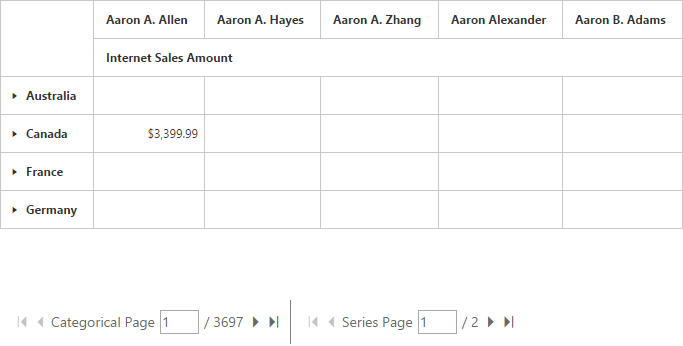
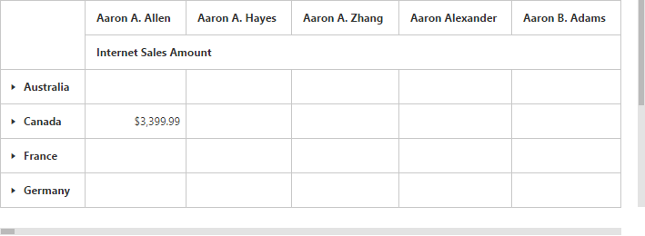

# Paging

## Pager

Paging helps to improve the rendering performance of the pivot grid control by dividing the large amount of data into several sections and displaying one section at a time. You can enable the paging option in the pivot grid by setting the [`EnablePaging`] property to true. You can provide the page size and current page details for each axis in the [`PagerOptions`] property.

To initialize a **Pager**, first you can define a **div** tag with an appropriate **id** attribute which acts as a container for the widget. Then, you can initialize the widget by using the **ejPivotPager** method.

In the **ejPivotPager** method, the enumeration property mode should be set to **ej.PivotPager.Mode.Both** to display both the categorical pager and the series pager. The other enumerations such as **ej.PivotPager.Mode.Categorical** and **ej.PivotPager.Mode.Series** will display only categorical pager and series pager respectively.



<ej:PivotGrid ID="PivotGrid1" EnablePaging="true" runat="server" ClientIDMode="Static">
    <DataSource>
        <%--...--%>
        <PagerOptions CategoricalPageSize="5" SeriesPageSize="5" CategoricalCurrentPage="1" SeriesCurrentPage="1" />
    </DataSource>
</ej:PivotGrid>

<ej:PivotPager ID="PivotPager1" runat="server" Mode="Both" TargetControlID="PivotGrid1"></ej:PivotPager>



Following are the navigation options available in the pager:

* Move first: Navigates to the first page.
* Move last: Navigates to the last page.
* Move previous: Navigates to the previous page from the current page.
* Move next: Navigates to the next page from the current page.
* Numeric box: Navigates to the desired page by entering an appropriate page number in the numeric value.

## Virtual scrolling

The virtual scrolling is a technique that allows you to view the pivot grid information page by page with the use of vertical and horizontal scrollbar. You can enable the virtual scrolling option in the pivot grid by setting the `EnableVirtualScrolling` property to true. You can provide the page size and current page details for each axis in the `PagerOptions` property.



<ej:PivotGrid ID="PivotGrid1" EnableVirtualScrolling="true" runat="server" ClientIDMode="Static">
    <DataSource>
        <%--...--%>
        <PagerOptions CategoricalPageSize="5" SeriesPageSize="5" CategoricalCurrentPage="1" SeriesCurrentPage="1" />
    </DataSource>
</ej:PivotGrid>



## Page settings

The properties associated to the paging are:

* EnablePaging: Enables/disables paging in the pivot client control.
* PagerOptions.CategoricalPageSize: Specifies the number of categorical columns to be displayed within a page of the pivot client control.
* PagerOptions.SeriesPageSize: Specifies the number of series rows to be displayed within a page of the pivot client control.
* PagerOptions.CategoricalCurrentPage: Sets the current page of the categorical axis in the pivot client control.
* PagerOptions.SeriesCurrentPage: Sets the current page of the series axis in the pivot client control.

For client mode, the page setting for categorical and series axes should be set in the data source property by using the following properties:



<ej:PivotGrid ID="PivotGrid1" EnablePaging="true" runat="server" ClientIDMode="Static">
    <DataSource>
        <%--...--%>
        <PagerOptions CategoricalPageSize="5" SeriesPageSize="5" CategoricalCurrentPage="1" SeriesCurrentPage="1" />
    </DataSource>
</ej:PivotGrid>

<ej:PivotPager ID="PivotPager1" runat="server" Mode="Both" TargetControlID="PivotGrid1"></ej:PivotPager>



For server mode, the page settings for categorical and series axes are done only through the OlapReport object that is created in the WebAPI or WCF file.

For Relational data source



PivotReport pivotReport = new PivotReport();
pivotReport.PagerOptions.SeriesPageSize = 4;
pivotReport.PagerOptions.CategoricalPageSize = 5;
pivotReport.PagerOptions.SeriesCurrentPage = 1;
pivotReport.PagerOptions.CategoricalCurrentPage = 1;



For OLAP data source



OlapReport olapReport = new OlapReport();
olapReport.CurrentCubeName = "Adventure Works";
olapReport.EnablePaging = true;
olapReport.PagerOptions.SeriesPageSize = 4;
olapReport.PagerOptions.CategoricalPageSize = 5;
olapReport.PagerOptions.CategoricalCurrentPage = 1;
olapReport.PagerOptions.SeriesCurrentPage = 1;

