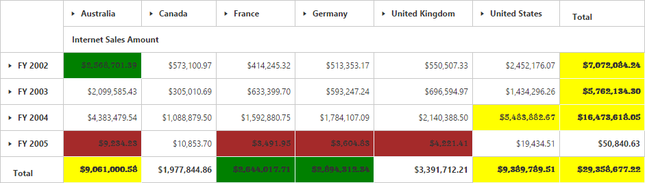

# PivotGrid: Elements

## Hyperlink

The PivotGrid control supports hyperlink option to link data for each individual cells. Hyperlink can be enabled separately for row, column, value and summary cells. Following are the respective properties:

* **EnableColumnHeaderHyperlink** - Enables hyperlink for column header.
* **EnableRowHeaderHyperlink** - Enables hyperlink for row header.
* **EnableSummaryCellHyperlink** - Enables hyperlink for summary cell.
* **EnableValueCellHyperlink** - Enables hyperlink for value cell.

Also hyperlink option provides separate event for row, column, value and summary cells as mentioned below.
 
* **ColumnHeaderHyperlinkClick** - Returns column header information through event on hyperlink click.
* **RowHeaderHyperlinkClick** - Returns row header information through event on hyperlink click.
* **SummaryCellHyperlinkClick** - Returns column header information through event on hyperlink click.
* **ValueCellHyperlinkClick** - Returns value cell information through event on hyperlink click.



<ej:PivotGrid ID="PivotGrid1" runat="server" Url="../PivotGridService">
        <HyperlinkSettings EnableColumnHeaderHyperlink="true" EnableValueCellHyperlink="true" EnableRowHeaderHyperlink="true" EnableSummaryCellHyperlink="true" />
        <ClientSideEvents ValueCellHyperlinkClick="CellClickEvent" RowHeaderHyperlinkClick="CellClickEvent" ColumnHeaderHyperlinkClick="CellClickEvent" SummaryCellHyperlinkClick="CellClickEvent" />
</ej:PivotGrid> 



## Selection

You can select a particular range of value cells from PivotGrid and manipulate/display them. Cell selection is applicable only for values cells and you can enable this functionality by setting `EnableCellSelection` property to true.

The **"CellSelection"** event would be triggered as soon as the selection process is over, that is, when the mouse left click is released. The event argument contains a collection of JSON records and header values, which contains information about the selected cells.



<ej:PivotGrid ID="PivotGrid1" runat="server" url="../PivotGridService" EnableCellSelection="true" >
    <ClientSideEvents CellSelection="valueCellClick"/>
</ej:PivotGrid> 



## Cell Context

Cell context allows user to perform any custom operation on cell right-click. For example, you can create and display content menu on cell right-click.

Cell context is enabled by setting the `EnableCellContext` property to true. The **"CellContext"** event would be raised as soon as right-click is done providing cell information through event argument.



<ej:PivotGrid ID="PivotGrid1" runat="server" url="../PivotGridService" EnableCellContext="true">
    <clientsideevents CellContext="cell_RightClick" />
</ej:PivotGrid> 



## Conditional Formatting

Conditional formatting in PivotGrid allows user to highlight particular cells with certain color, font-style, font-family etc. Based on the condition it has met.
  
Conditional formatting is enabled by setting `EnableConditionalFormatting` property to true and the formatting dialog is launched when **"createConditionalDialog"** method is invoked.



<ej:PivotGrid ID="PivotGrid1" runat="server" url="../PivotGridService" EnableConditionalFormatting="true">
</ej:PivotGrid>

<ej:Button ClientSideOnClick="btnClick" runat="server" Text="Conditional"></ej:Button>

 



