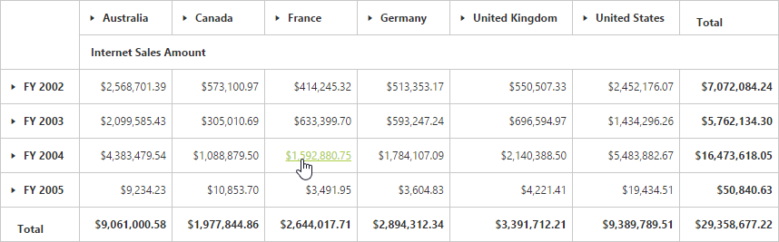
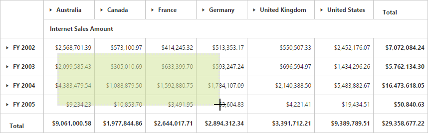
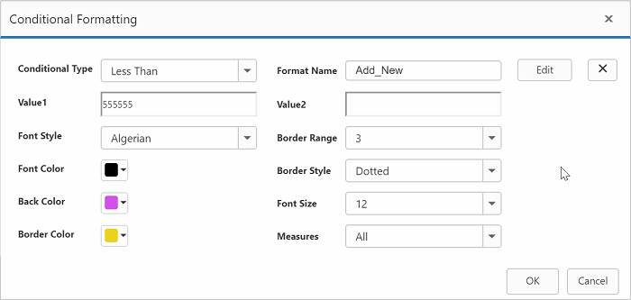
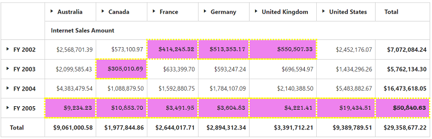
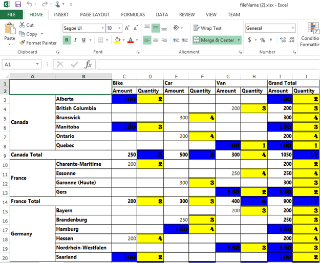

# Pivot grid: Elements

## Hyperlink
The pivot grid control supports hyperlink option to link data for each individual cell. The hyperlink can be enabled separately for row header, column header, value cell, and summary cell. Following are the respective properties:

* **EnableColumnHeaderHyperlink**: Enables hyperlink for column headers.
* **EnableRowHeaderHyperlink**: Enables hyperlink for row headers.
* **EnableSummaryCellHyperlink**: Enables hyperlink for a summary cell.
* **EnableValueCellHyperlink**: Enables hyperlink for a value cell.

Also, hyperlink option provides separate events for row header, column header, and value and summary cells as mentioned below:

* **ColumnHeaderHyperlinkClick**: Returns column header information through the event by clicking the hyperlink.
* **RowHeaderHyperlinkClick**: Returns row header information through the event by clicking the hyperlink.
* **SummaryCellHyperlinkClick**: Returns summary cell information through the event by clicking the hyperlink.
* **ValueCellHyperlinkClick**: Returns value cell information through the event by clicking the hyperlink.



<ej:PivotGrid ID="PivotGrid1" runat="server">
        <HyperlinkSettings EnableColumnHeaderHyperlink="true" EnableValueCellHyperlink="true" EnableRowHeaderHyperlink="true" EnableSummaryCellHyperlink="true" />
        <ClientSideEvents ValueCellHyperlinkClick="CellClickEvent" RowHeaderHyperlinkClick="CellClickEvent" ColumnHeaderHyperlinkClick="CellClickEvent" SummaryCellHyperlinkClick="CellClickEvent" />
</ej:PivotGrid>



## Selection
You can select a particular range of value cells from the pivot grid and manipulate/display them. The cell selection is applicable only for value cells and you can enable this functionality by setting the `EnableCellSelection` property to true.

The **"CellSelection"** event will be triggered as soon as the selection process is over, i.e., the event will be triggered when you release the mouse left-click. The event argument contains a collection of JSON records, and header values contains information about the selected cells.



<ej:PivotGrid ID="PivotGrid1" runat="server" EnableCellSelection="true" >
    <ClientSideEvents CellSelection="valueCellClick"/>
</ej:PivotGrid>



## Cell context
The cell context allows you to perform any custom operation by right-clicking the cell. For example, you can create and display the context menu by right-clicking the cell.

The cell context is enabled by setting the `EnableCellContext` property to true. The **"CellContext"** event will be raised as soon as the right-click is done to provide cell information through the event argument.



<ej:PivotGrid ID="PivotGrid1" runat="server" EnableCellContext="true">
    <clientsideevents CellContext="cell_RightClick" />
</ej:PivotGrid>



## Conditional formatting
The conditional formatting allows you to highlight the particular cells with certain color, font-style, font-family etc., based on the conditions they have met. It is enabled by setting the `EnableConditionalFormatting` property to true, and the formatting dialog will be launched when the **"createConditionalDialog"** method is invoked.



<ej:PivotGrid ID="PivotGrid1" runat="server" EnableConditionalFormatting="true">
    //...
</ej:PivotGrid>

<ej:Button ClientSideOnClick="btnClick" runat="server" Text="Conditional"></ej:Button>



### Export

You can export the pivot grid with highlighted particular cells along with its formatting styles.

Limitations for Word:

The following border styles are not supported:

* Solid
* Groove
* Ridge

Limitations for PDF:

Border styles are not applicable.

Limitations for Excel:

The following border styles are alone supported:

* Dashed
* Dotted
* Double

Also, the border size is not supported.

