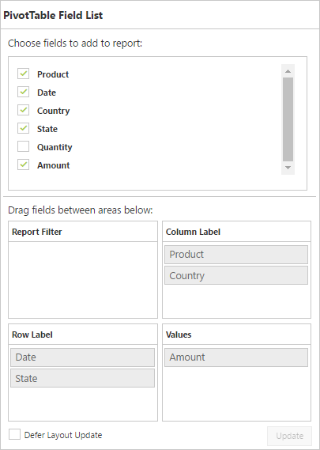

# Defer update

I> This feature is applicable for the relational data source at server mode only.

The defer update support allows you to refresh the control only on-demand and not during every UI interaction.



<ej:PivotGrid ID="PivotGrid1" runat=server url="/RelationalService.svc" ClientIDMode="Static" >
    <ClientSideEvents AfterServiceInvoke="OnAfterServiceInvoke" /> </ej:PivotGrid>

<ej:PivotSchemaDesigner ID="PivotSchemaDesigner" runat=server></ej:PivotSchemaDesigner>



