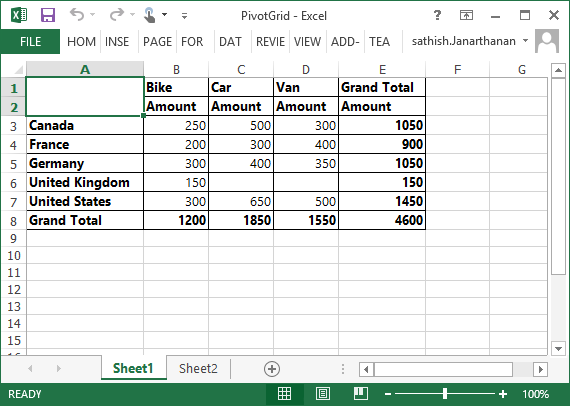
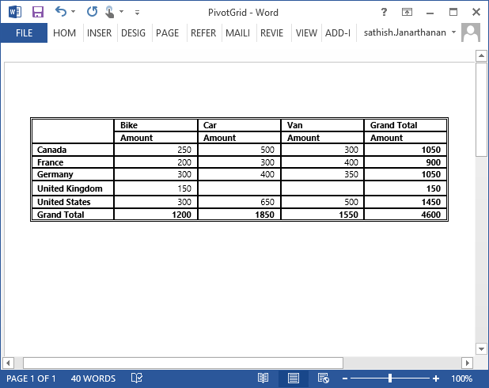
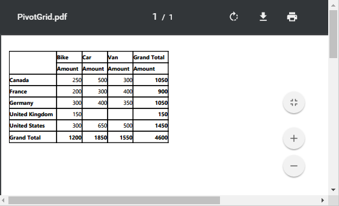
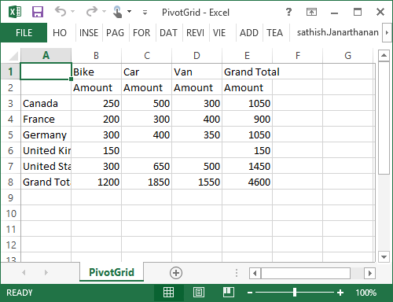

# Exporting

The pivot grid control can be exported to the following file formats:

* Microsoft Excel
* Microsoft Word
* PDF
* CSV

The pivot grid control can be exported by invoking the **“exportPivotGrid”** method, with an appropriate export option as parameter.

## JSON export

I> By default, the JSON export mode will be applied for server and client modes.



<html xmlns="http://www.w3.org/1999/xhtml">
//...

<body>
    //...
    //For PivotGrid in Client Mode.
    <ej:PivotGrid ID="PivotGrid1" runat="server" OnServerExcelExporting="PivotGrid_ServerExcelExporting" ClientIDMode="Static">
        <DataSource>
        </DataSource>
     </ej:PivotGrid>

    //For PivotGrid in Server Mode.
    <ej:PivotGrid ID="PivotGrid1" runat="server" Url="../RelationalService" IsResponsive="true">
    </ej:PivotGrid>

    <ej:Button runat="server" ClientSideOnClick="exportBtnClick" Text="Export">
    </ej:Button>
    
</body>

</html>



To achieve exporting in JSON mode, add the **"Syncfusion.EJ.Export"** dependency library to the application.

When the pivot grid is rendered, a server-side event method should be added in the code behind file of the application and you should import the **"Syncfusion.EJ.Export"** namespace in the code behind file.



//...
using Syncfusion.EJ.Export;

protected void PivotGrid_ServerExcelExporting(object sender, Syncfusion.JavaScript.Web.PivotGridEventArgs e)
{
    PivotGridExcelExport pGrid = new PivotGridExcelExport();
    dynamic args = e.Arguments;
    string fileName = "Sample";
    pGrid.ExportToExcel(fileName, args["args"].ToString(), HttpContext.Current.Response);
}



### Excel export

You can export the contents of the pivot grid to an Excel document for future archival, references, and analysis purposes.

To achieve Excel export, the **"excelExport"** server-side event is triggered and the file name is set as the parameter.



    <ej:PivotGrid ID="PivotGrid1" runat="server" OnServerExcelExporting="PivotGrid_ServerExcelExporting" ClientIDMode="Static">
        <DataSource>
        </DataSource>
     </ej:PivotGrid>
    <ej:Button runat="server" ClientSideOnClick="exportBtnClick" Text="Export">
    </ej:Button>
    



Following server-side event method should be added in the code behind file of the application:



//...
using Syncfusion.EJ.Export;

protected void PivotGrid_ServerExcelExporting(object sender, Syncfusion.JavaScript.Web.PivotGridEventArgs e)
{
    PivotGridExcelExport pGrid = new PivotGridExcelExport();
    dynamic args = e.Arguments;
    string fileName = "Sample";
    pGrid.ExportToExcel(fileName, args["args"].ToString(), HttpContext.Current.Response);
}



### Word export

You can export the contents of pivot grid to a Word document for future archival, references, and analysis purposes.

To achieve Word export, the **"wordExport"** server-side event is triggered and the file name is set as the parameter.



    <ej:PivotGrid ID="PivotGrid1" runat="server" OnServerWordExporting="PivotGrid_ServerWordExporting" ClientIDMode="Static">
        <DataSource>
        </DataSource>
     </ej:PivotGrid>
    <ej:Button runat="server" ClientSideOnClick="exportBtnClick" Text="Export">
    </ej:Button>
    



Following server-side event method should be added in the code behind file of the application:



//...
using Syncfusion.EJ.Export;

protected void PivotGrid_ServerWordExporting(object sender, Syncfusion.JavaScript.Web.PivotGridEventArgs e)
{
     PivotGridWordExport pGrid = new PivotGridWordExport();
     dynamic args = e.Arguments;
     string fileName = "Sample";
     pGrid.ExportToWord(fileName, args["args"].ToString(), HttpContext.Current.Response);
}



### PDF export

You can export the contents of the pivot grid to a PDF document for future archival, references, and analysis purposes.

To achieve Word export, the **"pdfExport"** server-side event is triggered and the file name is set as the parameter.



    <ej:PivotGrid ID="PivotGrid1" runat="server" OnServerPDFExporting="PivotGrid_ServerPDFExporting" ClientIDMode="Static">
        <DataSource>
        </DataSource>
     </ej:PivotGrid>
    <ej:Button runat="server" ClientSideOnClick="exportBtnClick" Text="Export">
    </ej:Button>
    



Following server-side event method should be added in the code behind file of the application:



//...
using Syncfusion.EJ.Export;

protected void PivotGrid_ServerPDFExporting(object sender, Syncfusion.JavaScript.Web.PivotGridEventArgs e)
{
     PivotGridPDFExport pGrid = new PivotGridPDFExport();
     dynamic args = e.Arguments;
     string fileName = "Sample";
     pGrid.ExportToPDF(fileName, args["args"].ToString(), HttpContext.Current.Response);
}



### CSV export

You can export the contents of the pivot grid to a CSV document for future archival, references, and analysis purposes.

To achieve CSV export, the **"csvExport"** server-side event is triggered and the file name is set as the parameter.



    <ej:PivotGrid ID="PivotGrid1" runat="server" OnServerCSVExporting="PivotGrid_ServerCSVExporting" ClientIDMode="Static">
        <DataSource>
        </DataSource>
     </ej:PivotGrid>
    <ej:Button runat="server" ClientSideOnClick="exportBtnClick" Text="Export">
    </ej:Button>
    



Following server-side event method should be added in the code behind file of the application:



//...
using Syncfusion.EJ.Export;

protected void PivotGrid_ServerCSVExporting(object sender, Syncfusion.JavaScript.Web.PivotGridEventArgs e)
{
     PivotGridCSVExport pGrid = new PivotGridCSVExport();
     dynamic args = e.Arguments;
     string fileName = "Sample";
     pGrid.ExportToCSV(fileName, args["args"].ToString(), HttpContext.Current.Response);
}



### Customize the export document name

For customizing file name, you can set the file name as a parameter to the **“exportPivotGrid”**  method along with server-side trigger event.



function exportBtnClick(args)
{
    var pGridObj = $('#PivotGrid1').data("ejPivotGrid");
    pGridObj.exportPivotGrid("excelExport","fileName");
}



## Pivot engine export

I> This feature is applicable only at the server mode operation.

To perform exporting with the use of the pivot engine available in the server-side, the 'exportMode' property obtained in the “BeforeExport” event is set to the "ej.PivotGrid.ExportMode.PivotEngine" value as shown below:



<html xmlns="http://www.w3.org/1999/xhtml">
//...

<body>
    //...

    <ej:PivotGrid ID="PivotGrid1" runat="server" Url="/RelationalService" IsResponsive="true">
        <ClientSideEvents  BeforeExport="Export"/>
    </ej:PivotGrid>

    <ej:Button runat="server" ClientSideOnClick="exportBtnClick" Text="Export">
    </ej:Button>
    
</body>

</html>



When the pivot grid is rendered in server mode, a service method should be added to the WCF/WebAPI for server-side operations.

For WebAPI controller, the following method should be added:



//...
using Syncfusion.Compression.Base;
using Syncfusion.XlsIO;
using Syncfusion.DocIO.Base;
using Syncfusion.Pdf.Base;

[System.Web.Http.ActionName("Export")]
[System.Web.Http.HttpPost]
public void Export()
{
    string args = HttpContext.Current.Request.Form.GetValues(0)[0];
    Dictionary<string, string> gridParams = serializer.Deserialize<Dictionary<string, string>>(args);
    htmlHelper.PopulateData(gridParams["currentReport"]);
    string fileName = "Sample";
    htmlHelper.ExportPivotGrid(ProductSales.GetSalesData(), args, fileName, HttpContext.Current.Response);
}



For WCF service, the following method should be added:



//...
using Syncfusion.Compression.Base;
using Syncfusion.XlsIO;
using Syncfusion.DocIO.Base;
using Syncfusion.Pdf.Base;

public void Export(System.IO.Stream stream)
{
    System.IO.StreamReader sReader = new System.IO.StreamReader(stream);
    string args = System.Web.HttpContext.Current.Server.UrlDecode(sReader.ReadToEnd()).Remove(0, 5);
    Dictionary<string, string> gridParams = serializer.Deserialize<Dictionary<string, string>>(args);
    htmlHelper.PopulateData(gridParams["currentReport"]);
    string fileName = "Sample";
    htmlHelper.ExportPivotGrid(ProductSales.GetSalesData(), args, fileName, System.Web.HttpContext.Current.Response);
}



### Excel export

You can export the contents of the pivot grid to an Excel document for future archival, references, and analysis purposes.

To achieve Excel export, you can add the following dependency libraries to the application.

* Syncfusion.Compression.Base
* Syncfusion.XlsIO.Base

For Excel export, the **“ej.PivotGrid.ExportOptions.Excel”** enumeration value is set as the parameter.



function exportBtnClick(args)
{
    var pGridObj = $('#PivotGrid1').data("ejPivotGrid");
    //Setting export option as Excel in the exportPivotGrid method for ServerMode
    pGridObj.exportPivotGrid(ej.PivotGrid.ExportOptions.Excel);
}



### Word export

You can export the contents of the pivot grid to a Word document for future archival, references, and analysis purposes.

 To achieve Word export, you can add the following dependency libraries to the application.

* Syncfusion.Compression.Base
* Syncfusion.DocIO.Base

For Word export, the **“ej.PivotGrid.ExportOptions.Word”** enumeration value is set as the parameter.



function exportBtnClick(args)
{
    var pGridObj = $('#PivotGrid1').data("ejPivotGrid");
    //Setting export option as Word in the exportPivotGrid method
    pGridObj.exportPivotGrid(ej.PivotGrid.ExportOptions.Word);
}



### PDF export

You can export the contents of the pivot grid to a PDF document for future archival, references, and analysis purposes.

To achieve PDF export, you can add the following dependency libraries to the application:

* Syncfusion.Compression.Base
* Syncfusion.Pdf.Base

For PDF export, the **“ej.PivotGrid.ExportOptions.PDF”** enumeration value is set as the parameter.



function exportBtnClick(args)
{
    var pGridObj = $('#PivotGrid1').data("ejPivotGrid");
    //Setting export option as PDF in the exportPivotGrid method
    pGridObj.exportPivotGrid(ej.PivotGrid.ExportOptions.PDF);
}



### CSV export

You can export the contents of the pivot grid to a CSV document for future archival, references, and analysis purposes.

For CSV export, the **“ej.PivotGrid.ExportOptions.CSV”** enumeration value is set as the parameter.



function exportBtnClick(args)
{
    var pGridObj = $('#PivotGrid1').data("ejPivotGrid");
    //Setting export option as CSV in the exportPivotGrid method
    pGridObj.exportPivotGrid(ej.PivotGrid.ExportOptions.CSV);
}



### File format selection

I> This option is applicable only for PivotGrid when exporting to Excel document.

You can set the option for exporting the control to Excel document either in *.xls* or *.xlsx* format, using `fileFormat` property inside the `BeforeExport` event.

N> By default excel document will be exported to ".xls" format using PivotEngine export.



<html xmlns="http://www.w3.org/1999/xhtml">
//...

<body>
    //...

    <ej:PivotGrid ID="PivotGrid1" runat="server" Url="/RelationalService" IsResponsive="true">
        <ClientSideEvents  BeforeExport="Export"/>
    </ej:PivotGrid>

    <ej:Button runat="server" ClientSideOnClick="exportBtnClick" Text="Export">
    </ej:Button>
    
</body>

</html>



### Customize the export document name

For customizing name in the WebAPI controller, the following code snippet is used:



//...
using Syncfusion.Compression.Base;
using Syncfusion.XlsIO;
using Syncfusion.DocIO.Base;
using Syncfusion.Pdf.Base;

[System.Web.Http.ActionName("Export")]
[System.Web.Http.HttpPost]
public void Export()
{
    string args = HttpContext.Current.Request.Form.GetValues(0)[0];
    Dictionary<string, string> gridParams = serializer.Deserialize<Dictionary<string, string>>(args);
    htmlHelper.PopulateData(gridParams["currentReport"]);
    string fileName = " File name is customized here ";
    htmlHelper.ExportPivotGrid(ProductSales.GetSalesData(), args, fileName, HttpContext.Current.Response);
}



For customizing name in the WCF service, the following code snippet is used:



//...
using Syncfusion.Compression.Base;
using Syncfusion.XlsIO;
using Syncfusion.DocIO.Base;
using Syncfusion.Pdf.Base;

public void Export(System.IO.Stream stream)
{
    System.IO.StreamReader sReader = new System.IO.StreamReader(stream);
    string args = System.Web.HttpContext.Current.Server.UrlDecode(sReader.ReadToEnd()).Remove(0, 5);
    Dictionary<string, string> gridParams = serializer.Deserialize<Dictionary<string, string>>(args);
    htmlHelper.PopulateData(gridParams["currentReport"]);
    string fileName = " File name is customized here ";
    htmlHelper.ExportPivotGrid(ProductSales.GetSalesData(), args, fileName, System.Web.HttpContext.Current.Response);
}



## Exporting customization

You can add the title and description to the exporting document by using the title and description property obtained in the "beforeExport" event.



    <ej:PivotGrid ID="PivotGrid1" runat="server" OnServerExcelExporting="PivotGrid_ServerExcelExporting" OnServerPDFExporting="PivotGrid_ServerPDFExporting" OnServerWordExporting="PivotGrid_ServerWordExporting" OnServerCSVExporting="PivotGrid_ServerCSVExporting" ClientIDMode="Static">
         //...
       <ClientSideEvents BeforeExport="Exporting" />
     </ej:PivotGrid>
    <ej:Button runat="server" ClientSideOnClick="exportBtnClick" Text="Export">
    </ej:Button>
    



You can also edit the exporting document by using a server-side event for the required exporting option.



//...
using Syncfusion.EJ.Export;
using Syncfusion.Compression.Base;
using Syncfusion.XlsIO;
using Syncfusion.DocIO.Base;
using Syncfusion.Pdf.Base;

//Following server side event method need to be added in code behind file of the application for JSON Export.

protected void PivotGrid_ServerExcelExporting(object sender, Syncfusion.JavaScript.Web.PivotGridEventArgs e)
{
    PivotGridExcelExport pGrid = new PivotGridExcelExport();
    dynamic args = e.Arguments;
    string fileName = "Sample";
    pGrid.ExcelExport += pGrid_ExcelExport;
    pGrid.ExportToExcel(fileName, args["args"].ToString(), HttpContext.Current.Response);
}

void pGrid_ExcelExport(object sender, Syncfusion.XlsIO.IWorkbook workBook)
{
    //You can customize exporting document here.
}

protected void PivotGrid_ServerPDFExporting(object sender, Syncfusion.JavaScript.Web.PivotGridEventArgs e)
{
    PivotGridPDFExport pGrid = new PivotGridPDFExport();
    dynamic args = e.Arguments;
    string fileName = "Sample";
    pGrid.AddPDFHeaderFooter += pGrid_AddPDFHeaderFooter;
    pGrid.PDFExport += pGrid_PDFExport;
    pGrid.ExportToPDF(fileName, args["args"].ToString(), HttpContext.Current.Response);
}

void pGrid_PDFExport(object sender, Syncfusion.Pdf.PdfDocument pdfDoc)
{
    //You can customize exporting document here.
}

void pGrid_AddPDFHeaderFooter(object sender, Syncfusion.Pdf.PdfDocument pdfDoc)
{
    //You can add header/footer information to the PDF document.
}

protected void PivotGrid_ServerCSVExporting(object sender, Syncfusion.JavaScript.Web.PivotGridEventArgs e)
{
    PivotGridCSVExport pGrid = new PivotGridCSVExport();
    dynamic args = e.Arguments;
    string fileName = "Sample";
    pGrid.CSVExport += pGrid_CSVExport;
    pGrid.ExportToCSV(fileName, args["args"].ToString(), HttpContext.Current.Response);
}

void pGrid_CSVExport(object sender, string csvString)
{
    //You can customize exporting document here.
}

protected void PivotGrid_ServerWordExporting(object sender, Syncfusion.JavaScript.Web.PivotGridEventArgs e)
{
    PivotGridWordExport pGrid = new PivotGridWordExport();
    dynamic args = e.Arguments;
    string fileName = "Sample";
    pGrid.WordExport += pGrid_WordExport;
    pGrid.ExportToWord(fileName, args["args"].ToString(), HttpContext.Current.Response);
}

void pGrid_WordExport(object sender, Syncfusion.DocIO.DLS.WordDocument document)
{
    //You can customize exporting document here.
}

//Following service method needs to be added in WCF/WebAPI for PivotEngine Export.

[System.Web.Http.ActionName("Export")]
[System.Web.Http.HttpPost]
public void Export()
{
    string args = HttpContext.Current.Request.Form.GetValues(0)[0];
    Dictionary<string, string> gridParams = serializer.Deserialize<Dictionary<string, string>>(args);
    htmlHelper.PopulateData(gridParams["currentReport"]);
    htmlHelper.ExcelExport += htmlHelper_ExcelExport;
    htmlHelper.WordExport += htmlHelper_WordExport;
    htmlHelper.AddPDFHeaderFooter += htmlHelper_AddPDFHeaderFooter;
    htmlHelper.PDFExport += htmlHelper_PDFExport;
    htmlHelper.CSVExport += htmlHelper_CSVExport;
    string fileName = "Sample";
    htmlHelper.ExportPivotGrid(ProductSales.GetSalesData(), args, fileName, System.Web.HttpContext.Current.Response);
}

void htmlHelper_ExcelExport(object sender, Syncfusion.XlsIO.IWorkbook workBook)
{
    //You can customize exporting document here.
}
void htmlHelper_WordExport(object sender, Syncfusion.DocIO.DLS.WordDocument document)
{
    //You can customize exporting document here.
}
void htmlHelper_AddPDFHeaderFooter(object sender, Syncfusion.Pdf.PdfDocument pdfDoc)
{
    //You can add header/footer information to the PDF document.
}
void htmlHelper_PDFExport(object sender, Syncfusion.Pdf.PdfDocument pdfDoc)
{
    //You can customize exporting document here.
}
void htmlHelper_CSVExport(object sender, string csvString)
{
    //You can customize exporting document here.
}



### Exporting complete data on Paging

When paging is enabled, you can export the complete data by enabling the `EnableCompleteDataExport` property. It is supported in both types of JSON and PivotEngine export and it is applicable for all kinds of exporting formats available in PivotGrid.


<html>
//...
<body>
    <ej:PivotGrid ID="PivotGrid1" runat="server" EnableCompleteDataExport="true">
    </ej:PivotGrid>
	//...
</body>
</html>



The below screenshot shows the PivotGrid control exported to Excel document.

The following screenshot shows the pivot grid control exported to a Word document:

The following screenshot shows the pivot grid control exported to a PDF document:

The following screenshot shows the pivot grid control exported to a CSV document:

N> Grand total and sub-totals can be hidden while exporting the document.

