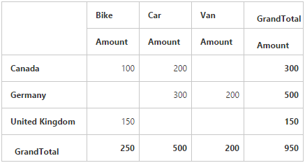
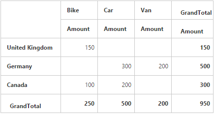
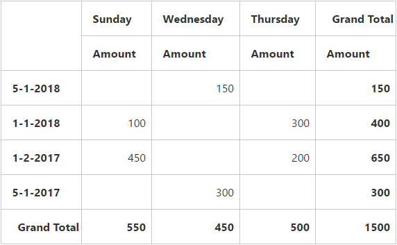
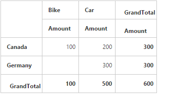
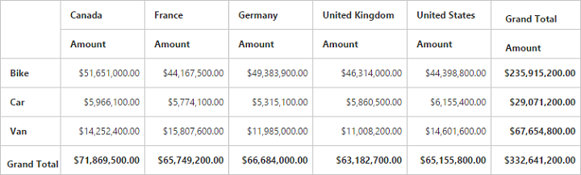

# Getting started

>**Important**
Starting with v16.2.0.x, if you refer to Syncfusion assemblies from trial setup or from the NuGet feed, include a license key in your projects. Refer to this [link](https://help.syncfusion.com/common/essential-studio/licensing/license-key) to learn about registering Syncfusion license key in your ASP.NET Core application to use our components.

## Creating a simple application with pivot grid and relational data source (client mode)

This section covers the information required to populate a simple pivot grid with relational data completely on the client-side.

### Project initialization

Create a new **ASP.NET Empty Web Application** by using the Visual Studio IDE and name the project **“PivotGridDemo”**.

Now, add a Web Form to the empty web application. For adding a Web Form, right-click the project in the solution explorer and select **Add > New Item**. In the **Add New Item** window, select Web Form and name it `GettingStarted.aspx`, and then click Add.

To set an appropriate start page, right-click the **“GettingStarted.aspx”** in the solution explorer and select **“Set As Start Page”**.

Now, add the following dependency libraries as references to your web application. To add them to your application, right-click **References** in the solution explorer and select Add Reference. In the **Reference Manager** dialog, under **Assemblies > Extension**, the following Syncfusion libraries will be found.

* Syncfusion.EJ
* Syncfusion.EJ.Export
* Syncfusion.EJ.Pivot

Register the referenced assemblies in Web.config files available at the root of the application.



<compilation debug="true" targetFramework="4.5">
    <assemblies>
        ……
        ……
        <add assembly="Syncfusion.EJ, Version= {{ site.45esreleaseversion}}, Culture=neutral, PublicKeyToken=3d67ed1f87d44c89" />
        <add assembly="Syncfusion.EJ.Pivot, Version= {{ site.45esreleaseversion}}, Culture=neutral, PublicKeyToken=3d67ed1f87d44c89" />
        <add assembly="Syncfusion.EJ.Export, Version= {{ site.45esreleaseversion}}, Culture=neutral, PublicKeyToken=3d67ed1f87d44c89" />

    </assemblies>
</compilation>


### Scripts and CSS references

create a GettingStarted.aspx page, and scripts and style sheets that are required to render the pivot grid control in a web application are mentioned below in an appropriate order:

1. ej.web.all.min.css
2. jQuery-3.0.0.min.js
3. ej.web.all.min.js

Scripts and style sheets are referred under the <head> tag in the GettingStarted.aspx page.



<head>
    <link href="http://cdn.syncfusion.com/{{ site.releaseversion }}/js/web/flat-azure/ej.web.all.min.css" rel="stylesheet" type="text/css" />
    
    

</head>



### Initialize pivot grid

You can drag and drop the pivot grid control from the toolbox (under Syncfusion BI Web category) or manually define the control as shown in the following code sample of the "GettingStarted.aspx" page.



<%@ Register Assembly="Syncfusion.EJ.Pivot" Namespace="Syncfusion.JavaScript.Web" TagPrefix="ej" %>
<%@ Register Assembly="Syncfusion.EJ.Pivot" Namespace="Syncfusion.JavaScript.Models" TagPrefix="ej" %>

<html>
    ……
    ……

<body>
    <form runat="server">
        <ej:PivotGrid ID="PivotGrid1" runat="server" ClientIDMode="Static">
        </ej:PivotGrid>
        <asp:ScriptManager ID="ScriptManager1" runat="server"></asp:ScriptManager>
    </form>
</body>

</html>



### Populate pivot grid with data
This section illustrates how to populate the pivot grid control using a sample JSON data as shown below:



<ej:PivotGrid ID="PivotGrid1" runat="server" ClientIDMode="Static">
<ClientSideEvents Load="onLoad" />
</ej:PivotGrid>
<asp:ScriptManager ID="ScriptManager1" runat="server"></asp:ScriptManager>



The JSON data is set to the **"Data"** property present in the **"DataSource"** object. The **"DataSource"** object allows you to set both the data source and fields that should be displayed in the row, column, value, and filter section of the pivot grid control.



<ej:PivotGrid ID="PivotGrid1" runat="server" ClientIDMode="Static">
    <DataSource>
        <Rows>
            <ej:Field FieldName="Country" FieldCaption="Country"></ej:Field>
        </Rows>
        <Columns>
            <ej:Field FieldName="Product" FieldCaption="Product"></ej:Field>
        </Columns>
        <Values>
            <ej:Field FieldName="Amount" FieldCaption="Amount"></ej:Field>
        </Values>
    </DataSource>
    <ClientSideEvents Load="onLoad" />
</ej:PivotGrid>
<asp:ScriptManager ID="ScriptManager1" runat="server"></asp:ScriptManager>



The above code will generate a simple pivot grid with "Country" field in the row, "Product" field in the column, and "Amount" field in the value section.

### Apply sorting

You can sort a field to ascending or descending order by using the **"SortOrder"** property. The sorting is applicable only for row and column fields. By default, the fields are arranged in the ascending order.



<ej:PivotGrid ID="PivotGrid1" runat="server" ClientIDMode="Static">
        <DataSource>
            <Rows>
                <ej:Field FieldName="Country" FieldCaption="Country" SortOrder="Descending"></ej:Field>
            </Rows>
            <Columns>
            <ej:Field FieldName="Product" FieldCaption="Product"></ej:Field>
        </Columns>
        <Values>
            <ej:Field FieldName="Amount" FieldCaption="Amount"></ej:Field>
        </Values>
        </DataSource>
    <ClientSideEvents Load="onLoad" />
</ej:PivotGrid>
<asp:ScriptManager ID="ScriptManager1" runat="server"></asp:ScriptManager>



### Sort Row/Column by Date

You can sort a field either in ascending or descending order according for date type by using the **sortOrder** property. Sorting is applicable only for Row and Column fields. By default, fields are arranged in ascending order.

N> To apply sorting by date, you need to specify the `format` and `formatString` in the field.



<ej:PivotGrid ID="PivotGrid1" runat="server" ClientIDMode="Static">
    <DataSource>
        <Rows>
            <ej:Field FieldName="Date" FieldCaption="Date" Format="date" FormatString="dd-MM-yyyy" SortOrder="Descending"></ej:Field>
        </Rows>
        <Columns>
            <ej:Field FieldName="Day" FieldCaption="Day" Format="date" FormatString="ddd" SortOrder="Ascending"></ej:Field>
        </Columns>
        <Values>
            <ej:Field FieldName="Amount" FieldCaption="Amount"></ej:Field>
        </Values>
    </DataSource>
    <ClientSideEvents Load="onLoad" />
</ej:PivotGrid>
<asp:ScriptManager ID="ScriptManager1" runat="server"></asp:ScriptManager>



### Apply Filtering

The filtering option allows you to specify a set of values that should be displayed or hidden. Also, the filtering option is applicable only for the row, column, and filter areas.

**"filterItems"** object allows you to apply filtering to fields by using the following properties:

* filterType: indicates whether the values should be included or excluded.
* values: specifies an array of values that should be included or excluded within the particular field.



<ej:PivotGrid ID="PivotGrid1" runat="server" ClientIDMode="Static">
    <DataSource>
    <Rows>
        <ej:Field FieldName="Country" FieldCaption="Country">
        <FilterItems FilterType="Exclude"/>
        </ej:Field>
    </Rows>
    <Columns>
        <ej:Field FieldName="Product" FieldCaption="Product">
        <FilterItems FilterType="Include" />
        </ej:Field>
    </Columns>
    <Values>
        <ej:Field FieldName="Amount" FieldCaption="Amount"></ej:Field>
    </Values>
    </DataSource>
    <ClientSideEvents Load="onLoad" />
</ej:PivotGrid>
<asp:ScriptManager ID="ScriptManager1" runat="server"></asp:ScriptManager>



The values for filtering are given in the GettingStarted.aspx.cs file as shown in the following snippet:



protected void Page_Load(object sender, EventArgs e)
{
    this.PivotGrid1.Model.DataSource.Rows[0].FilterItems.Values = new List<string>() { "United Kingdom" };
    this.PivotGrid1.Model.DataSource.Columns[0].FilterItems.Values = new List<string>() { "Bike","Car" };
}



### Apply summary types

Allows you to specify the required summary type to be used in summary cells of the pivot grid. **"Sum"** is the default summary type. Following are the summary types that are supported:

* Sum
* Average
* Count
* Min
* Max



<ej:PivotGrid ID="PivotGrid1" runat="server" ClientIDMode="Static">
    <DataSource>
        <Rows>
            <ej:Field FieldName="Country" FieldCaption="Country"></ej:Field>
        </Rows>
    <Columns>
            <ej:Field FieldName="Product" FieldCaption="Product"></ej:Field>
    </Columns>
    <Values>
            <ej:Field FieldName="Amount" FieldCaption="Amount" SummaryType="Average"></ej:Field>
            <ej:Field FieldName="Quantity" FieldCaption="Quantity" SummaryType="Average"></ej:Field>
    </Values>
    </DataSource>
    <ClientSideEvents Load="onLoad" />
</ej:PivotGrid>
<asp:ScriptManager ID="ScriptManager1" runat="server"></asp:ScriptManager>



## Creating a simple application with pivot grid and relational data source(server mode)

This section covers the information required to create a simple pivot grid bound to the relational data source.

N> ASP.NET MVC web application contains a service that will transfer the data to server-side, process it, and return it to client-side for control rendering and re-rendering. The service utilized for communication can be either the WCF or WebAPI based on user requirement.

### Project initialization

Create a new **ASP.NET Empty Web Application** by using the Visual Studio IDE and name the project **“PivotGridDemo”**.

Now, add a Web Form to the empty web application. For adding a Web Form, right-click the project in the solution explorer and select **Add > New Item**. In the **Add New Item** window, select Web Form and name it `GettingStarted.aspx`, and then click Add.

To set an appropriate start page, right-click the **“GettingStarted.aspx”** in the solution explorer and select **“Set As Start Page”**.

Now, add the following dependency libraries as references to your web application. To add them to your application, right-click **References** in the solution explorer and select **Add Reference**. In the **Reference Manager** dialog, under **Assemblies > Extension**, the following Syncfusion libraries will be found.

N> If you have installed any version of Essential Studio, then the location of Syncfusion libraries is [system drive:\Program Files (x86)\Syncfusion\Essential Studio\{{ site.releaseversion }}\Assemblies].

* Syncfusion.Compression.Base
* Syncfusion.Linq.Base
* Syncfusion.Olap.Base
* Syncfusion.PivotAnalysis.Base
* System.Data.SqlServerCe (Version: 4.0.0.0)
* Syncfusion.XlsIO.Base
* Syncfusion.Pdf.Base
* Syncfusion.DocIO.Base
* Syncfusion.EJ
* Syncfusion.EJ.Web
* Syncfusion.EJ.Export
* Syncfusion.EJ.Pivot

### Scripts and CSS initialization

The scripts and style sheets that are required to render the control in a web application are mentioned below in an appropriate order:

1. ej.web.all.min.css
2. jQuery-3.0.0.min.js
3. ej.web.all.min.js

[Click here](http://help.syncfusion.com/js/cdn) to know more about scripts and style sheets available in online (CDN link).

Scripts and style sheets are referred under the <head> tag in the **GettingStarted.aspx** page.



<head>
    <link href="http://cdn.syncfusion.com/{{ site.releaseversion }}/js/web/flat-azure/ej.web.all.min.css" rel="stylesheet" type="text/css" />
    
    
</head>



### Control initialization

You can drag and drop the **pivot grid** control from the toolbox (under **Syncfusion BI Web** category) or manually define the control as shown in the following code sample of the **"GettingStarted.aspx"** page.

After placing the control in the web page, add the **'ScriptManager'** next to it to generate appropriate scripts.



<%@ Register Assembly="Syncfusion.EJ.Pivot, Version={{ site.45esreleaseversion }}, Culture=neutral, PublicKeyToken=3d67ed1f87d44c89" Namespace="Syncfusion.JavaScript.Web" TagPrefix="ej" %>
<html>
    ……
    ……

<body>
    <form runat="server">
        <ej:PivotGrid ID="PivotGrid1" Url="/Relational" runat="server" ClientIDMode="Static"></ej:PivotGrid>
        <asp:ScriptManager ID="ScriptManager1" runat="server"></asp:ScriptManager>
    </form>
</body>

</html>



The **Url** property in the pivot grid control points the service endpoint, where the data is processed and fetched in the form of JSON. The services used in the pivot grid control as endpoint are WCF and WebAPI.

N> The above “GettingStarted.aspx” contains WebAPI URL, which is “/Relational”. If the WCF service is used as an endpoint, then the URL will look like “/RelationalService.svc”.

If you enter the code manually instead of drag and drop from the toolbox, then you need to register the referenced assemblies in the Web.config file.



<compilation debug="true" targetFramework="4.5">
    <assemblies>
        ……
        ……
        <add assembly="Syncfusion.EJ, Version= {{ site.45esreleaseversion }}, Culture=neutral, PublicKeyToken=3d67ed1f87d44c89" />
        <add assembly="Syncfusion.EJ.Web, Version= {{ site.45esreleaseversion }}, Culture=neutral, PublicKeyToken=3d67ed1f87d44c89" />
        <add assembly="Syncfusion.EJ.Pivot, Version= {{ site.45esreleaseversion }}, Culture=neutral, PublicKeyToken=3d67ed1f87d44c89" />
        <add assembly="Syncfusion.EJ.Export, Version= {{ site.45esreleaseversion }}, Culture=neutral, PublicKeyToken=3d67ed1f87d44c89" />
        <add assembly="Syncfusion.Compression.Base, Version= {{ site.45esreleaseversion }}, Culture=neutral, PublicKeyToken=3d67ed1f87d44c89" />
        <add assembly="Syncfusion.Linq.Base, Version= {{ site.45esreleaseversion }}, Culture=neutral, PublicKeyToken=3d67ed1f87d44c89" />
        <add assembly="Syncfusion.Olap.Base, Version= {{ site.45esreleaseversion }}, Culture=neutral, PublicKeyToken=3d67ed1f87d44c89" />
        <add assembly="Syncfusion.PivotAnalysis.Base, Version= {{ site.45esreleaseversion }}, Culture=neutral, PublicKeyToken=3d67ed1f87d44c89" />
        <add assembly="Syncfusion.Pdf.Base, Version= {{ site.45esreleaseversion }}, Culture=neutral, PublicKeyToken=3d67ed1f87d44c89" />
        <add assembly="Syncfusion.XlsIO.Base, Version= {{ site.45esreleaseversion }}, Culture=neutral, PublicKeyToken=3d67ed1f87d44c89" />
        <add assembly="Syncfusion.DocIO.Base, Version= {{ site.45esreleaseversion }}, Culture=neutral, PublicKeyToken=3d67ed1f87d44c89" />

    </assemblies>
</compilation>



### WebAPI

**Adding a WebAPI controller**

To add a WebAPI controller in an existing web application, right-click the project in the solution explorer and select **Add > New Item**. In the **Add New Item** window, select **WebAPI Controller Class** and name it `RelationalController.cs`, and then click Add.

Now, the WebAPI controller is added to the application that contains the **"RelationalController.cs"** file.

N> While adding the WebAPI controller class, add the mandatory suffix 'Controller'. For example, in this demo, the controller is named "RelationalController".

Next, remove all the existing methods such as "Get", "Post", "Put", and "Delete" present in the `RelationalController.cs` file.



namespace PivotGridDemo
{
    public class RelationalController: ApiController
    {

    }
}



**Adding the list of namespaces**

The following are the list of namespaces to be added on top of the main class in the `RelationalController.cs` file:



using Syncfusion.JavaScript;
using Syncfusion.PivotAnalysis.Base;
using System;
using System.Collections.Generic;
using System.Data;
using System.Data.SqlServerCe;
using System.Linq;
using System.Text;
using System.Web;
using System.Web.Http;
using System.Web.Script.Serialization;
using OLAPUTILS = Syncfusion.JavaScript.Olap;

namespace PivotGridDemo
{
    public class RelationalController : ApiController
    {

    }
}



**Data source initialization**

A simple collection is provided as a data source for the pivot grid in this demo section. This data source is placed inside a separate class named "ProductSales" in the `RelationalController.cs` file. Find the code sample below:



namespace PivotGridDemo
{
………
………
………
internal class ProductSales
    {
        public string Product { get; set; }

        public string Date { get; set; }

        public string Country { get; set; }

        public string State { get; set; }

        public int Quantity { get; set; }

        public double Amount { get; set; }

        public static ProductSalesCollection GetSalesData()
        {
            /// Geography
            string[] countries = new string[] { "Australia", "Canada", "France", "Germany", "United Kingdom", "United States" };
            string[] ausStates = new string[] { "New South Wales", "Queensland", "South Australia", "Tasmania", "Victoria" };
            string[] canadaStates = new string[] { "Alberta", "British Columbia", "Brunswick", "Manitoba", "Ontario", "Quebec" };
            string[] franceStates = new string[] { "Charente-Maritime", "Essonne", "Garonne (Haute)", "Gers", };
            string[] germanyStates = new string[] { "Bayern", "Brandenburg", "Hamburg", "Hessen", "Nordrhein-Westfalen", "Saarland" };
            string[] ukStates = new string[] { "England" };
            string[] ussStates = new string[] { "New York", "North Carolina", "Alabama", "California", "Colorado", "New Mexico", "South Carolina" };

            /// Time
            string[] dates = new string[] { "FY 2005", "FY 2006", "FY 2007", "FY 2008", "FY 2009" };

            /// Products
            string[] products = new string[] { "Bike", "Van", "Car" };
            Random r = new Random(123345345);

            int numberOfRecords = 2000;
            ProductSalesCollection listOfProductSales = new ProductSalesCollection();
            for (int i = 0; i < numberOfRecords; i++)
            {
                ProductSales sales = new ProductSales();
                sales.Country = countries[r.Next(1, countries.GetLength(0))];
                sales.Quantity = r.Next(1, 12);
                /// 1 percent discount for 1 quantity
                double discount = (30000 * sales.Quantity) * (double.Parse(sales.Quantity.ToString()) / 100);
                sales.Amount = (30000 * sales.Quantity) - discount;
                sales.Date = dates[r.Next(r.Next(dates.GetLength(0) + 1))];
                sales.Product = products[r.Next(r.Next(products.GetLength(0) + 1))];
                switch (sales.Product)
                {
                    case "Car":
                        {
                            sales.Date = "FY 2005";
                            break;
                        }
                }
                switch (sales.Country)
                {
                    case "Australia":
                        {
                            sales.State = ausStates[r.Next(ausStates.GetLength(0))];
                            break;
                        }
                    case "Canada":
                        {
                            sales.State = canadaStates[r.Next(canadaStates.GetLength(0))];
                            break;
                        }
                    case "France":
                        {
                            sales.State = franceStates[r.Next(franceStates.GetLength(0))];
                            break;
                        }
                    case "Germany":
                        {
                            sales.State = germanyStates[r.Next(germanyStates.GetLength(0))];
                            break;
                        }
                    case "United Kingdom":
                        {
                            sales.State = ukStates[r.Next(ukStates.GetLength(0))];
                            break;
                        }
                    case "United States":
                        {
                            sales.State = ussStates[r.Next(ussStates.GetLength(0))];
                            break;
                        }
                }
                listOfProductSales.Add(sales);
            }

            return listOfProductSales;
        }

        public override string ToString()
        {
            return string.Format("{0}-{1}-{2}", this.Country, this.State, this.Product);
        }

        public class ProductSalesCollection : List<ProductSales>
        {
        }
    }
}



**Service methods in WebAPI controller**

Now, you can define the service methods in the RelationalController class, find in the `RelationalController.cs` file which was created while adding the WebAPI controller class to your web application.



namespace PivotGridDemo
{
    public class RelationalController : ApiController
    {
            PivotGrid htmlHelper = new PivotGrid();
            JavaScriptSerializer serializer = new JavaScriptSerializer();
            Dictionary<string, object> dict = new Dictionary<string, object>();
            static int cultureIDInfoval = 1033;
            string connectionString = "Data Source=https://bi.syncfusion.com/olap/msmdpump.dll; Initial Catalog=Adventure Works DW 2008 SE;";
            string conStringforDB = ""; //Enter appropriate connection string to connect database for saving and loading operation of reports

            [System.Web.Http.ActionName("InitializeGrid")]
            [System.Web.Http.HttpPost]
            public Dictionary<string, object> InitializeGrid(Dictionary<string, object> jsonResult)
            {
                htmlHelper.PivotReport = BindDefaultData();
                dict = htmlHelper.GetJsonData(jsonResult["action"].ToString(), ProductSales.GetSalesData());
                return dict;
            }

            [System.Web.Http.ActionName("FetchMembers")]
            [System.Web.Http.HttpPost]
            public Dictionary<string, object> FetchMembers(Dictionary<string, object> jsonResult)
            {
                htmlHelper.PopulateData(jsonResult["currentReport"].ToString());
                dict = htmlHelper.GetJsonData(jsonResult["action"].ToString(), ProductSales.GetSalesData(), jsonResult["headerTag"].ToString(), jsonResult["sortedHeaders"].ToString());
                return dict;
            }

            [System.Web.Http.ActionName("Filtering")]
            [System.Web.Http.HttpPost]
            public Dictionary<string, object> Filtering(Dictionary<string, object> jsonResult)
            {
                htmlHelper.PopulateData(jsonResult["currentReport"].ToString());
                dict = htmlHelper.GetJsonData(jsonResult["action"].ToString(), ProductSales.GetSalesData(), jsonResult["filterParams"].ToString(), jsonResult["sortedHeaders"].ToString());
                return dict;
            }

            [System.Web.Http.ActionName("NodeStateModified")]
            [System.Web.Http.HttpPost]
            public Dictionary<string, object> NodeStateModified(Dictionary<string, object> jsonResult)
            {
                htmlHelper.PopulateData(jsonResult["currentReport"].ToString());
                dict = htmlHelper.GetJsonData(jsonResult["action"].ToString(), ProductSales.GetSalesData(), jsonResult["headerTag"].ToString(), jsonResult["dropAxis"].ToString(), jsonResult["filterParams"].ToString(), jsonResult["sortedHeaders"].ToString());
                return dict;
            }

            [System.Web.Http.ActionName("NodeDropped")]
            [System.Web.Http.HttpPost]
            public Dictionary<string, object> NodeDropped(Dictionary<string, object> jsonResult)
            {
                htmlHelper.PopulateData(jsonResult["currentReport"].ToString());
                dict = htmlHelper.GetJsonData(jsonResult["action"].ToString(), ProductSales.GetSalesData(), jsonResult["dropAxis"].ToString(), jsonResult["headerTag"].ToString(), jsonResult.ContainsKey("filterParams") ? jsonResult["filterParams"].ToString() : null, jsonResult["sortedHeaders"].ToString());
                return dict;
            }

            [System.Web.Http.ActionName("Sorting")]
            [System.Web.Http.HttpPost]
            public Dictionary<string, object> Sorting(Dictionary<string, object> jsonResult)
            {
                htmlHelper.PopulateData(jsonResult["currentReport"].ToString());
                dict = htmlHelper.GetJsonData(jsonResult["action"].ToString(), ProductSales.GetSalesData(), jsonResult["sortedHeaders"].ToString());
                return dict;
            }

            [System.Web.Http.ActionName("CalculatedField")]
            [System.Web.Http.HttpPost]
            public Dictionary<string, object> CalculatedField(Dictionary<string, object> jsonResult)
            {
                htmlHelper.PopulateData(jsonResult["currentReport"].ToString());
                dict = htmlHelper.GetJsonData(jsonResult["action"].ToString(), ProductSales.GetSalesData(), null, jsonResult["headerTag"].ToString());
                return dict;
            }

            [System.Web.Http.ActionName("Export")]
            [System.Web.Http.HttpPost]
            public void Export()
            {
                string args = HttpContext.Current.Request.Form.GetValues(0)[0];
                Dictionary<string, string> gridParams = serializer.Deserialize<Dictionary<string, string>>(args);
                htmlHelper.PopulateData(gridParams["currentReport"]);
                string fileName = "Sample";
                htmlHelper.ExportPivotGrid(ProductSales.GetSalesData(), args, fileName, System.Web.HttpContext.Current.Response);
            }

            [System.Web.Http.ActionName("SaveReport")]
            [System.Web.Http.HttpPost]
            public Dictionary<string, object> SaveReport(Dictionary<string, object> jsonResult)
            {
                string mode = jsonResult["operationalMode"].ToString();
                bool isDuplicate = true;
                SqlCeConnection con = new SqlCeConnection() { ConnectionString = conStringforDB };
                con.Open();
                SqlCeCommand cmd1 = null;
                foreach (DataRow row in GetDataTable().Rows)
                {
                    if ((row.ItemArray[0] as string).Equals(jsonResult["reportName"].ToString()))
                    {
                        isDuplicate = false;
                        cmd1 = new SqlCeCommand("update ReportsTable set Report=@Reports where ReportName like @ReportName", con);
                    }
                }
                if (isDuplicate)
                {
                    cmd1 = new SqlCeCommand("insert into ReportsTable Values(@ReportName,@Reports)", con);
                }
                cmd1.Parameters.Add("@ReportName", jsonResult["reportName"].ToString());
                if (mode == "serverMode")
                    cmd1.Parameters.Add("@Reports", OLAPUTILS.Utils.GetReportStream(jsonResult["clientReports"].ToString()).ToArray());
                else if (mode == "clientMode")
                    cmd1.Parameters.Add("@Reports", Encoding.UTF8.GetBytes(jsonResult["clientReports"].ToString()).ToArray());
                cmd1.ExecuteNonQuery();
                con.Close();
                return null;
            }

            [System.Web.Http.ActionName("LoadReportFromDB")]
            [System.Web.Http.HttpPost]
            public Dictionary<string, object> LoadReportFromDB(Dictionary<string, object> jsonResult)
            {
                byte[] reportString = new byte[2 * 1024];
                PivotReport report = new PivotReport();
                var reports = "";
                string mode = jsonResult["operationalMode"].ToString();
                Dictionary<string, object> dictionary = new Dictionary<string, object>();
                if (mode == "serverMode" && jsonResult.ContainsKey("clientReports"))
                {
                    reports = jsonResult["clientReports"].ToString();
                }
                else
                {
                    foreach (DataRow row in GetDataTable().Rows)
                    {
                        if ((row.ItemArray[0] as string).Equals(jsonResult["reportName"].ToString()))
                        {
                            if (mode == "clientMode")
                            {
                                reportString = (row.ItemArray[1] as byte[]);
                                dictionary.Add("report", Encoding.UTF8.GetString(reportString));
                                break;
                            }
                            else if (mode == "serverMode")
                            {
                                reports = OLAPUTILS.Utils.CompressData(row.ItemArray[1] as byte[]);
                                break;
                            }
                        }
                    }
                }
                if (reports != "")
                {
                    report = htmlHelper.DeserializedReports(reports);
                    htmlHelper.PivotReport = report;
                    dictionary = htmlHelper.GetJsonData("loadOperation", ProductSales.GetSalesData(), "Load Report", jsonResult["reportName"].ToString());
                }
                return dictionary;
            }

            private DataTable GetDataTable()
            {
                SqlCeConnection con = new SqlCeConnection() { ConnectionString = conStringforDB };
                con.Open();
                DataSet dSet = new DataSet();
                new SqlCeDataAdapter("Select * from ReportsTable", con).Fill(dSet);
                con.Close();
                return dSet.Tables[0];
            }

            [System.Web.Http.ActionName("DeferUpdate")]
            [System.Web.Http.HttpPost]
            public Dictionary<string, object> DeferUpdate(Dictionary<string, object> jsonResult)
            {
                htmlHelper.PopulateData(jsonResult["currentReport"].ToString());
                dict = htmlHelper.GetJsonData(jsonResult["action"].ToString(), ProductSales.GetSalesData(), null, null, null, jsonResult["sortedHeaders"].ToString(), jsonResult["filterParams"].ToString());
                return dict;
            }

            [System.Web.Http.ActionName("CellEditing")]
            [System.Web.Http.HttpPost]
            public Dictionary<string, object> CellEditing(Dictionary<string, object> jsonResult)
            {
                htmlHelper.PopulateData(jsonResult["currentReport"].ToString());
                dict = htmlHelper.GetJsonData(jsonResult["action"].ToString(), ProductSales.GetSalesData(), jsonResult["index"].ToString(), jsonResult["summaryValues"].ToString(), jsonResult["valueHeaders"].ToString());
                return dict;
            }

            private PivotReport BindDefaultData()
            {
                PivotReport pivotSetting = new PivotReport();
                pivotSetting.PivotRows.Add(new PivotItem { FieldMappingName = "Product", FieldHeader = "Product", TotalHeader = "Total" });
                pivotSetting.PivotColumns.Add(new PivotItem { FieldMappingName = "Country", FieldHeader = "Country", TotalHeader = "Total" });
                pivotSetting.PivotCalculations.Add(new PivotComputationInfo { CalculationName = "Amount", Description = "Amount", FieldHeader = "Amount", FieldName = "Amount", Format = "C", SummaryType = Syncfusion.PivotAnalysis.Base.SummaryType.DoubleTotalSum });
                return pivotSetting;
            }
        }
            .....
            ..... // Initialize the datasource
            .....
    }



**Configure routing in global application class**

To add a Global.asax, right-click the project in the solution explorer and select **Add > New Item**. In the **Add New Item** window, select **Global Application Class** and name it `Global.asax`, and then click **Add**. After adding the **Global.asax** file, immediately add the namespace **“using System.Web.Http;”**, and then configure the routing as shown in the following code example:



public class Global: System.Web.HttpApplication
{
    protected void Application_Start(object sender, EventArgs e)
    {
        GlobalConfiguration.Configuration.Routes.MapHttpRoute(name: "DefaultApi", routeTemplate: "{controller}/{action}/{id}", defaults: new
        {
            id = RouteParameter.Optional
        });
        AppDomain.CurrentDomain.SetData("SQLServerCompactEditionUnderWebHosting", true);
    }
}



Now, the **pivot grid** will be rendered with sales amount over a set of products across different customer geographic locations.

### WCF

This section demonstrates the utilization of WCF service as an endpoint binding relational data source to a simple pivot grid. For more details on this topic, [click here](https://help.syncfusion.com/aspnet/pivotgrid/relational-connectivity#wcf).

