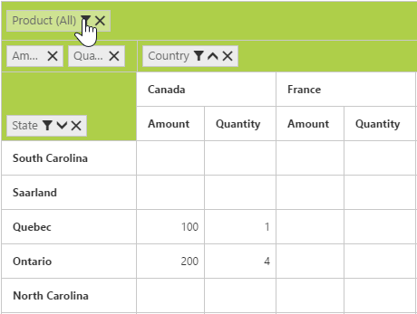
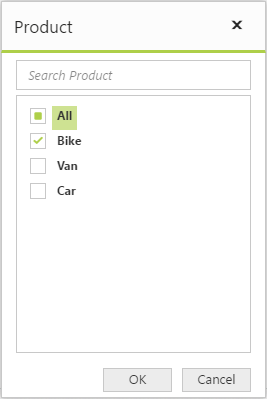
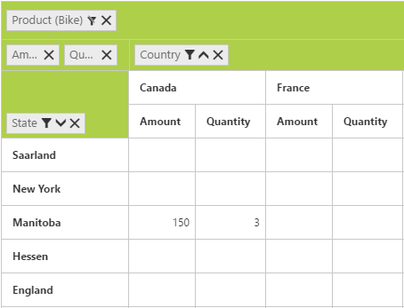
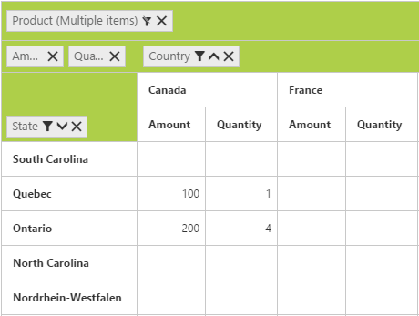

# Grouping Bar

## Initialization 
Grouping Bar allows user to dynamically alter the report by filter, sort and remove operations in the PivotGrid control. Based on the Relational datasource and report bound to the PivotGrid control, Grouping Bar will be automatically populated. You can enable Grouping Bar option in PivotGrid by setting the `EnableGroupingBar` property to true.

### Client Mode



<ej:PivotGrid ID="PivotGrid1" EnableGroupingBar="true" runat="server" ClientIDMode="Static">
    <DataSource>
        <Rows>
            <ej:Field FieldName="Country" FieldCaption="Country" SortOrder="Ascending"></ej:Field>
            <ej:Field FieldName="State" FieldCaption="State" SortOrder="Descending"></ej:Field>
        </Rows>
        <Columns>
            <ej:Field FieldName="Product" FieldCaption="Product"></ej:Field>
        </Columns>
        <Values>
            <ej:Field FieldName="Amount" FieldCaption="Amount"></ej:Field>
            <ej:Field FieldName="Quantity" FieldCaption="Quantity"></ej:Field>
        </Values>
        <Filters>
            <ej:Field FieldName="Date" FieldCaption="Date">
                <FilterItems FilterType="Exclude" />
            </ej:Field>
        </Filters>
    </DataSource>
    <ClientSideEvents Load="onLoad" />
</ej:PivotGrid>
   


### Server Mode



<ej:PivotGrid ID="PivotGrid1" runat=server url="/RelationalService" EnableGroupingBar="true">
</ej:PivotGrid>



## Searching Values
Search option available in Grouping Bar allows you to search a specific value that needs to be filtered and displayed from the list of values inside the filter pop-up window.

## Filtering Values

Filtering option available in Grouping Bar allows you to select a specific set of values that needs to be displayed in the PivotGrid control. At least one value needed to be in checked state while filtering otherwise “Ok” button will be disabled.

## Filtering Filter Values
Filtering option available in Filter field in Grouping Bar allows you to filter the values with respect to the field which is not visible in PivotGrid control.

N> By default, all the members are included which is indicated in the split button.

The below example denotes filtering all product values except "Bike" from the list in the filter pop-up window.

When click on "OK" button, the split button in slicer filter indicates the filter as shown in the below image.   

The below example denotes filtered multiple the product values from the list in the filter pop-up window.

## Sorting Values

Sorting option available in Grouping Bar allows you to arrange headers either in ascending or descending order. Sorting option is applicable for fields available only in Row and Column region. By default, headers are sorted in ascending order. Regarding sorting indicator, up arrow denotes ascending order and down arrow denotes descending order.

## Removing Field

Remove option available in the Grouping Bar allows you to completely remove a specific field from the PivotGrid control. Remove operation can be either achieved by clicking remove icon available inside each field or by dragging and dropping field out of Grouping Bar region.

