# Pivot Table Field List

## Initialization

The field list, also known as Pivot Schema Designer, allows you to add, rearrange, filter, and remove fields to show the data in the pivot grid exactly the way as you desired.

Based on the data source and relational binding to the pivot grid control, the pivot table field list will be automatically populated with cube information or field names. The pivot table field list provides an Excel like appearance and behavior.

To initialize the pivot table field list, define a "div" tag with an appropriate "id" attribute that acts as a container for the control. Then, use the **"PivotSchemaDesigner"** method to render the pivot field list in that container.

### Client mode



<%--...--%>

<head runat="server">
    
</head>

<%--...--%>

<ej:PivotGrid ID="PivotGrid1" Url="" runat="server" ClientIDMode="Static">
    <DataSource>
        <Rows>
            <ej:Field FieldName="Country" FieldCaption="Country"></ej:Field>
            <ej:Field FieldName="State" FieldCaption="State"></ej:Field>
        </Rows>
        <Columns>
            <ej:Field FieldName="Product" FieldCaption="Product"></ej:Field>
        </Columns>
        <Values>
            <ej:Field FieldName="Amount" FieldCaption="Amount"></ej:Field>
            <ej:Field FieldName="Quantity" FieldCaption="Quantity"></ej:Field>
        </Values>
        <Filters>
            <ej:Field FieldName="Date" FieldCaption="Date"></ej:Field>
        </Filters>
    </DataSource>
    <ClientSideEvents Load="onLoad" RenderSuccess="loadSchemaDesigner" />
</ej:PivotGrid>
<ej:PivotSchemaDesigner ID="PivotSchemaDesigner1" runat="server">
</ej:PivotSchemaDesigner>

</ej:PivotGrid>



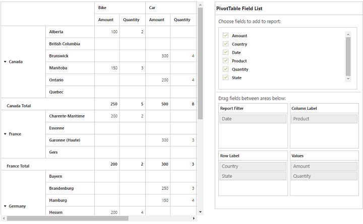

### Server mode



<ej:PivotGrid ID="PivotGrid1" runat=server url="/RelationalService">
    <ClientSideEvents AfterServiceInvoke="OnAfterServiceInvoke" />
</ej:PivotGrid>

<ej:PivotSchemaDesigner ID="PivotSchemaDesigner1" runat=server></ej:PivotSchemaDesigner>



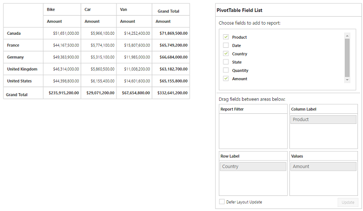

## Layout

The top portion of the layout shows the field or cube items in a categorized way. They can dynamically be added to the report by the drag and drop option or through the simple check box selection.

Item(s) selected will be placed in the row section by default except numeric based item(s) or measures, which will alone be placed in the value section by default.

The bottom portion of the layout is segregated as follows:

* Report filter: Exclusively designed to filter an item(s) placed in this particular position of the layout.
* Value section: The value label usually displays the numeric value item(s) present in the report.
* Column section: It is used to display item(s) as column header and values in the pivot grid control.
* Row section: It is used to display item(s) as row header and values in the pivot grid control.

## UI interactions

### By drag and drop

You can alter the report on fly through the drag and drop operation. You can drag any item from the field list and drop into column, row, value, or filter section available at the bottom of the field list.

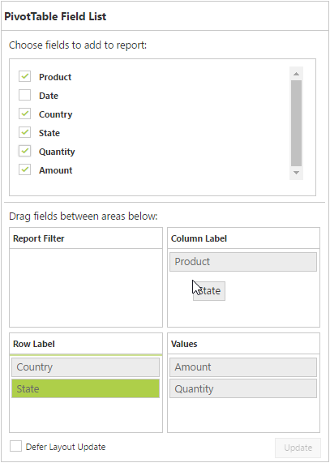

### By drag and drop to grid headers

You can drag and drop the elements from the field list to grid headers.

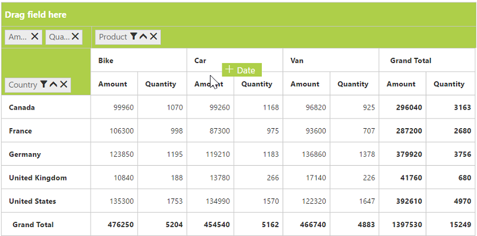

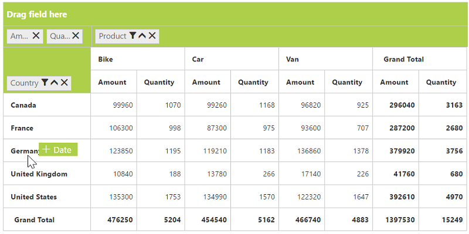

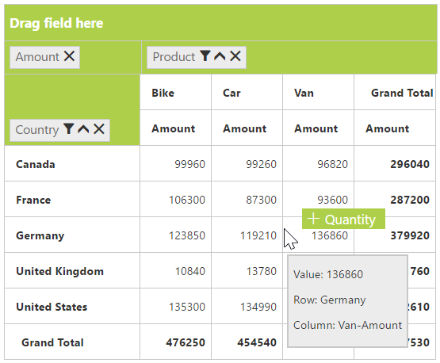

### By tree view selection

You can alter the report on fly through the check and uncheck option as an alternate. By default, the fields will be added to the row label when checked.

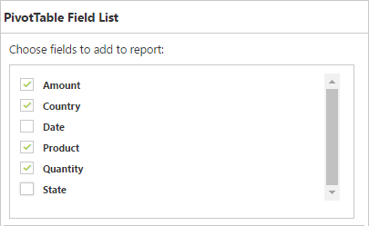

 ### By context menu

You can alter the report by using the context menu.

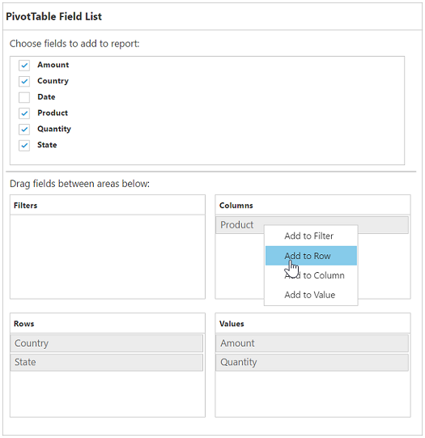

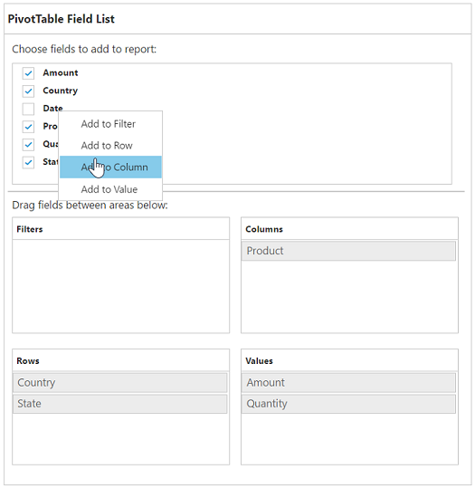

## Searching values
Search option available in the field list allows you to search a specific value that should be filtered from the list of values in the filter pop-up window.

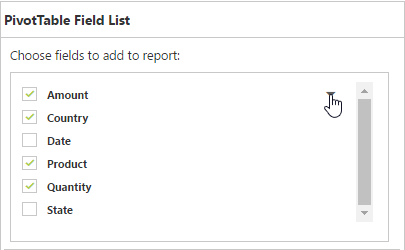

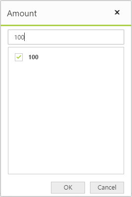

## Filtering
Values can be filtered by checking/unchecking the check box beside them in the filter pop-up window. At least, one value should present in the checked state while filtering, or else, the OK button will be disabled.

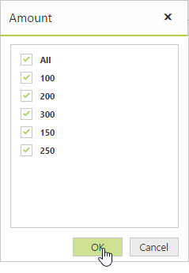

