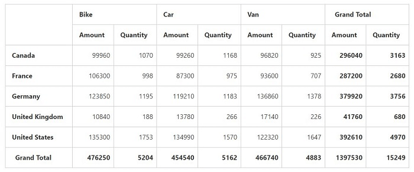
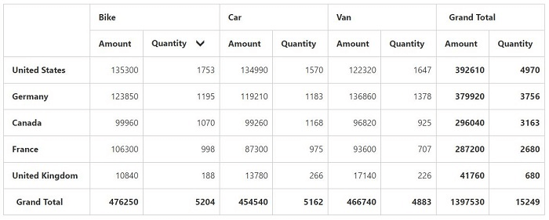

# Value sorting

I> This feature is applicable only for the relational data source.

The value sorting allows you to sort the columns and rows based on value fields.

The headers of the column to be sorted is given in the `HeaderText` property under the 'ValueSortSettings' in field wise order separated by a string.  The string that is used to separate the headers is given in the `HeaderDelimiters` property.
Also you can sort column by clicking the column header. On clicking the same header once again will reverse the sorting direction.



<ej:PivotGrid ID="PivotGrid1" runat="server" ClientIDMode="Static">
    <DataSource>
        <Rows>
            <ej:Field FieldName="Country" FieldCaption="Country"></ej:Field>
        </Rows>
        <Columns>
            <ej:Field FieldName="Product" FieldCaption="Product"></ej:Field>
        </Columns>
        <Values>
            <ej:Field FieldName="Amount" FieldCaption="Amount"></ej:Field>
            <ej:Field FieldName="Quantity" FieldCaption="Quantity"></ej:Field>
        </Values>
    </DataSource>
    <ValueSortSettings HeaderText="Bike##Quantity" HeaderDelimiters="##" SortOrder="Descending" />
</ej:PivotGrid>



