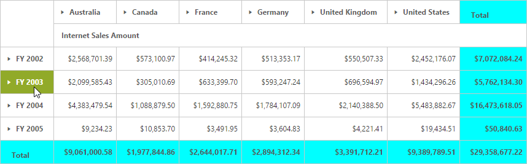
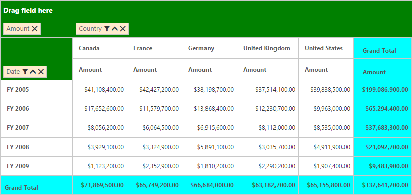
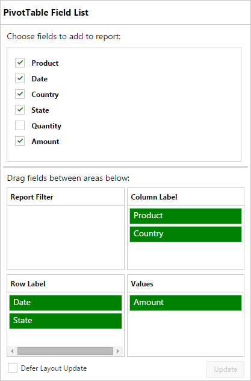

# Styling

By default, PivotGrid supports **17** different themes.

* default-theme
* flat-azure-dark
* fat-lime
* flat-lime-dark
* flat-saffron
* flat-saffron-dark
* gradient-azure
* gradient-azure-dark
* gradient-lime
* gradient-lime-dark
* gradient-saffron
* gradient-saffron-dark
* bootstrap-theme
* high-contrast-01
* high-contrast-02
* material
* office-365

You can also customize the appearance of the following component manually.

* PivotGrid
* Grouping Bar 
* PivotTable Field List

To change the appearance of PivotGrid, apply the below customized CSS.



.e-pivotgrid table {
   color: #565656;
   background-color: White;
}
.e-pivotgrid th,
.e-pivotgrid td {
   border: solid 1px;
   border-color: #c4c4c4;
}
.e-pivotgrid .value {
   background-color: White;
}
.e-pivotgrid .summary {
   background-color: aqua !important;
   color: #565656;
}
.e-pivotgrid .colheader, .e-pivotgrid .rowheader {
   color: #5c5c5c;
   background: white;
   background-repeat: repeat;
}
.e-pivotgrid .colheader:hover, .e-pivotgrid .rowheader:hover {
   color: white;
   background: #91aa29;
   background-repeat: repeat;
}



To change the appearance of Grouping Bar, apply the below customized CSS.



.e-pivotgrid .summary {
   background-color: aqua !important;
   color: #565656;
}
.e-pivotgrid .e-grpRow, .e-pivotgrid .values, .e-pivotgrid .columns, .e-pivotgrid .e-drag {
   background: green;
}
.e-pivotgrid .e-pivotButton .e-btn.e-select, .e-pivotgrid .e-rows .e-pivotButton, .e-pivotgrid .values .e-pivotButton, .e-pivotgrid .columns .e-pivotButton, .e-pivotgrid .e-drag .e-pivotButton {
   background: blanchedalmond;    
}
.e-pivotgrid .colheader, .e-pivotgrid .rowheader {
   color: #5c5c5c;
   background: white;
   background-repeat: repeat;
}
.e-pivotgrid .colheader:hover, .e-pivotgrid .rowheader:hover {
   color: white;
   background: #91aa29;
   background-repeat: repeat;
}



To change the appearance of PivotTable Field List, apply the below customized CSS.



.e-pivotschemadesigner, .e-pivotschemadesigner .e-fieldTable {
     background-color: white;
     color: black;   
}
.e-pivotschemadesigner .e-treeview .e-active {
     background: white;
}
.e-pivotschemadesigner .e-chkbox-wrap .e-chk-image.e-stop, .e-chkbox-wrap .e-chk-image.e-checkmark {
     color:green
}
.e-pivotschemadesigner .subheadText, .e-pivotschemadesigner .centerHead, .e-pivotschemadesigner .e-schemaFieldTree.e-treeview .e-text{
     color: black;
}
.e-pivotschemadesigner .e-pivotButton .e-pvtBtn {
     background: green;
     color: white;
}



You can also customize the appearance of the Pivot component using our Theme Studio utility. To know more about Theme Studio [click here](/aspnet/pivotgrid/styling). 

