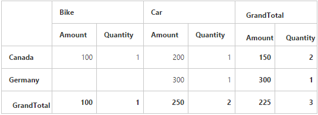

# Summary type

I> This feature is applicable only for the relational data source only at client mode.

Allows you to specify the required summary type to be used in the summary cells of the pivot grid. The sum is the default summary type. Following are the summary types that are supported:

* Sum
* Average
* Count
* Min
* Max



<ej:PivotGrid ID="PivotGrid1" runat="server" ClientIDMode="Static">
    <DataSource>
        <Rows>
            <ej:Field FieldName="Country" FieldCaption="Country"></ej:Field>
        </Rows>
       <Columns>
            <ej:Field FieldName="Product" FieldCaption="Product"></ej:Field>
       </Columns>
       <Values>
            <ej:Field FieldName="Amount" FieldCaption="Amount" SummaryType="Average"></ej:Field>
            <ej:Field FieldName="Quantity" FieldCaption="Quantity" SummaryType="Sum"></ej:Field>
      </Values>
    </DataSource>
    <ClientSideEvents Load="onLoad" />
</ej:PivotGrid>



