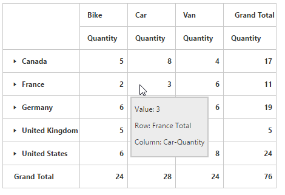

# Tooltip

Allows you to display the details of the cell upon hovering the value cells. By default, the tooltip is enabled. You can disable the tooltip in the pivot grid by setting the `EnableToolTip` property to false.



<ej:PivotGrid ID="PivotGrid1" runat="server" EnableToolTip="false">
 </ej:PivotGrid>



## Tooltip animation

The pivot grid provides an option to animate the tooltip displayed in the grid. The animation enhances the appearance of tooltip by displaying it slowly. You can enable the animation in the tooltip by setting the `EnableToolTipAnimation` property to true.



<ej:PivotGrid ID="PivotGrid1" runat="server" EnableToolTipAnimation="false">
 </ej:PivotGrid>



