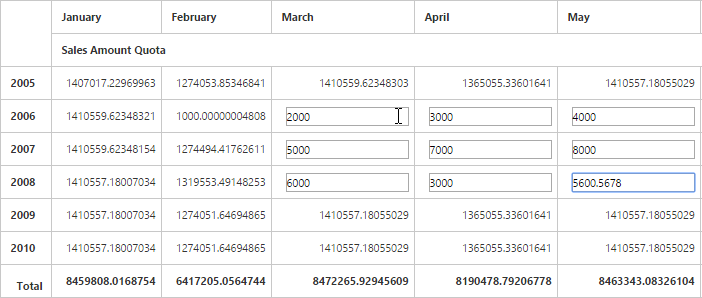

# Write-back

I> This feature is applicable only for the OLAP data source at server mode.

You can edit the values in the pivot grid and update a write enabled cube at the back-end (SSAS) dynamically at runtime.

N> Write-back is supported only for measures that use the **SUM** aggregation.



<ej:PivotGrid ID="PivotGrid1" runat="server" url="/PivotGridService" EnableCellEditing="true">
</ej:PivotGrid>





public Dictionary < string, object > WriteBack(string action, string value, string rowUniqueName, string columnUniqueName, string currentReport) {
    OlapDataManager DataManager = new OlapDataManager(connectionString);
    DataManager.SetCurrentReport(Syncfusion.ASP NET.Olap.Utils.DeserializeOlapReport(currentReport));
    return htmlHelper.GetJsonData(action, DataManager, value, rowUniqueName, columnUniqueName);
}



