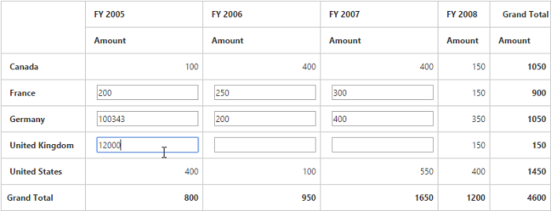

# Cell editing

I> This feature is applicable only for the relational data source.

The cell editing allows you to edit and alter the values in the pivot grid. The summary values will be recreated based on the edited values. By selecting multiple cells (like in cell selection feature), you can edit multiple cells at the same time.

You can enable the cell editing option in the pivot grid by setting the `EnableCellEditing` property to true.



<ej:PivotGrid ID="PivotGrid1" EnableCellEditing="true" runat="server" ClientIDMode="Static">
    //...
</ej:PivotGrid>



