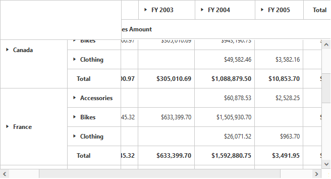
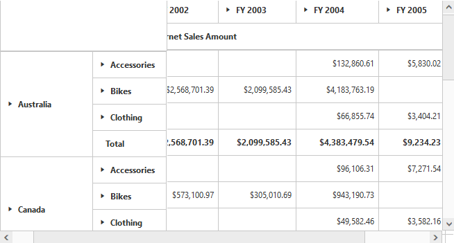
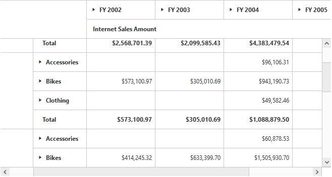
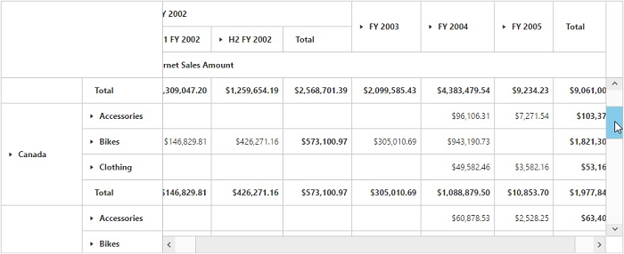

# Frozen header

Allows you to freeze the header of the grid, so that it will be always visible when scrolling the content with a large number of rows or columns to provide a precise view.



<ej:PivotGrid ID="PivotGrid1" runat="server">
    <%--...--%>
    <FrozenHeaderSettings EnableFrozenHeaders="true"></FrozenHeaderSettings>
</ej:PivotGrid>



You can also freeze the row/column headers individually by setting the below properties:



<ej:PivotGrid ID="PivotGrid1" runat="server">
    <%--...--%>
    <FrozenHeaderSettings EnableFrozenRowHeaders="true"></FrozenHeaderSettings>  <%--To Freeze the Row headers--%>
</ej:PivotGrid>





<ej:PivotGrid ID="PivotGrid1" runat="server">
    <%--...--%>
    <FrozenHeaderSettings EnableFrozenColumnHeaders="true"></FrozenHeaderSettings> <%--To Freeze the Column headers--%>
</ej:PivotGrid>



We can also set the size of the scroller (horizontal and vertical) in PivotGrid by using below property.



<ej:PivotGrid ID="PivotGrid1" runat="server">
    <%--...--%>
    <FrozenHeaderSettings ScrollerSize=18></FrozenHeaderSettings>
</ej:PivotGrid>



