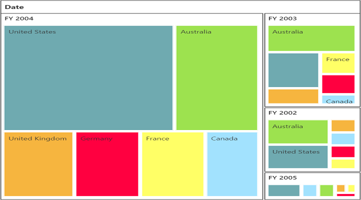

# Color mapping

You can customize the colors of leaf nodes of the pivot tree map by using the color mapping support. 

Color mapping is categorized into two different types as follows:

* Normal
* Range

You can color all leaf nodes with different colors by setting the `color` value of the `rangeColorMapping` property.

### Normal color mapping

You can customize the nodes based on number of leaf items by using different color ranges. You can also define the color value range by using `from` and `to` properties.

The following code sample illustrates how to customize the pivot tree map appearance by using the **normal** mode (i.e., differentiate color based on number of the leaf items in each header).



<! --Create a tag which acts as a container for PivotTreeMap--> 
<ej:PivotTreemap ID="PivotTreemap1" runat="server">
    ....
    <ClientSideEvents RenderSuccess="onTypeChange" />
</ej:PivotTreemap>
<asp:ScriptManager ID="ScriptManager1" runat="server"></asp:ScriptManager>

<! --Tooltip labels can be localized here-->



### Range color mapping

You can customize the nodes based on its value and color ranges by using the **range** color. You can also define the color value range by using `from` and `to` properties.

The following code sample illustrates how to customize the pivot tree map appearance by using the **range** mode (i.e., differentiate color for leaf items based on values).





