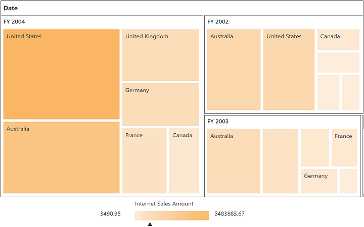
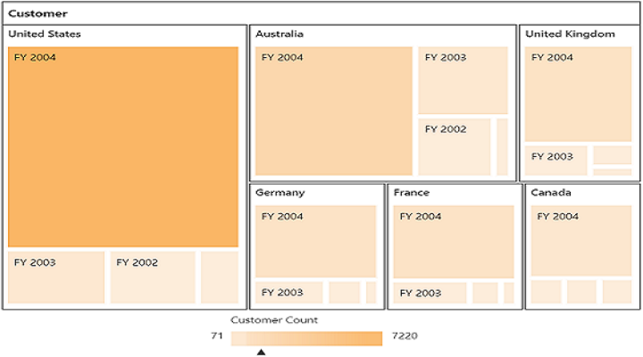

# Getting started

>**Important**
Starting with v16.2.0.x, if you refer to Syncfusion assemblies from trial setup or from the NuGet feed, include a license key in your projects. Refer to this [link](https://help.syncfusion.com/common/essential-studio/licensing/license-key) to learn about registering Syncfusion license key in your ASP.NET Core application to use our components.

## Creating a simple application with the pivot tree map and OLAP data sources (client mode)

This section covers the information required to populate a simple pivot tree map with OLAP data completely on the client-side.

### Project initialization

Create a new **ASP.NET Empty Web Application** by using the Visual Studio IDE and name the project **“PivotTreeMapDemo”**.

Now, add a Web Form to the empty web application. For adding a Web Form, right-click the project in the solution explorer and select **Add > New Item**. In the **Add New Item** window, select Web Form and name it `GettingStarted.aspx`, and then click Add.

To set an appropriate start page, right-click the **“GettingStarted.aspx”** in the solution explorer and select **“Set As Start Page”**.

Now, add the following dependency libraries as references to your web application. To add them to your application, right-click **References** in the solution explorer and select Add Reference. In the **Reference Manager** dialog, under **Assemblies > Extension**, the following Syncfusion libraries are found.

* Syncfusion.EJ
* Syncfusion.EJ.Export
* Syncfusion.EJ.Pivot

Register the referenced assemblies in Web.config files available at the root of the application.



<compilation debug="true" targetFramework="4.5">
    <assemblies> 
        ……
        ……
        <add assembly="Syncfusion.EJ, Version= {{ site.45esreleaseversion}}, Culture=neutral, PublicKeyToken=3d67ed1f87d44c89" />
        <add assembly="Syncfusion.EJ.Pivot, Version= {{ site.45esreleaseversion}}, Culture=neutral, PublicKeyToken=3d67ed1f87d44c89" /> 
        <add assembly="Syncfusion.EJ.Export, Version= {{ site.45esreleaseversion}}, Culture=neutral, PublicKeyToken=3d67ed1f87d44c89" />            

    </assemblies>
</compilation>


### Scripts and CSS references

Create a GettingStarted.aspx page and add scripts and style sheets that are required to render a pivot tree map control in a web application, which are highlighted below in an appropriate order:

1. ej.web.all.min.css
2. jQuery-3.0.0.min.js
3. ej.web.all.min.js
4. jsrender.min.js

Scripts and style sheets are referred under the <head> tag in the GettingStarted.aspx page.



<head>
    <link href="http://cdn.syncfusion.com/{{ site.releaseversion }}/js/web/flat-azure/ej.web.all.min.css" rel="stylesheet" type="text/css" />
    
    
    
</head> 



### Initialize pivot tree map

You can drag and drop the pivot tree map control from the toolbox (under **Syncfusion BI Web** category) or manually define the control as shown in the following code sample of the “GettingStarted.aspx” page.



<%@ Register Assembly="Syncfusion.EJ.Pivot" Namespace="Syncfusion.JavaScript.Web" TagPrefix="ej" %>
<%@ Register Assembly="Syncfusion.EJ.Pivot" Namespace="Syncfusion.JavaScript.Models" TagPrefix="ej" %>

<html> 
<head>
.....
.....

</head>
<body>
    <form runat="server">
        <ej:PivotTreeMap ID="PivotTreeMap1" runat="server" ClientIDMode="Static">
        </ej:PivotTreeMap>
    <asp:ScriptManager ID="ScriptManager1" runat="server"></asp:ScriptManager>
    </form>
</body>

</html>



### Populate pivot tree map with data source

Initializes the OLAP data source for the pivot tree map control as shown below:



<form id="form1" runat="server">
    <ej:PivotTreemap ID="PivotTreemap1" runat="server">
        <DataSource Catalog="Adventure Works DW 2008 SE" Cube="Adventure Works" Data="http://bi.syncfusion.com/olap/msmdpump.dll">
            <Rows>
                <ej:Field FieldName="[Customer].[Customer Geography]"></ej:Field>
            </Rows>
            <Columns>
                <ej:Field FieldName="[Date].[Fiscal]"></ej:Field>
            </Columns>
            <Values>
                <ej:Field Axis="Column">
                    <Measures>
                        <ej:MeasuresItems FieldName="[Measures].[Customer Count]" />
                    </Measures>
                </ej:Field>
            </Values>
        </DataSource>
    </ej:PivotTreemap>
    <asp:ScriptManager ID="ScriptManager1" runat="server"></asp:ScriptManager>
</form>

    <!--Tooltip labels can be localized here-->
      



The above code will generate a simple pivot tree map with internet sales amount over a period of fiscal years across different customer geographic locations.

 

## Creating a simple application with pivot tree map and OLAP data source (server mode)

This section covers the information required to create a simple pivot tree map bound to the OLAP data source.

N> This section is illustrated by creating a simple web application through the Visual Studio IDE since the pivot tree map in server-side control requires .NET dependency. The ASP.NET web application contains a service that will transfer the data to server-side, process it, and return it client-side for control rendering and re-rendering. The service utilized for communication can be either WCF or WebAPI based on user requirement.

###Project initialization
Create a new **ASP.NET Empty Web Application** by using the Visual Studio IDE and name the project **“PivotTreeMapDemo.”**

Now, add a Web Form to the empty web application. For adding a Web Form, right-click the project in the solution explorer and select **Add > New Item**. In the **Add New Item** window, select Web Form and name it `GettingStarted.aspx`, and then click Add.

To set an appropriate start page, right-click the **“GettingStarted.aspx”** in the solution explorer and select **“Set As Start Page”**.

Now, add the following dependency libraries as references to your web application. To add them to your application, right-click **References** in the solution explorer and select **Add Reference**. In the **Reference Manager** dialog, under **Assemblies > Extension**, the following Syncfusion libraries will be found.

N> If you have installed any version of SQL Server Analysis Service (SSAS) or Microsoft ADOMD.NET utility, then the location of Microsoft.AnalysisServices.AdomdClient library is [system drive:\Program Files (x86)\Microsoft.NET\ADOMD.NET]. And if you have installed any version of Essential Studio, then the location of Syncfusion libraries is [system drive:\Program Files (x86)\Syncfusion\Essential Studio\{{ site.releaseversion }}\Assemblies].

* Microsoft.AnalysisServices.AdomdClient
* Syncfusion.Compression.Base
* Syncfusion.Linq.Base
* Syncfusion.Olap.Base
* Syncfusion.PivotAnalysis.Base
* Syncfusion.EJ
* Syncfusion.EJ.Web
* Syncfusion.EJ.Pivot

### Scripts and CSS initialization
The scripts and style sheets that are required to render a pivot tree map control in a web application are mentioned in an appropriate order:

1. ej.web.all.min.css
2. jQuery-3.0.0.min.js
3. ej.web.all.min.js
4. jsrender.min.js

[Click here](http://helpjs.syncfusion.com/js/cdn) to know more about script and style sheets available in online (CDN link).

Scripts and style sheets are referred under the <head> tag in the **GettingStarted.aspx** page.



<head>
    <link href="http://cdn.syncfusion.com/{{ site.releaseversion }}/js/web/flat-azure/ej.web.all.min.css" rel="stylesheet" type="text/css" />
    
    
    
</head> 



### Control initialization
You can drag and drop the **pivot tree map** control from the toolbox (under **Syncfusion BI Web** category) or manually define the control as shown in the following code sample of the **“GettingStarted.aspx”** page.
    
After placing the control in the web page, add the **‘ScriptManager’** next to it to generate appropriate scripts.



<%@ Register Assembly="Syncfusion.EJ.Pivot, Version={{ site.45esreleaseversion }}, Culture=neutral, PublicKeyToken=3d67ed1f87d44c89" Namespace="Syncfusion.JavaScript.Web" TagPrefix="ej" %> 
<html> 
    …… 
    ……

<body>
    <form runat="server">
        <ej:PivotTreeMap ID="PivotTreeMap1" Url="/Olap" runat="server" ClientIDMode="Static"></ej:PivotTreeMap>
        <asp:ScriptManager ID="ScriptManager1" runat="server"></asp:ScriptManager>
    </form>

    <!--Tooltip labels can be localized here-->
    
</body>

</html>



The `Url` property in the pivot tree map control points the service endpoint, where the data is processed and fetched in the form of JSON. The service used for the pivot tree map control as endpoint are WCF and WebAPI.

N> The above "GettingStarted.aspx" contains WebAPI URL, which is “/Olap”. If the WCF service is used as an endpoint, then the URL will look like "/OlapService.svc".

If you enter the code manually instead of drag and drop from the toolbox, then register the referenced assemblies in the Web.config file.



<compilation debug="true" targetFramework="4.5">
    <assemblies> 
        …… 
        ……
        <add assembly="Syncfusion.EJ, Version= {{ site.45esreleaseversion }}, Culture=neutral, PublicKeyToken=3d67ed1f87d44c89" />
        <add assembly="Syncfusion.EJ.Pivot, Version= {{ site.45esreleaseversion }}, Culture=neutral, PublicKeyToken=3d67ed1f87d44c89" />
        <add assembly="Syncfusion.EJ.Web, Version= {{ site.45esreleaseversion }}, Culture=neutral, PublicKeyToken=3d67ed1f87d44c89" />
        <add assembly="Syncfusion.Compression.Base, Version= {{ site.45esreleaseversion }}, Culture=neutral, PublicKeyToken=3d67ed1f87d44c89" />
        <add assembly="Syncfusion.Linq.Base, Version= {{ site.45esreleaseversion }}, Culture=neutral, PublicKeyToken=3d67ed1f87d44c89" />
        <add assembly="Syncfusion.Olap.Base, Version= {{ site.45esreleaseversion }}, Culture=neutral, PublicKeyToken=3d67ed1f87d44c89" />
        <add assembly="Syncfusion.PivotAnalysis.Base, Version= {{ site.45esreleaseversion }}, Culture=neutral, PublicKeyToken=3d67ed1f87d44c89" />
   
    </assemblies>
</compilation>



### WebAPI

**Adding a WebAPI controller**

To add a WebAPI controller in your existing web application, right-click the project in the solution explorer and select **Add > New Item.** In the **Add New Item** window, select **WebAPI Controller Class** and name it “OlapController.cs,” and then click **Add.**

Now, the WebAPI controller is added to your application, which, in-turn, comprises the following file. The utilization of this file will be explained in the following sections.
 
* OlapController.cs

N> While adding the WebAPI controller class, add the mandatory suffix “Controller”. For example, in the demo, the controller is named “OlapController”.

Next, remove all the existing methods such as “Get”, “Post”, “Put”, and “Delete” present in the `OlapController.cs` file.



namespace PivotTreeMapDemo 
{ 
    public class OlapController : ApiController 
    { 
    } 
}



**Adding the list of namespaces**

Following is the list of namespaces to be added on top of the main class in the `OlapController.cs` file:



using System.Web;
using System.Collections.Generic;
using System.Configuration;
using System.Linq;
using System.Net;
using System.Net.Http;
using System.Web.Http;
using System.Web.Script.Serialization;
using Syncfusion.Olap.Manager;
using Syncfusion.Olap.Reports;
using Syncfusion.JavaScript;
using OLAPUTILS = Syncfusion.JavaScript.Olap;

namespace PivotTreeMapDemo
{
    public class OlapController : ApiController
    {

    }
}



**Data source initialization**

Now, the connection string to connect the OLAP cube and pivot tree map instances is created immediately in the main class of the `OlapController.cs` file.



namespace PivotTreeMapDemo
{
    public class OlapController : ApiController
    {
        PivotTreeMap htmlHelper = new PivotTreeMap();
        string connectionString = "Data Source=http://bi.syncfusion.com/olap/msmdpump.dll; Initial Catalog=Adventure Works DW 2008 SE;";

    }
}



**Service methods in WebAPI controller**

Now, you can define the service methods in the OlapController class, find in the `OlapController.cs` file which was created while adding the WebAPI controller class to your web application.
 


namespace PivotTreeMapDemo 
{ 
    public class OlapController : ApiController
    {
        PivotTreeMap htmlHelper = new PivotTreeMap(); 
        string connectionString = "Data Source=http://bi.syncfusion.com/olap/msmdpump.dll; Initial Catalog=Adventure Works DW 2008 SE;";
        [System.Web.Http.ActionName("InitializeTreeMap")]
        [System.Web.Http.HttpPost]
        public Dictionary<string, object> InitializeTreeMap(Dictionary<string, object> jsonResult)
        {
            OlapDataManager DataManager = null;
            DataManager = new OlapDataManager(connectionString);
            DataManager.SetCurrentReport(CreateOlapReport());
            return htmlHelper.GetJsonData(jsonResult["action"].ToString(), DataManager);
        }
        [System.Web.Http.ActionName("DrillTreeMap")]
        [System.Web.Http.HttpPost]
        public Dictionary<string, object> DrillTreeMap(Dictionary<string, object> jsonResult)
        {
            OlapDataManager DataManager = new OlapDataManager(connectionString);
            DataManager = new OlapDataManager(connectionString);
            DataManager.SetCurrentReport(OLAPUTILS.Utils.DeserializeOlapReport(jsonResult["olapReport"].ToString()));
            return htmlHelper.GetJsonData(jsonResult["action"].ToString(), DataManager, jsonResult["drillInfo"].ToString());
        }

        private OlapReport CreateOlapReport()
        {
            OlapReport olapReport = new OlapReport();
            olapReport.Name = "Default Report";
            olapReport.CurrentCubeName = "Adventure Works";

            DimensionElement dimensionElementColumn = new DimensionElement();
            //Specifying the Name for the Dimension Element
            dimensionElementColumn.Name = "Date";
            dimensionElementColumn.AddLevel("Fiscal", "Fiscal Year");

            MeasureElements measureElementColumn = new MeasureElements();
            //Specifying the Name for the Measure Element
            measureElementColumn.Elements.Add(new MeasureElement { Name = "Customer Count" });

            DimensionElement dimensionElementRow = new DimensionElement();
            //Specifying the Dimension Name
            dimensionElementRow.Name = "Customer";
            dimensionElementRow.AddLevel("Customer Geography", "Country");
            DimensionElement dimensionElementRow1 = new DimensionElement();

            ///Adding Row Members
            olapReport.SeriesElements.Add(dimensionElementRow);
            ///Adding Column Members
            olapReport.CategoricalElements.Add(dimensionElementColumn);
            ///Adding Measure Element
            olapReport.CategoricalElements.Add(measureElementColumn);
            return olapReport;
        }
    }
}



**Configure routing in global application class**

To add a Global.asax in your existing web application, right-click the project in the solution explorer and select **Add > New Item.** In the **Add New Item** window, select **Global Application Class** and name it “Global.asax”, and then click **Add**. After adding the **Global.asax** file, immediately add the namespace **“using System.Web.Http;”**, and then configure the routing as shown in the following code example:



public class Global : System.Web.HttpApplication
    {
        protected void Application_Start(object sender, EventArgs e)
        {
            System.Web.Http.GlobalConfiguration.Configuration.Routes.MapHttpRoute(
                name: "DefaultApi",
                routeTemplate: "{controller}/{action}/{id}",
                defaults: new { id = RouteParameter.Optional });
            AppDomain.CurrentDomain.SetData("SQLServerCompactEditionUnderWebHosting", true);
        }
}



Now, the pivot tree map is rendered with customer count over different customer geographic locations across a period of fiscal years.

 

### WCF
This section demonstrates the utilization of WCF service as endpoint binding the OLAP data source to a simple pivot tree map. For more details on this topic, [click here](http://help.syncfusion.com/js/pivottreemap/olap-connectivity#wcf).

