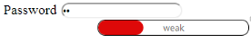

# Getting Started

## Create your first Progress Bar in ASP.NET

ASP.NET ProgressBar displays a ProgressBar within a web page that shows the progress of an event. This article explains how to customize the progress and color of the ProgressBar in a real-time application, to indicate the strength of the password, where the progress changes with respect to the change in length of the password. This enables you to validate the password when typed.

### Create a ProgressBar

ASP.NET ProgressBar control is created by using the &lt;ej:ProgressBar&gt; tag. This element provides an in-built feature that allows you to change the progress, size, and text of the control. You can create the ProgressBar control by using the following steps.

You can create an ASP.NET Project and add the necessary Dll and scripts with the help of the given [ASP-Getting Started](http://help.syncfusion.com/aspnetmvc/captcha/getting-started#create-your-first-captcha-in-aspnet-mvc ) documentation.

You can add the following code example to the corresponding ASPX page to render the ProgressBar.


<div style="content-container-fluid">

        <div class="row">

            <div class="cols-sample-area">

                <div class="frame">

                    <div class="wrap_up">

                        <!--Initializing password field*-->

                        <label for="startButton">

                            Password</label>

                        <input type="password" id="password" style="border-radius: 10px" />

                    

                    <div class="control">

                        <!--initializing progressbar control-->

                        <ej:ProgressBar ID="ProgressBar" Height="20px" Width="200px"Value="30" runat="server" Text="Weak">

                        </ej:ProgressBar>

                    

                

            

        



It also includes a password field and through that the progress of the ProgressBar can be controlled. Include the following CSS within the <head> tag to change the page layout 


/*applying styles */

 .frame

        {

            border: 1px solid #BBBCBB;

            border-radius: 10px 10px 10px 10px;

            padding: 50px 60px;

            margin-top: 40px;

            width: 400px;

            margin-left: 400px;

        }

        .control

        {

            margin-bottom: 5px;

            margin-left: 230px;

        }

        .wrap_up

        {

            margin-left: 105px;

            font-size: 18px;

        }

        #progressBar

        {

            margin-top: 10px;

        }



Include the following script also. 


$(function () {

            $(".e-progress").css({ "background-color": "#DE0909", "border-radius":"10px" });

            $(".e-progressbar").css({ "border-radius": "10px", "border": "1px solid black" });

        });



The following screenshot displays the ProgressBar control.

