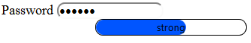
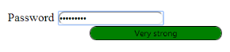

# Progress control by using the length of the Password Field

In real-time scenario, the progress of ProgressBar is changed according to the length of text in the password field by binding the change in the properties of control and checking the length of the password field.

Add the following code example in the <script> tag of your ASP.NETweb page.



        $(function () {

            $(".e-progress").css({ "background-color": "#DE0909", "border-radius":"10px" });

            $(".e-progressbar").css({ "border-radius": "10px", "border": "1px solid black" });

        });

        var progresObj, buttonObj, k = 10, timer = window.clearInterval(timer), i = 0, obj;

        $(document).keypress(function () { /*Captures the keypress inside the document*/

            i = $("#password").val().length;

            if (i < 5) {

                weak();

            }

            else if (i >= 5 && i < 7) {

                Strong();

            }

            else if (i > 7) {

                var pwd = $("input").val();

                if (/^[a-zA-Z0-9- ]*$/.test(pwd) == false);

                {

                    veryStrong();

                }

            }

        });

        function Strong() { /*Changes the width and text of the progress ... called when the length is greater than 5*/

            progresObj.option("text", "strong");

            progresObj.option("percentage", k + 50);

            $(".e-progress").css("background-color", "#0055FF");

            $(".e-progressbar").css("color", "#000000");

        }

        function veryStrong() {/*Changes the width and text of the progress ... called when the length is greater than 7*/

            progresObj.option("text", "Very strong");

            progresObj.option("percentage", k + 90);

            $(".e-progress").css("background-color", "Green");

            $(".e-progressbar").css("color", "#000000");

        }

        function weak() {/*Changes the width and text of the progress... called when the length is less than 5*/

            progresObj.option("text", "Weak");

            progresObj.option("percentage", k + 20);

            $(".e-progress").css("background-color", "#DE0909");

            $(".e-progressbar").css("border-radius", "10px");

        }       



You can calculate the length of the password and call the appropriate function that changes the percentage property of the ProgressBar. The weak() function changes the text in the ProgressBar to Weak and percentage to 30, that is invoked when the length of the text is less than 5. The strong() function changes the text in the ProgressBar to Strong and percentage to 60, that is invoked when the length of the text exceeds 5. The veryStrong() function changes the text in the ProgressBar to Very Strong and percentage to 100, that is invoked when the length of the text exceeds 7 and the text contains a symbol in it.

You can also change the themes or appearance of the ProgressBar as required.

The following screenshots display the output when password length less than 5, password length less than 7, and password length greater than 7.                          .

You can also bind an event at the start and finish of a ProgressBar by using the start, complete, and change properties of the ProgressBar.

