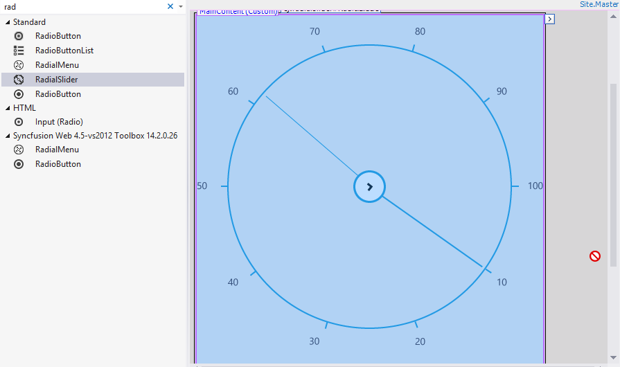
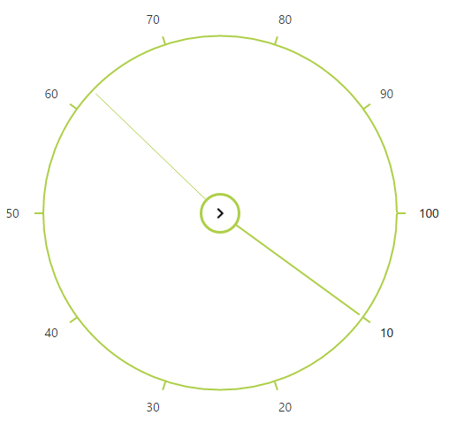

# Getting Started

## Creating your first RadialSlider in ASP Web Forms

1. Create an ASP.NET Web Forms application and add RadialSlider control to the Default.aspx page.

    

2. Once the control is dragged and dropped into the page the embedded resource will add dependent script and CSS files from Syncfusion.EJ.Web assembly and the assembly will be referred from GAC. This will add the following appSetting key in web.config file to load resource files.

    
        
        <appSettings>
                <add key="LoadEJResourcesFromAssembly" value="true"/>
                <add key="EJResources" value="jsrender:true;jqueryeasing:true;globalize:true;themes:true;"/>
        </appSettings>
            
    
    
    N> Refer the [ASP.NET-Getting Started](http://help.syncfusion.com/aspnet/getting-started#manual-integration-of-syncfusion-aspnet-controls-into-the-newexisting-application) Documentation to know further details about necessary assemblies, Script and CSS files.

    Switching from Design view to Source the RadialSlider code looks like the below. Syncfusion namespace will be registered and control will be initialized from the Syncfusion.EJ.Web namespace tag prefix "ej". 

   

            <ej:RadialSlider ID="RadialSlider1" runat="server"></ej:RadialSlider>

      

3. Execute the code to get the below output

