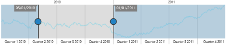
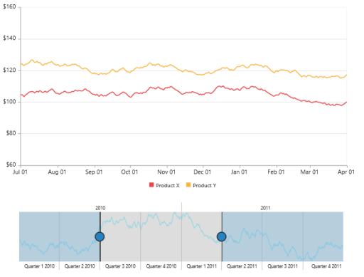
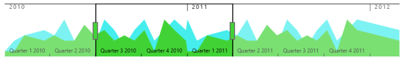

# Behavior Customization

RangeNavigator allows you to customize the control using events. You can change the range for selected data of the RangeNavigator using events.

## Deferred update

If you set `EnableDeferredUpdate` to true, the `RangeChanged` event gets fired after dragging and dropping the slider. By default the EnableDeferredUpdate is true. If EnableDeferredUpdate is false then the RangeChanged event gets fired while dragging the slider. 


<ej:RangeNavigator ID="RangeNavigator1" runat="server" EnableDeferredUpdate="true" >

<%--Code --%>

<%--Code --%>

</ej:RangeNavigator>


Deferred update
{:.caption}

## Methods

### _destroy

This method is used to destroy the **RangeNavigator** widget. 


 
<ej:RangeNavigator ID="RangeNavigator1" runat="server">
</ej:RangeNavigator>



## Handle Events

### Load

This event is fired when **RangeNavigator** is loading. A parameter **sender** is passed to the handler. Using **sender.model**, you can access the RangeNavigator properties. 



<ej:RangeNavigator ID="RangeNavigator1" runat="server" onClientSideLoad="loadData">

</ej:RangeNavigator>







### Loaded

This event is handled when the RangeNavigator gets loaded. A parameter sender is passed to the handler. Using sender.model, you can access the RangeNavigator properties. 


<ej:RangeNavigator ID="RangeNavigator1" runat="server" onClientSideLoaded="loadingData">

<%--Code --%>

<%--Code --%>

</ej:RangeNavigator>



         


### RangeChanged

This event gets fired whenever the selected range changes in RangeNavigator. A parameter sender is passed to the handler. Using sender.selectedRangeSettings, you can access the start and end value of range for the selected region. 



<ej:RangeNavigator ID="RangeNavigator1" runat="server" onClientSideRangeChanged="onChartLoad">

<%--Code --%>

<%--Code --%>

</ej:RangeNavigator>





  

    

### SelectedRangeStart

This event is fired when starting to change the slider position in **RangeNavigator**. A parameter **sender** is passed to the handler. Using **sender.selectedRangeSettings**, you can access the start value of range for the selected region. 



<ej:RangeNavigator ID="RangeNavigator1" runat="server" onClientSideSelectedRangeStart="selectedRangeStart">

</ej:RangeNavigator>

    



   



### SelectedRangeEnd

This event is fired when selection ends in **RangeNavigator**. A parameter **sender** is passed to the handler. Using sender.selectedRangeSettings, you can access the end value of range for the selected region. 



<ej:RangeNavigator ID="RangeNavigator1" runat="server" onClientSideSelectedRangeEnd="selectedRangeEnd">

</ej:RangeNavigator>

    



   



### ScrollStart

This event is fired when starting to change the scrollbar position of **RangeNavigator**. A parameter **sender** is passed to the handler. Using sender.data startRange and sender.data endRange, you can access the scrollbar position starting and ending range value on changed scrollbar. 



<ej:RangeNavigator ID="RangeNavigator1" runat="server" onClientSideScrollStart="scrollStart">

</ej:RangeNavigator>

    



  



### ScrollEnd

This event is fired while ending the change in scrollbar position of **RangeNavigator**. A parameter **sender** is passed to the handler. Using data oldRange and data newRange, you can access the scrollbar position old and new range values on changing scrollbar. 



<ej:RangeNavigator ID="RangeNavigator1" runat="server" onClientSideScrollEnd="scrollEnd">

</ej:RangeNavigator>

    



  



### ScrollChanged

This event is fired when changing the scrollbar position of **RangeNavigator**. A parameter **sender** is passed to the handler. Using data oldRange and data newRange, you can access the old and new range values of changed scrollbar position. 



<ej:RangeNavigator ID="RangeNavigator1" runat="server" onClientSideScrollChanged="scrollChanged">

</ej:RangeNavigator>

    



  



### Click

`Click` event is handled when the **RangeNavigator** gets clicked. A parameter **sender** is passed to the handler. Using **sender.model**, you can access the RangeNavigator properties. 



<ej:RangeNavigator ID="RangeNavigator1" runat="server" onClientSideClick="click">

</ej:RangeNavigator>

    



  



### DoubleClick

`DoubleClick` event is handled when the **RangeNavigator** gets clicked. A parameter **sender** is passed to the handler. Using **sender.model**, you can access the RangeNavigator properties. 



<ej:RangeNavigator ID="RangeNavigator1" runat="server" onClientSideDoubleClick="doubleClick">

</ej:RangeNavigator>

    



  



### RightClick

`RightClick` event is handled when the **RangeNavigator** gets clicked. A parameter **sender** is passed to the handler. Using **sender.model**, you can access the RangeNavigator properties. 



<ej:RangeNavigator ID="RangeNavigator1" runat="server" onClientSideRightClick="rightClick">

</ej:RangeNavigator>

    



  



## Use of ZoomCoordinates

RangeNavigator is used along with the controls like chart and grid to view the selected data. To update chart/grid, whenever the selected range changes in RangeNavigator, you can use `RangeChanged` event of RangeNavigator and then update the chart/grid with the selected data in this event. 

You can easily update the data for chart by assigning the  `ZoomFactor` and `ZoomPosition` of the RangeNavigator to the chart axis. 



<ej:RangeNavigator ID="RangeNavigator1" runat="server" onClientSideRangeChanged="loadingData">

<%--Code --%>

<%--Code --%>

</ej:RangeNavigator>
 


         
 

Use of ZoomCoordinates
{:.caption}

## Thumb Template

You can customize Thumb template by using `LeftThumbTemplate` and `RightThumbTemplate` property. You can add the required template as a “div” element with an “id” to the web page and assign the id or assign the HTML string to this property under `NavigatorStyleSettings`. 



 


<ej:RangeNavigator ID="Range1" runat="server"> 

// ...

<NavigatorStyleSettings LeftThumbTemplate="left" RightThumbTemplate=" right"/>

// ...

</ej:RangeNavigator>
 

The following screenshot displays the RangeNavigator using thumb template.

Thumb template
{:.caption}

## Value Axis Settings

You can customize the line, `Font` `Size`, gridline, tickline, range, `RangePadding` and visibility of **RangeNavigator** axis.

To enable the visibility of axis line, you need to set `Visible` property of `AxisLine` in `ValueAxisSettings`. 

You can customize the axis range by specifying `Min`, `Max` and `Interval` for `Range` property.

The `MajorGridLines` can be enabled by specifying `Visible` property. The `Size`, `Width` and `Visible` property of `MajorTickLines` is used to customize the axis tick lines.

The visibility of `ValueAxisSettings` is enabled by setting `Visible` property as true. 



<ej:RangeNavigator ID="Range1" runat="server">
    <ValueAxisSettings RangePadding="Normal" Visible="true">
        <AxisLine Visible="true"></AxisLine>
        
        <MajorGridLines Visible="true"></MajorGridLines>
		<MajorTickLines Size="3" Visible="false" Width="3"></MajorTickLines>
        <Range Min="0" Max="100" Interval="10"></Range>
    </ValueAxisSettings>           
</ej:RangeNavigator>



## Selected Range Settings

The start and end range values of selected range can be customized using `Start` and `End` property of `SelectedRangeSettings`.



<ej:RangeNavigator ID="Range1" runat="server">
    <SelectedRangeSettings Start="01/05/1992" End="01/05/1993">
    </SelectedRangeSettings>           
</ej:RangeNavigator>  

