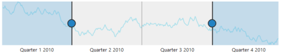

# Populate Data

When you provide data to RangeNavigator, it produces limited set of data. You can populate the RangeNavigator with data using the DataSource and Series properties.

## Add series to the RangeNavigator

The Series property provides access to a collection of all series that are defined explicitly within a RangeNavigator control. Each series is assigned with type and name. It contains collection of data point, each point contains x value and y values. You can add data points to the series through DataSource property.



&lt;ej:RangeNavigator ID="RangeNavigator1" runat="server" onClientSideLoad="loadingdata"&gt;

         &lt;Series&gt;

             &lt;ej:Series Name="ProductA" EnableAnimation="false" Type="Line" Opacity="0.5" Fill="#69D2E7"&gt;&lt;/ej:Series&gt;

         &lt;/Series&gt;

  &lt;%--Code --%&gt;

&lt;/ej:RangeNavigator&gt;





&lt;script type="text/javascript"&gt;

  function loadingdata(sender) {

                 data = GetData();

              sender.model.series[0].dataSource = data.Open;

              sender.model.series[0].xName =  "XValue",

              sender.model.series[0].yName = "YValue";   

       }

// Method to get data in json format

function GetData() {

            var series1 = [];

            var series2 = [];

            var value = 100;

            var value1 = 120;

            for (var i = 1; i < 730; i++) {

                if (Math.random() > .5) {

                    value += Math.random();

                    value1 += Math.random();

                } else {

                    value -= Math.random();

                    value1 -= Math.random();

                }

                var point1 = { XValue: new Date(2010, 0, i), YValue: value };

                var point2 = { XValue: new Date(2010, 0, i), YValue: value1 };

                series1.push(point1);

                series2.push(point2);

            }

            data = { Open: series1, Close: series2 };

            return data;

        }

      &lt;/script&gt;         

	  

The following screenshot illustrates the RangeNavigator that is populated with data using DataSource property in series.

{:.image }

