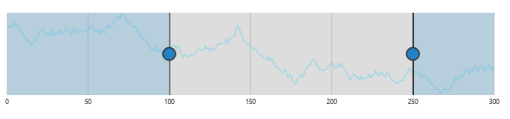
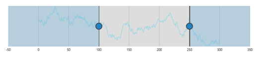
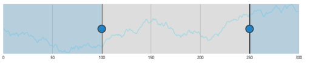
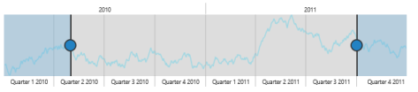
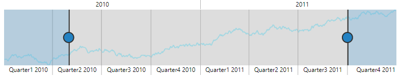
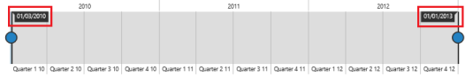

# Range Padding

Range Padding adds padding for range in RangeNavigator. It allows you to space the grid lines in the RangeNavigator.  By 
default, this property is set to none.

## Numeric

The RangePadding property allows you to customize the automatic range calculation using the default auto range calculation for 
RangeNavigator. 


<ej:RangeNavigator ID="RangeNavigator1" runat="server" RangePadding="none" ValueType="numeric">         

<%--Code --%>

</ej:RangeNavigator>


### None:

By default, the `RangePadding` for numerical range is none. The range is calculated from the minimum value to the maximum value of data in the RangeNavigator.

The following screenshot illustrates a RangeNavigator with RangePadding set to none.

RangeNavigator with RangePadding set to none
{:.caption}

### Additional:

When you set the RangePadding for numerical range to Additional, range is padded with an interval.

The following screenshot illustrates a RangeNavigator with RangePadding set to additional.

RangeNavigator with RangePadding set to additional
{:.caption}

### Normal:

In normal RangePadding, automatic range calculation differs based on the data. 

The following screenshot illustrates RangeNavigator with RangePadding set to normal

 

RangeNavigator with RangePadding set to normal
{:.caption}

### Round:

Round RangePadding for a numerical range rounds the range of the control to the nearest possible value that is divisible by the interval.

The following screenshot illustrates a RangeNavigator with RangePadding set to Round.

 

RangeNavigator with RangePadding set to Round
{:.caption}

## DateTime

Using the default range calculation for RangeNavigator, the RangePadding property allows you to customize the range. 


<ej:RangeNavigator ID="RangeNavigator1" runat="server" RangePadding="none">         

<%--Code --%>

</ej:RangeNavigator>


### None:

By default, the RangePadding for DateTime range is none. The range is calculated from the minimum value to the maximum value of data in the RangeNavigator

The following screenshot illustrates a RangeNavigator with RangePadding set to none.

RangeNavigator with RangePadding set to none
{:.caption}

### Round:

Round RangePadding for a DateTime range rounds the range of the control to the nearest possible value.

The following screenshot illustrates a RangeNavigator with RangePadding set to Round.

 

RangeNavigator with RangePadding set to Round
{:.caption}

## Padding

The gap between the container and the **RangeNavigator** can be specified using `Padding` property.



<ej:RangeNavigator ID="RangeNavigator1" runat="server" Padding="15"> 
</ej:RangeNavigator>



## AllowSnapping

An `AllowSnapping` property toggles the placement of slider exactly on the place it left or on the nearest interval.



<ej:RangeNavigator ID="RangeNavigator1" runat="server" AllowSnapping="true"> 
</ej:RangeNavigator>



## Responsive

Set `IsResponsive` value to make the **RangeNavigator** responsive on resize.



<ej:RangeNavigator ID="RangeNavigator1" runat="server" IsResponsive="true"> 
</ej:RangeNavigator>



## Auto Resizing

Enable `EnableAutoResizing` option to resize the **RangeNavigator**.



<ej:RangeNavigator ID="RangeNavigator1" runat="server" EnableAutoResizing="true"> 
</ej:RangeNavigator>



## Customize range Navigator border

**RangeNavigator** provides options to customize the `Color`, `Opacity` and `Width` of range navigator `Border`.



<ej:RangeNavigator ID="RangeNavigator1" runat="server"> 
    <Border Color="Green" Opacity="0.5" Width="2"></Border>
</ej:RangeNavigator>



## Customize size of range navigator

The `Height` and `Width` of **RangeNavigator** can be customized using `SizeSettings` property.



<ej:RangeNavigator ID="RangeNavigator1" runat="server"> 
    <Size Height="130" Width="900"></Size>
</ej:RangeNavigator>



## Customize axis range of navigator

RangeNavigator calculates the range automatically based on the values of series data points. However you can explicitly specify the range using the Start, End properties in RangeSettings that is not possible when data is provided.

The following code example renders a RangeNavigator with a range from 2010 January 1st to 2013 January 1st. 


<ej:RangeNavigator ID="RangeNavigator1" runat="server">         

<RangeSettings Start="2010/1/1" End="2012/13/1" />

<%--Code --%>

</ej:RangeNavigator>


RangeNavigator
{:.caption}